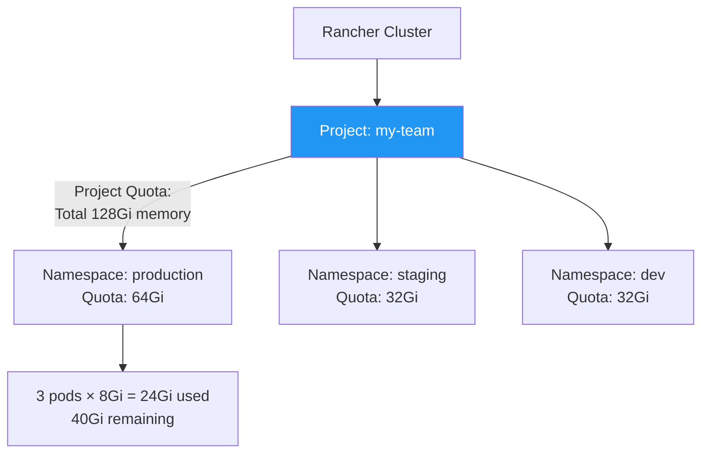
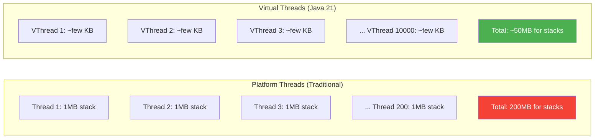
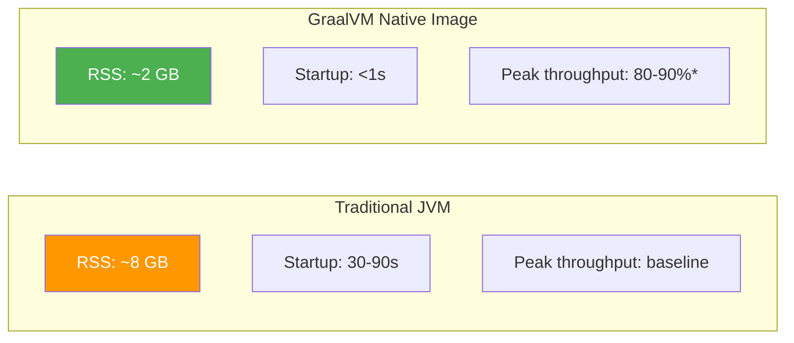
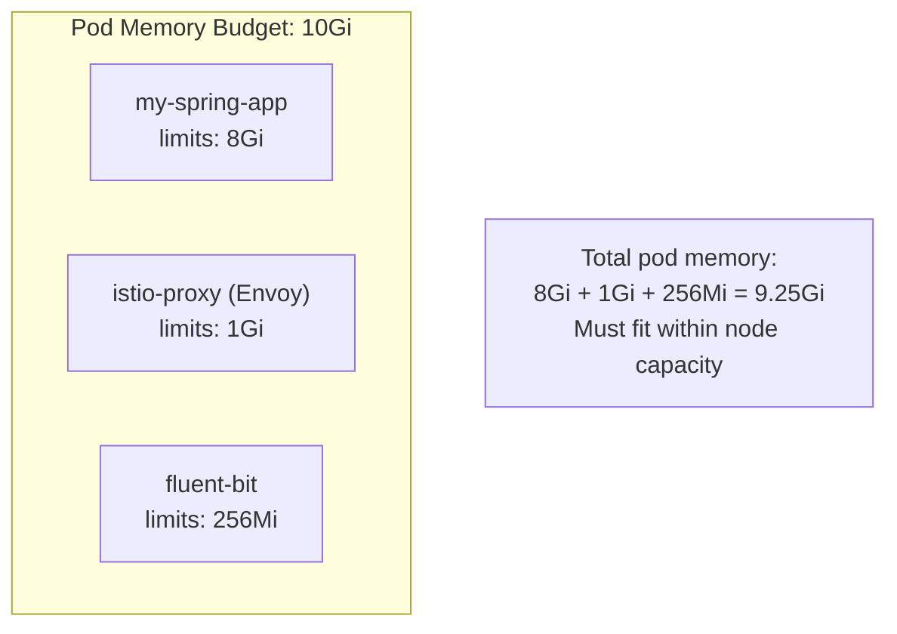
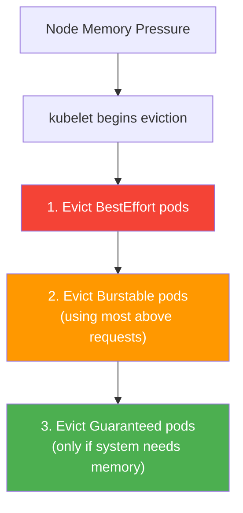

# Advanced Considerations

[< Back to Main Guide](../java-memory-k8s-guide.md)

---

## Rancher-Specific Considerations

### Project and Namespace Quotas

Rancher organizes namespaces into **Projects**, which can have resource quotas at both levels:



**Before increasing pod memory, verify:**

```bash
# Namespace-level quota
kubectl describe resourcequota -n my-namespace

# Check if Rancher imposed a LimitRange (silently modifies pods)
kubectl describe limitrange -n my-namespace

# Check project-level quota in Rancher UI:
# Cluster → Project → Resource Quotas
```

### LimitRange Interference

Rancher may create a `LimitRange` that silently overrides your resource settings:

```bash
kubectl get limitrange -n my-namespace -o yaml
```

If a LimitRange has `default.memory: 4Gi` and you deploy with `limits.memory: 8Gi`, your setting wins. But if you **omit** limits, the LimitRange default applies. Always be explicit.

### Rancher Monitoring Stack

Rancher ships with a Prometheus Operator-based monitoring stack:
- Access via Rancher UI → Cluster → Monitoring
- ServiceMonitor CRDs are supported
- Grafana dashboards can be provisioned via ConfigMaps
- Alert rules integrate with Rancher's notification system

---

## Java 21 Virtual Threads

### Impact on Memory Model

Virtual threads (Project Loom) fundamentally change the threading model:



### Enabling in Spring Boot 3.2+

```yaml
# application.yml
spring:
  threads:
    virtual:
      enabled: true
```

### Memory Implications

| Aspect | Platform Threads | Virtual Threads |
|:-------|:----------------|:----------------|
| Stack size per thread | 512KB - 1MB (`-Xss`) | Few KB (grows as needed) |
| Max concurrent | Limited by memory | Millions possible |
| Thread stack memory (200 concurrent) | ~200MB | ~5MB |
| Thread stack memory (10,000 concurrent) | ~10GB (impractical) | ~50MB |
| `-Xss` flag effect | Applies | **Does NOT apply** (only platform threads) |

### When Virtual Threads Reduce Memory Needs

If your app is I/O bound (waiting on DB, HTTP calls, etc.) and you've been running 200+ threads to handle concurrency, virtual threads can save 150-200MB of stack memory. This might mean you **don't need to increase heap** — the saved memory can be reallocated.

### When Virtual Threads Don't Help

- CPU-bound workloads (computation-heavy, not waiting)
- The heap is the bottleneck (objects, not threads)
- Already using reactive/non-blocking frameworks (WebFlux)

---

## GraalVM Native Image

### Memory Comparison



*Native images may have slightly lower peak throughput because there's no JIT optimization at runtime.

### Trade-offs

| Aspect | JVM Mode | Native Image |
|:-------|:---------|:-------------|
| Memory footprint | Higher (heap + JIT + metaspace) | 50-80% less |
| Startup time | 30-90 seconds | Milliseconds |
| Peak throughput | Best (JIT optimizes hot paths) | ~80-90% of JVM |
| Build time | Fast (seconds) | Slow (5-15 minutes) |
| Reflection support | Full | Requires configuration |
| Dynamic proxies | Full | Requires configuration |
| Spring Boot support | Full | Spring Boot 3.x (first-class) |
| Debugging | Full (jcmd, jmap, JFR) | Limited |
| Monitoring | Full (JMX, Micrometer) | Micrometer works, no JMX |

### When to Consider Native Image

- Serverless / FaaS (startup time critical)
- Memory-constrained environments
- Large replica counts where memory savings compound
- Sidecar services that must be lightweight

### When to Stay on JVM

- Performance-critical services (need JIT peak throughput)
- Heavy reflection use (complex Spring configurations)
- Need runtime diagnostics (jcmd, heap dumps, JFR)
- Team unfamiliar with native image constraints

### Building Native Image with Spring Boot 3.x

```bash
# Gradle
./gradlew nativeCompile

# Maven
./mvnw -Pnative native:compile

# Docker (buildpacks)
./gradlew bootBuildImage --imageName=my-app:native
```

---

## JVM Ergonomics in Containers

The JVM auto-tunes many settings based on detected resources. In containers, this can be surprising:

### CPU-Based Ergonomics

| JVM Behavior | Based On | Impact if CPU Limit is Low |
|:-------------|:---------|:--------------------------|
| GC thread count | Available CPUs | Fewer GC threads → slower collection |
| JIT compiler threads | Available CPUs | Slower warmup, longer time in interpreter |
| Default GC selection | Available CPUs + memory | < 2 CPUs → SerialGC by default |
| Fork-Join pool size | Available CPUs | Reduced parallelism for streams |

**Key issue:** If `limits.cpu = 1`, the JVM may see only 1 CPU and:
- Default to SerialGC (not G1!)
- Use only 1 GC thread
- Use only 1 compiler thread (very slow warmup)

**Fix:** Always explicitly set the GC: `-XX:+UseG1GC`

You can also override the detected CPU count:
```bash
-XX:ActiveProcessorCount=4    # Tell JVM it has 4 CPUs regardless of cgroup limit
```

### Memory-Based Ergonomics

With `UseContainerSupport` (default on Java 10+):
- JVM reads memory limit from cgroup (`/sys/fs/cgroup/memory/memory.limit_in_bytes` or v2 equivalent)
- Auto-sizes heap based on this limit (default ~25% for small containers, ~50% for larger ones)
- **This is why we explicitly set `MaxRAMPercentage=75.0`** — the default auto-sizing is too conservative

Without container support (very old Java):
- JVM sees **host memory** (e.g., 64GB) and may try to allocate 16GB heap
- Container OOMKills immediately

---

## Sidecar Containers and Memory

If your pods have sidecars (service mesh, log collectors, etc.), account for their memory:



**Common sidecars and their memory:**

| Sidecar | Typical Memory | Notes |
|:--------|:--------------|:------|
| Istio/Envoy proxy | 128MB - 1GB | Grows with connection count |
| Linkerd proxy | 20-100MB | Much lighter than Envoy |
| Fluent Bit | 64-256MB | Depends on buffer config |
| Datadog agent | 256MB-1GB | Depends on checks enabled |
| Vault agent | 64-128MB | For secret injection |

---

## cgroup v1 vs v2

Kubernetes and container runtimes are transitioning from cgroup v1 to v2:

| Aspect | cgroup v1 | cgroup v2 |
|:-------|:----------|:----------|
| Memory path | `/sys/fs/cgroup/memory/memory.limit_in_bytes` | `/sys/fs/cgroup/memory.max` |
| Java support | Java 8u131+ | Java 15+ (full), Java 11 (partial) |
| Default on | Older K8s (< 1.25) | Newer K8s (>= 1.25), modern Linux |
| JVM flag | `UseContainerSupport` handles both | Same flag |

**If you're on Java 11 and your cluster migrates to cgroup v2 nodes, the JVM may not detect the limit correctly.** Upgrade to Java 17+ for full cgroup v2 support.

Check which version your node uses:
```bash
# On the node (or via exec)
stat -fc %T /sys/fs/cgroup/
# "cgroup2fs" = v2
# "tmpfs" = v1
```

---

## Memory Overcommit and Node Pressure

### What Happens When Nodes Run Low



**This is why `requests == limits` matters for Java.** Guaranteed QoS means your pod is last to be evicted during node pressure. Since Java doesn't voluntarily release heap, a Burstable pod using more than `requests` is a prime eviction candidate.

### Monitoring Node Pressure

```bash
# Node conditions
kubectl describe node <node> | grep -A 3 "Conditions"

# Memory pressure events
kubectl get events --field-selector reason=Evicted -A
```

---

## Kubernetes Memory Definitions

Understanding what K8s measures vs what the JVM reports:

| K8s Metric | What It Measures | JVM Equivalent |
|:-----------|:----------------|:---------------|
| `container_memory_usage_bytes` | RSS + page cache | Total process memory |
| `container_memory_working_set_bytes` | Active RSS (what triggers OOMKill) | `process_resident_memory_bytes` |
| `container_memory_rss` | Resident Set Size | All JVM regions actually in RAM |
| `container_spec_memory_limit_bytes` | Container's `limits.memory` | — |

**The OOMKiller looks at `working_set_bytes` vs `limits.memory`.** This is why monitoring `process_resident_memory_bytes` from the JVM is important — it's what will get you killed.

---

## Next Steps

- [JVM Memory Model](jvm-memory-model.md) — Foundation for understanding these advanced topics
- [Troubleshooting](troubleshooting.md) — When advanced configurations go wrong
- [Change Management Checklist](change-management-checklist.md) — Process for applying changes
