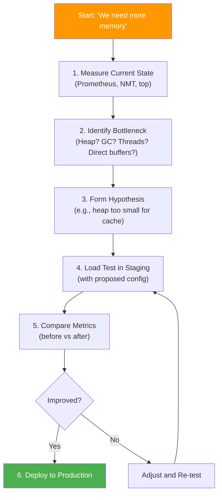
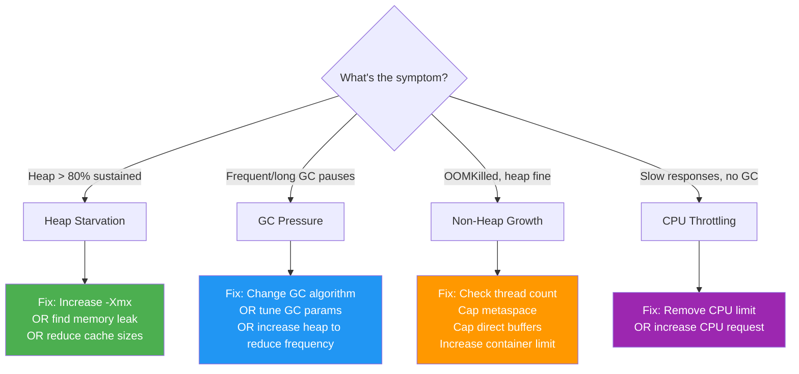
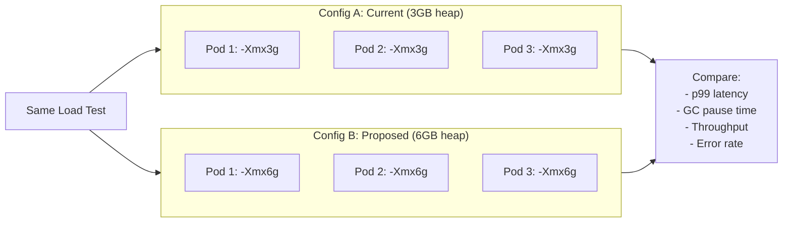
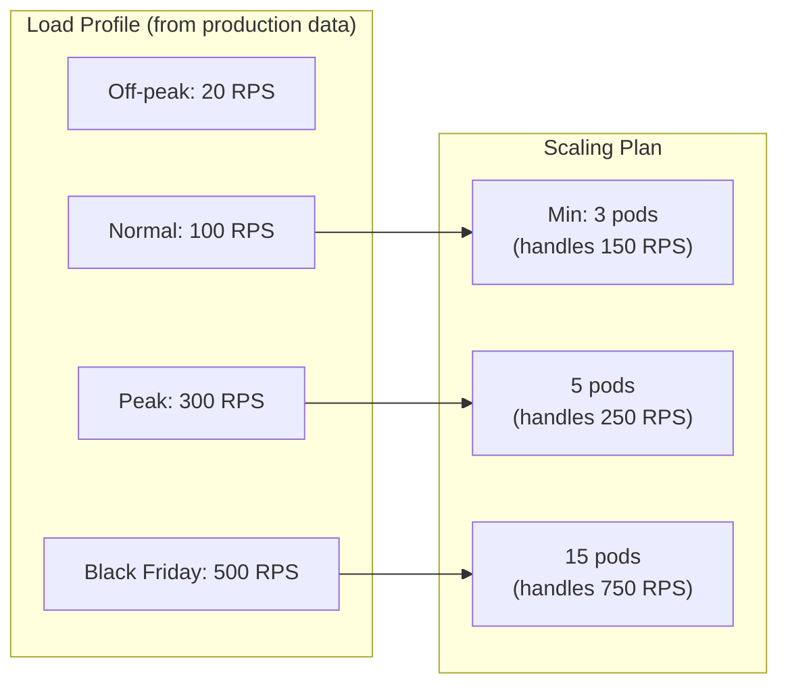

# Capacity Planning & Load Testing

[< Back to Main Guide](../java-memory-k8s-guide.md)

---

## Right-Sizing Process



---

## Step 1: Measure Current State

Before changing anything, establish baselines:

### Prometheus Queries for Baseline

```promql
# Average heap usage over 24h
avg_over_time(
  jvm_memory_used_bytes{area="heap", application="my-spring-app"}[24h]
) / jvm_memory_max_bytes{area="heap", application="my-spring-app"}

# Peak heap usage over 7 days
max_over_time(
  jvm_memory_used_bytes{area="heap", application="my-spring-app"}[7d]
) / jvm_memory_max_bytes{area="heap", application="my-spring-app"}

# GC frequency (events per minute)
rate(jvm_gc_pause_seconds_count{application="my-spring-app"}[5m]) * 60

# GC time (% of time spent in GC)
rate(jvm_gc_pause_seconds_sum{application="my-spring-app"}[5m]) * 100

# Longest GC pause in last hour
max_over_time(jvm_gc_pause_seconds_max{application="my-spring-app"}[1h])

# Object promotion rate to old gen
rate(jvm_gc_memory_promoted_bytes_total{application="my-spring-app"}[5m])

# RSS vs container limit (safety margin)
container_memory_working_set_bytes{container="my-spring-app"}
/ container_spec_memory_limit_bytes{container="my-spring-app"}
```

### kubectl Inspection

```bash
# Current resource usage
kubectl top pods -n my-namespace -l app=my-spring-app --containers

# Detailed native memory breakdown
POD=$(kubectl get pods -l app=my-spring-app -n my-namespace -o jsonpath='{.items[0].metadata.name}')
kubectl exec $POD -n my-namespace -- jcmd 1 VM.native_memory summary

# Thread count (each thread = 512KB-1MB stack)
kubectl exec $POD -n my-namespace -- jcmd 1 Thread.print | grep "^\"" | wc -l

# Top memory-consuming classes
kubectl exec $POD -n my-namespace -- jcmd 1 GC.class_histogram | head -20
```

---

## Step 2: Identify the Bottleneck



### Decision Matrix: Do You Actually Need More Heap?

| Observation | Diagnosis | Action |
|:------------|:----------|:-------|
| Heap sustained > 80%, GC frequent | Heap too small for workload | Increase heap |
| Heap 50%, but long GC pauses | Wrong GC algorithm or poor tuning | Switch to ZGC or tune G1 |
| Heap fine, but pod OOMKilled | Non-heap memory exceeds margin | Increase container limit, cap non-heap |
| Heap spikes during peak traffic | Temporary allocation pressure | Scale horizontally (more pods) instead |
| Heap grows monotonically, never drops | Memory leak | Fix the leak (don't mask with more heap) |
| High GC, large old gen | Too many long-lived objects | Review caching strategy, object lifecycle |

---

## Step 3: Load Testing

### Tool Options

| Tool | Best For | Learning Curve |
|:-----|:---------|:---------------|
| **k6** | HTTP load testing, JavaScript-based scripts | Low |
| **Gatling** | Complex scenarios, Java/Scala-based | Medium |
| **JMeter** | GUI-based, wide protocol support | Medium |
| **wrk/wrk2** | Simple HTTP benchmarking | Very low |
| **Locust** | Python-based, distributed | Low |

### k6 Load Test Example

```javascript
// loadtest.js
import http from 'k6/http';
import { check, sleep } from 'k6';

export const options = {
  stages: [
    { duration: '2m', target: 50 },    // Ramp up
    { duration: '5m', target: 50 },    // Steady state
    { duration: '5m', target: 200 },   // Peak load
    { duration: '10m', target: 200 },  // Sustained peak
    { duration: '5m', target: 400 },   // Stress test
    { duration: '5m', target: 400 },   // Sustained stress
    { duration: '3m', target: 0 },     // Ramp down
  ],
  thresholds: {
    http_req_duration: ['p(99)<1000'],  // 99th percentile < 1s
    http_req_failed: ['rate<0.01'],     // Error rate < 1%
  },
};

export default function () {
  // Simulate realistic traffic patterns
  const responses = http.batch([
    ['GET', 'http://my-spring-app.staging/api/resource'],
    ['GET', 'http://my-spring-app.staging/api/resource/123'],
  ]);

  check(responses[0], {
    'status is 200': (r) => r.status === 200,
  });

  sleep(1); // Think time between requests
}
```

### Running the Load Test

```bash
# Port-forward or use ingress to reach staging
kubectl port-forward svc/my-spring-app 8080:8080 -n my-namespace-staging &

# Run k6
k6 run loadtest.js

# In parallel, monitor the pods:
# Terminal 1: resource usage
watch -n 5 kubectl top pods -n my-namespace-staging --containers -l app=my-spring-app

# Terminal 2: pod events
kubectl get pods -n my-namespace-staging -l app=my-spring-app -w

# Terminal 3: GC metrics (via actuator)
watch -n 10 'curl -s http://localhost:8080/actuator/metrics/jvm.gc.pause | jq ".measurements"'
```

---

## Step 4: Compare Configurations

### A/B Test Approach



### Metrics to Compare

| Metric | Config A (3GB) | Config B (6GB) | Improved? |
|:-------|:---------------|:---------------|:----------|
| p99 latency | _measure_ | _measure_ | ? |
| Avg GC pause | _measure_ | _measure_ | ? |
| GC frequency | _measure_ | _measure_ | ? |
| Max throughput (RPS) | _measure_ | _measure_ | ? |
| Error rate at peak | _measure_ | _measure_ | ? |
| Time to first OOMKill | _measure_ | _measure_ | ? |

**Record these numbers.** They justify the cost increase and provide a baseline for future tuning.

---

## Step 5: Cost Analysis

### Resource Impact

```
Current state:
  3 pods × 4Gi limit = 12 Gi cluster memory
  With HPA max 15: up to 60 Gi

Proposed state:
  3 pods × 8Gi limit = 24 Gi cluster memory
  With HPA max 15: up to 120 Gi
```

### Verify Node Capacity

```bash
# Total allocatable memory across all nodes
kubectl get nodes -o custom-columns=\
NAME:.metadata.name,\
ALLOC_MEM:.status.allocatable.memory,\
ALLOC_CPU:.status.allocatable.cpu

# Current allocation (what's already requested)
kubectl describe nodes | grep -A 5 "Allocated resources"

# Available headroom per node
kubectl top nodes
```

### Can the Cluster Handle It?

```bash
# Total cluster allocatable memory
TOTAL=$(kubectl get nodes -o jsonpath='{range .items[*]}{.status.allocatable.memory}{"\n"}{end}' | \
  awk '{sum += $1} END {print sum/1024/1024 " Gi"}')
echo "Total cluster memory: $TOTAL"

# Total currently requested
REQUESTED=$(kubectl get pods --all-namespaces -o jsonpath='{range .items[*]}{.spec.containers[*].resources.requests.memory}{"\n"}{end}' | \
  awk '{sum += $1} END {print sum/1024/1024 " Gi"}')
echo "Total requested: $REQUESTED"

# Your additional ask
echo "Additional request: $(( (8-4) * 3 )) Gi for 3 pods at new size"
```

---

## Step 6: Scaling Thresholds

Once you have load test data, configure autoscaling thresholds:



Calculate pods needed:
```
Pods needed = Peak RPS / (Single pod max RPS at acceptable latency)
```

If one pod handles ~50 RPS at p99 < 200ms:
- Normal (100 RPS): 2 pods needed → min 3 (with headroom)
- Peak (300 RPS): 6 pods needed → HPA handles this
- Stress (500 RPS): 10 pods needed → within max 15

---

## Load Test Checklist

- [ ] Load test environment matches production config (same memory, CPU, JVM flags)
- [ ] Test includes realistic traffic patterns (not just GET /)
- [ ] Test includes ramp-up period (for JIT warmup)
- [ ] Test runs long enough to see GC behavior stabilize (> 10 minutes)
- [ ] Monitor both JVM metrics AND container-level metrics during test
- [ ] Record results in a shareable format (screenshot dashboards, export CSVs)
- [ ] Compare against current production baseline
- [ ] Test at 2× expected peak (headroom validation)
- [ ] Verify no OOMKills during sustained load
- [ ] Verify autoscaling triggers at expected thresholds

---

## Next Steps

- [Troubleshooting](troubleshooting.md) — When load tests reveal problems
- [Change Management Checklist](change-management-checklist.md) — Process for applying changes
- [CI/CD](cicd-github-actions.md) — Automating the deployment
