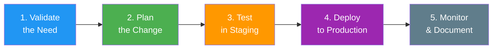
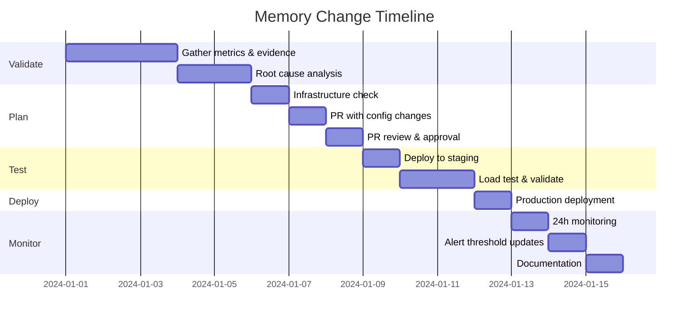

# Change Management Checklist

[< Back to Main Guide](../java-memory-k8s-guide.md)

---

## Overview

This checklist covers the full process of changing Java memory configuration from 3GB heap (4Gi container) to 6GB heap (8Gi container) in a Kubernetes/Rancher environment.



---

## Phase 1: Validate the Need

> Goal: Prove that increasing heap from 3GB to 6GB is the correct solution.

### Evidence Gathering

- [ ] **Heap utilization data collected** — Prometheus shows sustained >80% heap usage during normal load
  ```promql
  avg_over_time(jvm_memory_used_bytes{area="heap"}[7d])
  / jvm_memory_max_bytes{area="heap"}
  ```

- [ ] **GC metrics reviewed** — Frequent GC or long pauses indicate heap pressure
  ```promql
  rate(jvm_gc_pause_seconds_sum[5m])
  rate(jvm_gc_pause_seconds_count[5m]) * 60
  max_over_time(jvm_gc_pause_seconds_max[24h])
  ```

- [ ] **Root cause identified** — Is this genuinely heap starvation, or:
  - [ ] Memory leak? (heap grows monotonically → fix the leak, not the symptom)
  - [ ] Cache misconfiguration? (unbounded cache → configure eviction)
  - [ ] Non-heap issue? (RSS exceeds container limit with healthy heap → different fix)
  - [ ] GC algorithm issue? (long pauses with low heap → switch GC, not add memory)

- [ ] **Memory leak ruled out** — Heap usage is stable under constant load (sawtooth pattern), not monotonically increasing

- [ ] **Impact quantified** — What business metric suffers today?
  - [ ] p99 latency exceeds SLO: ____ ms (SLO: ____ ms)
  - [ ] Error rate during peaks: ____%
  - [ ] GC pauses causing timeouts: ____ events/hour

---

## Phase 2: Plan the Change

> Goal: Ensure infrastructure can support the change and all configurations are updated coherently.

### Infrastructure Readiness

- [ ] **Namespace quota checked** — Sufficient headroom for new pod sizes
  ```bash
  kubectl describe resourcequota -n my-namespace
  ```

- [ ] **Rancher project quota checked** — Project-level limits won't block deployment
  - Rancher UI → Cluster → Project → Resource Quotas

- [ ] **LimitRange reviewed** — No default/max limits that conflict
  ```bash
  kubectl describe limitrange -n my-namespace
  ```

- [ ] **Node capacity verified** — Nodes can fit the larger pods
  ```bash
  kubectl get nodes -o custom-columns=NAME:.metadata.name,ALLOC_MEM:.status.allocatable.memory
  kubectl top nodes
  ```

- [ ] **Autoscaling impact calculated:**
  - Current: `max_replicas × current_limit` = ____ Gi
  - Proposed: `max_replicas × new_limit` = ____ Gi
  - Cluster can accommodate maximum: [ ] Yes [ ] No → scale node pool

### Configuration Changes (Version Controlled)

- [ ] **JVM flags updated:**
  ```yaml
  # Using percentage-based (recommended):
  JAVA_TOOL_OPTIONS: "-XX:MaxRAMPercentage=75.0 -XX:InitialRAMPercentage=75.0 ..."

  # Or absolute:
  JAVA_TOOL_OPTIONS: "-Xms6g -Xmx6g ..."
  ```

- [ ] **Container resources updated:**
  ```yaml
  resources:
    requests:
      memory: "8Gi"    # Was: 4Gi
    limits:
      memory: "8Gi"    # Was: 4Gi
  ```

- [ ] **HPA maxReplicas reviewed** — Still appropriate with larger pod size?

- [ ] **PDB unchanged** — `minAvailable` still makes sense

- [ ] **PR created** with all changes — Reviewed by at least one other engineer

---

## Phase 3: Test in Staging

> Goal: Validate the new configuration under realistic load before production.

### Deployment

- [ ] **Staging environment matches production** (same JVM flags, same memory limits, same GC)

- [ ] **Deployed to staging successfully**
  ```bash
  kubectl rollout status deployment/my-spring-app -n my-namespace-staging
  ```

- [ ] **JVM flags verified:**
  ```bash
  kubectl logs <pod> -n my-namespace-staging | grep "Picked up JAVA_TOOL_OPTIONS"
  kubectl exec <pod> -n my-namespace-staging -- jcmd 1 VM.flags | grep MaxHeapSize
  ```

- [ ] **No OOMKills after deployment** — Pods stable for at least 30 minutes

### Load Testing

- [ ] **Load test executed** — Simulating production traffic patterns
  ```bash
  k6 run --vus 200 --duration 30m loadtest.js
  ```

- [ ] **Metrics compared (before vs after):**

  | Metric | Before (3GB heap) | After (6GB heap) | Improvement |
  |:-------|:-------------------|:-----------------|:------------|
  | Heap usage % | ___% | ___% | |
  | p99 latency | ___ms | ___ms | |
  | GC pause max | ___ms | ___ms | |
  | GC frequency | ___/min | ___/min | |
  | Throughput (RPS) | ___ | ___ | |
  | Error rate | ___% | ___% | |

- [ ] **Sustained load test passed** — 30+ minutes without OOMKill or degradation

- [ ] **Stress test completed** — 2× expected peak traffic, validated behavior

---

## Phase 4: Deploy to Production

> Goal: Safely roll out the change with ability to roll back immediately.

### Pre-Deploy

- [ ] **Deployment window agreed** — Low-traffic period preferred

- [ ] **Monitoring dashboards open** — GC, heap, RSS, pod status visible

- [ ] **Rollback plan confirmed:**
  ```bash
  kubectl rollout undo deployment/my-spring-app -n my-namespace
  ```

- [ ] **Team notified** — Slack/Teams: "Deploying memory increase for my-spring-app at HH:MM"

### Deploy

- [ ] **Rolling update initiated:**
  ```bash
  kubectl set image deployment/my-spring-app \
    my-spring-app=registry.example.com/my-spring-app:<tag> \
    -n my-namespace
  ```

- [ ] **Rollout completed successfully:**
  ```bash
  kubectl rollout status deployment/my-spring-app -n my-namespace --timeout=300s
  ```

- [ ] **All pods running and ready:**
  ```bash
  kubectl get pods -l app=my-spring-app -n my-namespace
  kubectl wait --for=condition=ready pod -l app=my-spring-app -n my-namespace
  ```

### Post-Deploy Validation (First 30 Minutes)

- [ ] **No OOMKills:**
  ```bash
  kubectl get events -n my-namespace --field-selector reason=OOMKilling
  ```

- [ ] **No pod restarts:**
  ```bash
  kubectl get pods -l app=my-spring-app -n my-namespace \
    -o jsonpath='{range .items[*]}{.metadata.name}: {.status.containerStatuses[0].restartCount}{"\n"}{end}'
  ```

- [ ] **Heap size correct:**
  ```bash
  kubectl exec <pod> -n my-namespace -- jcmd 1 VM.flags | grep MaxHeapSize
  # Expected: ~6442450944 (6 GB)
  ```

- [ ] **Resource usage nominal:**
  ```bash
  kubectl top pods -l app=my-spring-app -n my-namespace --containers
  ```

- [ ] **Application health verified:**
  ```bash
  kubectl port-forward svc/my-spring-app 8080:8080 -n my-namespace
  curl http://localhost:8080/actuator/health
  ```

- [ ] **Traffic flowing normally** — Check request rate in Grafana/Prometheus

---

## Phase 5: Monitor & Document

> Goal: Confirm sustained improvement and record the change for future reference.

### Sustained Monitoring (Next 24-48 Hours)

- [ ] **No OOMKills over 24 hours**

- [ ] **Heap usage at new baseline** — Should be lower % (more headroom)

- [ ] **GC metrics improved** — Fewer/shorter pauses

- [ ] **p99 latency improved** — Matches staging test results

- [ ] **No unexpected behavior** during peak traffic window

### Alert Threshold Updates

- [ ] **Heap alert thresholds reviewed** — May need adjustment for new baseline
  - Warning: 85% of 6GB = 5.1GB (was 85% of 3GB = 2.55GB)
  - Critical: 95% of 6GB = 5.7GB

- [ ] **Container RSS alert updated** — Threshold relative to new 8Gi limit

### Documentation

- [ ] **Change recorded:**
  - What: Heap increased from 3GB to 6GB
  - Why: Sustained heap pressure causing GC pauses and p99 latency degradation
  - When: [date]
  - By: [who]
  - Result: [measured improvement]

- [ ] **Runbook updated** — If heap alerts fire at new thresholds, next steps are documented

- [ ] **Cost impact noted** — Additional cluster memory consumed: ____ Gi

---

## Rollback Procedure

If at any point the deployment shows problems:

```bash
# Immediate rollback
kubectl rollout undo deployment/my-spring-app -n my-namespace

# Verify rollback
kubectl rollout status deployment/my-spring-app -n my-namespace --timeout=180s

# Confirm old pods are back
kubectl get pods -l app=my-spring-app -n my-namespace
kubectl exec <pod> -n my-namespace -- jcmd 1 VM.flags | grep MaxHeapSize
# Should show old heap size
```

### Rollback Triggers

Roll back immediately if:
- Pods enter CrashLoopBackOff
- OOMKills within first 5 minutes
- Error rate increases above baseline
- Multiple pods restart simultaneously
- Downstream services report increased errors

---

## Summary Timeline



---

## Next Steps

- [JVM Memory Model](jvm-memory-model.md) — Understanding the fundamentals
- [Monitoring & Metrics](monitoring-metrics.md) — Setting up observability
- [CI/CD](cicd-github-actions.md) — Automating future deployments
