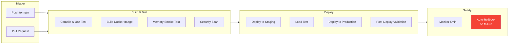
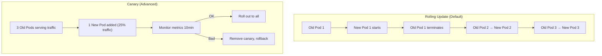

# CI/CD with GitHub Actions

[< Back to Main Guide](../java-memory-k8s-guide.md)

---

## Pipeline Overview



---

## Complete Pipeline

```yaml
name: Build, Test, and Deploy

on:
  push:
    branches: [main]
  pull_request:
    branches: [main]

env:
  REGISTRY: registry.example.com
  IMAGE_NAME: my-spring-app
  NAMESPACE: my-namespace

jobs:
  # ─────────────────────────────────────────────────────
  # Job 1: Build and Test
  # ─────────────────────────────────────────────────────
  build-and-test:
    runs-on: ubuntu-latest
    outputs:
      image-tag: ${{ github.sha }}
    steps:
      - uses: actions/checkout@v4

      - name: Set up JDK 21
        uses: actions/setup-java@v4
        with:
          java-version: '21'
          distribution: 'temurin'
          cache: 'gradle'    # or 'maven'

      - name: Run Tests
        run: ./gradlew test

      - name: Build JAR
        run: ./gradlew bootJar

      - name: Build Docker Image
        run: |
          docker build \
            -t $REGISTRY/$IMAGE_NAME:${{ github.sha }} \
            -t $REGISTRY/$IMAGE_NAME:latest \
            .

      - name: Memory Smoke Test
        run: |
          # Start with production-like memory constraints
          docker run -d --name memtest \
            --memory=8g \
            --cpus=2 \
            -e JAVA_TOOL_OPTIONS="-XX:MaxRAMPercentage=75.0 -XX:InitialRAMPercentage=75.0 -XX:+UseG1GC -XX:MaxMetaspaceSize=512m" \
            -p 8080:8080 \
            $REGISTRY/$IMAGE_NAME:${{ github.sha }}

          # Wait for healthy
          echo "Waiting for application to start..."
          for i in $(seq 1 60); do
            if curl -sf http://localhost:8080/actuator/health > /dev/null 2>&1; then
              echo "Application is healthy after ${i}s"
              break
            fi
            if [ $i -eq 60 ]; then
              echo "ERROR: Application failed to start within 60s"
              docker logs memtest
              exit 1
            fi
            sleep 2
          done

          # Validate JVM heap configuration
          echo "=== JVM Flags ==="
          docker exec memtest jcmd 1 VM.flags | grep -E "MaxHeapSize|InitialHeapSize|UseG1GC"

          # Validate heap is approximately 6GB (75% of 8GB)
          MAX_HEAP=$(docker exec memtest jcmd 1 VM.flags | grep MaxHeapSize | awk '{print $4}' | cut -d'=' -f2)
          EXPECTED_MIN=5900000000  # ~5.5GB (allow some variance)
          EXPECTED_MAX=6500000000  # ~6.5GB
          if [ "$MAX_HEAP" -lt "$EXPECTED_MIN" ] || [ "$MAX_HEAP" -gt "$EXPECTED_MAX" ]; then
            echo "ERROR: MaxHeapSize $MAX_HEAP not in expected range [$EXPECTED_MIN, $EXPECTED_MAX]"
            exit 1
          fi
          echo "MaxHeapSize: $MAX_HEAP bytes (OK)"

          # Check RSS is within container bounds
          echo "=== Container Memory Usage ==="
          docker stats --no-stream --format 'table {{.Name}}\t{{.MemUsage}}\t{{.MemPerc}}' memtest

          docker stop memtest

      - name: Security Scan
        uses: aquasecurity/trivy-action@master
        with:
          image-ref: '${{ env.REGISTRY }}/${{ env.IMAGE_NAME }}:${{ github.sha }}'
          format: 'sarif'
          output: 'trivy-results.sarif'
          severity: 'CRITICAL,HIGH'

      - name: Upload Scan Results
        uses: github/codeql-action/upload-sarif@v3
        if: always()
        with:
          sarif_file: 'trivy-results.sarif'

      - name: Push Image
        if: github.ref == 'refs/heads/main'
        run: |
          echo "${{ secrets.REGISTRY_PASSWORD }}" | docker login $REGISTRY \
            -u ${{ secrets.REGISTRY_USERNAME }} --password-stdin
          docker push $REGISTRY/$IMAGE_NAME:${{ github.sha }}
          docker push $REGISTRY/$IMAGE_NAME:latest

  # ─────────────────────────────────────────────────────
  # Job 2: Deploy to Staging
  # ─────────────────────────────────────────────────────
  deploy-staging:
    needs: build-and-test
    if: github.ref == 'refs/heads/main'
    runs-on: ubuntu-latest
    environment: staging
    steps:
      - uses: actions/checkout@v4

      - name: Configure kubectl
        run: |
          mkdir -p ~/.kube
          echo "${{ secrets.KUBECONFIG_STAGING }}" | base64 -d > ~/.kube/config

      - name: Deploy to Staging
        run: |
          kubectl set image deployment/my-spring-app \
            my-spring-app=$REGISTRY/$IMAGE_NAME:${{ github.sha }} \
            -n $NAMESPACE-staging

      - name: Wait for Rollout
        run: |
          kubectl rollout status deployment/my-spring-app \
            -n $NAMESPACE-staging \
            --timeout=300s

      - name: Validate Pods Healthy
        run: |
          # Wait for all pods to be ready
          kubectl wait --for=condition=ready pod \
            -l app=my-spring-app \
            -n $NAMESPACE-staging \
            --timeout=180s

          # Check for OOMKills
          RESTARTS=$(kubectl get pods -l app=my-spring-app -n $NAMESPACE-staging \
            -o jsonpath='{range .items[*]}{.status.containerStatuses[0].restartCount}{"\n"}{end}')
          echo "Restart counts: $RESTARTS"

          for count in $RESTARTS; do
            if [ "$count" -gt "0" ]; then
              echo "WARNING: Pod has restart count > 0"
              kubectl describe pods -l app=my-spring-app -n $NAMESPACE-staging | grep -A 5 "Last State"
            fi
          done

      - name: Validate JVM Configuration
        run: |
          POD=$(kubectl get pods -l app=my-spring-app -n $NAMESPACE-staging \
            -o jsonpath='{.items[0].metadata.name}')

          echo "=== JVM Flags ==="
          kubectl exec $POD -n $NAMESPACE-staging -- jcmd 1 VM.flags | grep -E "MaxHeapSize|UseG1GC"

          echo "=== Heap Info ==="
          kubectl exec $POD -n $NAMESPACE-staging -- jcmd 1 GC.heap_info

      - name: Rollback Staging on Failure
        if: failure()
        run: |
          kubectl rollout undo deployment/my-spring-app -n $NAMESPACE-staging

  # ─────────────────────────────────────────────────────
  # Job 3: Deploy to Production
  # ─────────────────────────────────────────────────────
  deploy-production:
    needs: deploy-staging
    if: github.ref == 'refs/heads/main'
    runs-on: ubuntu-latest
    environment: production    # Requires manual approval in GitHub
    steps:
      - uses: actions/checkout@v4

      - name: Configure kubectl
        run: |
          mkdir -p ~/.kube
          echo "${{ secrets.KUBECONFIG_PRODUCTION }}" | base64 -d > ~/.kube/config

      - name: Pre-Deploy Snapshot
        run: |
          echo "=== Current State ==="
          kubectl get deployment my-spring-app -n $NAMESPACE -o jsonpath='{.spec.template.spec.containers[0].image}'
          echo ""
          kubectl get pods -l app=my-spring-app -n $NAMESPACE

      - name: Deploy to Production
        run: |
          kubectl set image deployment/my-spring-app \
            my-spring-app=$REGISTRY/$IMAGE_NAME:${{ github.sha }} \
            -n $NAMESPACE

      - name: Wait for Rollout
        run: |
          kubectl rollout status deployment/my-spring-app \
            -n $NAMESPACE \
            --timeout=300s

      - name: Post-Deploy Validation
        run: |
          # Wait for all pods ready
          kubectl wait --for=condition=ready pod \
            -l app=my-spring-app \
            -n $NAMESPACE \
            --timeout=180s

          # Check no OOMKills in first 2 minutes
          echo "Monitoring for 2 minutes..."
          sleep 120

          # Verify no restarts occurred
          RESTARTS=$(kubectl get pods -l app=my-spring-app -n $NAMESPACE \
            -o jsonpath='{range .items[*]}{.status.containerStatuses[0].restartCount}{" "}{end}')
          echo "Restart counts after 2min: $RESTARTS"

          for count in $RESTARTS; do
            if [ "$count" -gt "0" ]; then
              echo "ERROR: Pod restarted — possible OOMKill"
              kubectl get events -n $NAMESPACE --field-selector reason=OOMKilling --sort-by='.lastTimestamp' | tail -5
              exit 1
            fi
          done

          # Verify resource usage
          echo "=== Resource Usage ==="
          kubectl top pods -l app=my-spring-app -n $NAMESPACE --containers

          echo "Deployment validated successfully"

      - name: Rollback Production on Failure
        if: failure()
        run: |
          echo "ROLLING BACK due to validation failure"
          kubectl rollout undo deployment/my-spring-app -n $NAMESPACE
          kubectl rollout status deployment/my-spring-app -n $NAMESPACE --timeout=180s
```

---

## Configuration as Code

### Helm Values (Per Environment)

```
helm/
├── Chart.yaml
├── templates/
│   ├── deployment.yaml
│   ├── service.yaml
│   ├── hpa.yaml
│   └── pdb.yaml
└── values/
    ├── values-dev.yaml
    ├── values-staging.yaml
    └── values-production.yaml
```

**values-production.yaml:**
```yaml
replicaCount: 3

image:
  repository: registry.example.com/my-spring-app
  tag: "latest"    # Overridden by CI/CD

resources:
  requests:
    memory: "8Gi"
    cpu: "2000m"
  limits:
    memory: "8Gi"
    cpu: "4000m"

jvm:
  maxRAMPercentage: "75.0"
  initialRAMPercentage: "75.0"
  gc: "G1GC"
  maxMetaspaceSize: "512m"
  threadStackSize: "512k"
  additionalFlags: "-XX:+HeapDumpOnOutOfMemoryError -XX:+ExitOnOutOfMemoryError"

autoscaling:
  enabled: true
  minReplicas: 3
  maxReplicas: 15
  targetCPUUtilization: 70

pdb:
  minAvailable: 2
```

**values-dev.yaml:**
```yaml
replicaCount: 1

resources:
  requests:
    memory: "2Gi"
    cpu: "500m"
  limits:
    memory: "2Gi"
    cpu: "1000m"

jvm:
  maxRAMPercentage: "75.0"
  initialRAMPercentage: "50.0"
  gc: "G1GC"
  maxMetaspaceSize: "256m"
  threadStackSize: "512k"
  additionalFlags: "-XX:NativeMemoryTracking=summary"

autoscaling:
  enabled: false
```

### Helm Deployment in CI

```yaml
- name: Deploy with Helm
  run: |
    helm upgrade --install my-spring-app ./helm \
      -n $NAMESPACE \
      -f ./helm/values/values-production.yaml \
      --set image.tag=${{ github.sha }} \
      --wait \
      --timeout 5m
```

---

## PR Checks for Resource Changes

Add a check that flags resource changes for review:

```yaml
name: Resource Change Review

on:
  pull_request:
    paths:
      - 'helm/values/**'
      - 'k8s/**'
      - 'Dockerfile'

jobs:
  review-resources:
    runs-on: ubuntu-latest
    steps:
      - uses: actions/checkout@v4

      - name: Detect Resource Changes
        run: |
          echo "## Resource Changes Detected" >> $GITHUB_STEP_SUMMARY
          echo "" >> $GITHUB_STEP_SUMMARY

          if git diff origin/main -- helm/values/ | grep -E "memory:|cpu:|maxRAMPercentage|Xmx|Xms"; then
            echo "⚠️ **Memory/CPU configuration changed.** Please verify:" >> $GITHUB_STEP_SUMMARY
            echo "- [ ] Container limit >= heap / 0.75" >> $GITHUB_STEP_SUMMARY
            echo "- [ ] Namespace quota has capacity" >> $GITHUB_STEP_SUMMARY
            echo "- [ ] Node pool can accommodate at max replicas" >> $GITHUB_STEP_SUMMARY
            echo "- [ ] Load tested in staging" >> $GITHUB_STEP_SUMMARY
            echo "" >> $GITHUB_STEP_SUMMARY
            echo "### Diff:" >> $GITHUB_STEP_SUMMARY
            echo '```diff' >> $GITHUB_STEP_SUMMARY
            git diff origin/main -- helm/values/ >> $GITHUB_STEP_SUMMARY
            echo '```' >> $GITHUB_STEP_SUMMARY
          fi
```

---

## Deployment Strategies



For memory changes, **rolling update is sufficient** — each new pod validates the new configuration independently.

---

## Secrets Management

```yaml
# Store kubeconfig and registry credentials as GitHub Secrets:
# - KUBECONFIG_STAGING (base64 encoded)
# - KUBECONFIG_PRODUCTION (base64 encoded)
# - REGISTRY_USERNAME
# - REGISTRY_PASSWORD

# For Rancher-managed clusters, generate a kubeconfig:
# Rancher UI → Cluster → Kubeconfig File → Download
# Then: base64 -w 0 kubeconfig.yaml → store as secret
```

---

## Next Steps

- [Capacity Planning](capacity-planning.md) — Load testing before production deployment
- [Change Management Checklist](change-management-checklist.md) — Full process for memory changes
