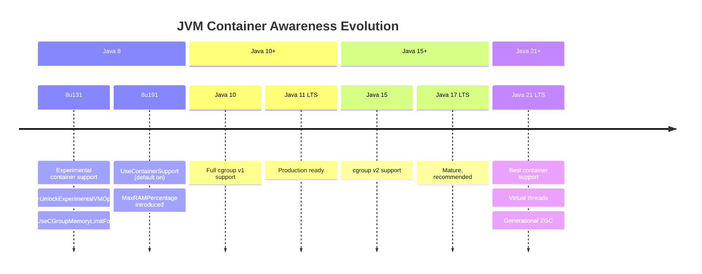
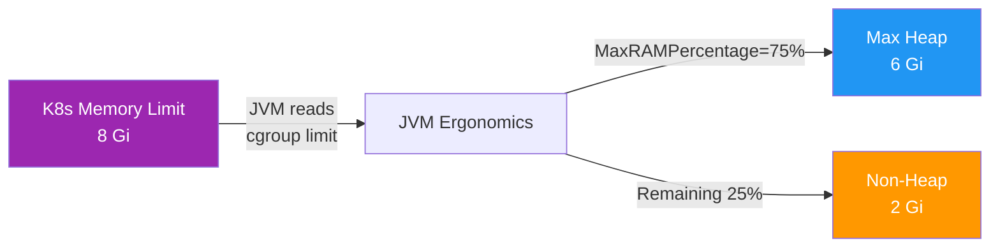
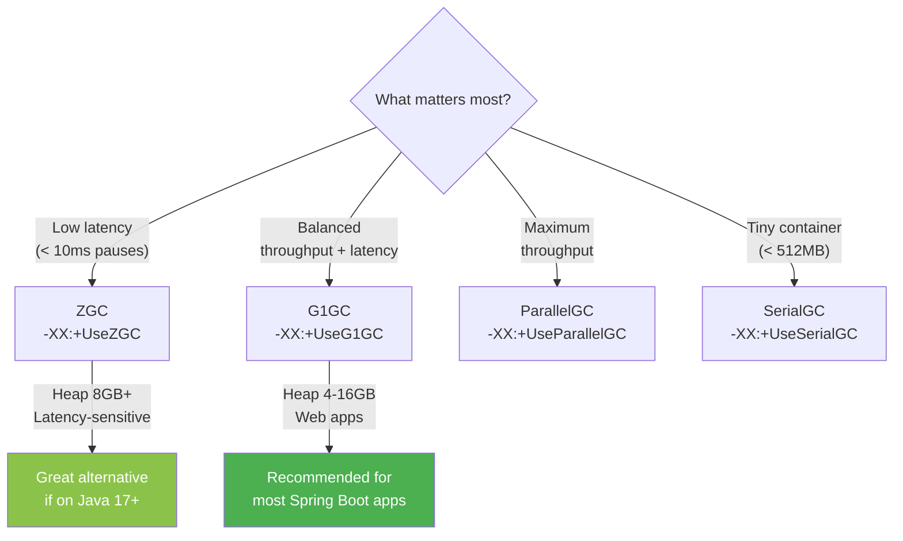

# Container-Aware JVM Configuration

[< Back to Main Guide](../java-memory-k8s-guide.md)

---

## Java Version and Container Awareness

The JVM's ability to detect container memory limits has evolved significantly:



| Java Version | Container Support | Recommendation |
|:-------------|:-----------------|:---------------|
| Java 8 (< u131) | **None** — JVM sees host memory | Upgrade immediately |
| Java 8 (u131-u190) | Experimental flag required | Migrate to 8u191+ or Java 17+ |
| Java 8 (u191+) | `UseContainerSupport` on by default | Acceptable, but prefer LTS 17/21 |
| Java 11 (LTS) | Full support, cgroup v1 | Good, but approaching EOL |
| Java 17 (LTS) | Full support, cgroup v1 + v2 | Recommended baseline |
| Java 21 (LTS) | Full support + virtual threads | Best option for new deployments |

---

## Percentage-Based Sizing (Recommended)

Rather than hardcoding absolute heap sizes, use percentage-based flags that adapt to the container's memory limit:

```bash
JAVA_TOOL_OPTIONS="-XX:MaxRAMPercentage=75.0 -XX:InitialRAMPercentage=75.0 -XX:MinRAMPercentage=50.0"
```

### How It Works



### Why This Is Better Than `-Xmx`

| Approach | Pros | Cons |
|:---------|:-----|:-----|
| `-Xmx6g` (absolute) | Explicit, predictable | Must change if container limit changes; easy to misconfigure |
| `-XX:MaxRAMPercentage=75.0` | Adapts automatically; single source of truth (K8s limit) | Slightly less explicit; must understand the percentage |

**Key advantage:** If ops changes the container limit from 8Gi to 12Gi (e.g., for a different environment), the heap auto-adjusts from 6GB to 9GB with no image rebuild or config change.

### Percentage Flag Reference

| Flag | Purpose | Recommended Value |
|:-----|:--------|:-----------------|
| `-XX:MaxRAMPercentage` | Max heap as % of container limit | `75.0` |
| `-XX:InitialRAMPercentage` | Initial heap as % of container limit | `75.0` (match max to avoid resizing) |
| `-XX:MinRAMPercentage` | Min heap for small containers (<200MB) | `50.0` |

> **Note:** `MinRAMPercentage` is misleadingly named — it only applies when the JVM detects a very small memory environment (< ~200MB). For most production containers, only `MaxRAMPercentage` and `InitialRAMPercentage` matter.

---

## Recommended Production Flags

### Full Flag Set

```bash
JAVA_TOOL_OPTIONS="\
  -XX:MaxRAMPercentage=75.0 \
  -XX:InitialRAMPercentage=75.0 \
  -XX:+UseContainerSupport \
  -XX:MaxMetaspaceSize=512m \
  -Xss512k \
  -XX:ReservedCodeCacheSize=256m \
  -XX:MaxDirectMemorySize=256m \
  -XX:+UseG1GC \
  -XX:+HeapDumpOnOutOfMemoryError \
  -XX:HeapDumpPath=/tmp/heapdump.hprof \
  -XX:+ExitOnOutOfMemoryError \
  -Xlog:gc*:file=/tmp/gc.log:time,uptime,level,tags:filecount=5,filesize=10m"
```

### Flag Explanation

| Flag | Category | Purpose |
|:-----|:---------|:--------|
| `MaxRAMPercentage=75.0` | Heap | Use 75% of container limit for heap |
| `InitialRAMPercentage=75.0` | Heap | Start at full heap size (avoid resize pauses) |
| `UseContainerSupport` | Container | Detect cgroup limits (on by default in Java 10+) |
| `MaxMetaspaceSize=512m` | Non-Heap | Cap metaspace to prevent unbounded growth |
| `Xss512k` | Non-Heap | Reduce per-thread stack size from 1MB default |
| `ReservedCodeCacheSize=256m` | Non-Heap | Cap JIT code cache |
| `MaxDirectMemorySize=256m` | Non-Heap | Cap NIO direct buffers |
| `UseG1GC` | GC | Use G1 garbage collector |
| `HeapDumpOnOutOfMemoryError` | Diagnostics | Auto-dump heap on OOM for analysis |
| `HeapDumpPath` | Diagnostics | Where to write the dump |
| `ExitOnOutOfMemoryError` | Resilience | Kill JVM on OOM so K8s can restart it |
| `Xlog:gc*` | Diagnostics | GC logging for performance analysis |

---

## Garbage Collector Selection



### Comparison

| GC | Best For | Pause Times | Throughput | Memory Overhead | Min Java |
|:---|:---------|:------------|:-----------|:----------------|:---------|
| **G1GC** | General purpose, 4-16 GB heaps | 50-200ms | Good | Moderate | 9 (default) |
| **ZGC** | Large heaps, low latency | < 1ms | Good | Higher (~15% more) | 15 (production: 17+) |
| **Shenandoah** | Low latency (RedHat) | < 10ms | Good | Moderate | 12 (RedHat JDKs) |
| **ParallelGC** | Batch jobs, throughput | 100ms-seconds | Best | Low | Any |
| **SerialGC** | Small containers | Variable | Low | Minimal | Any |

### G1GC Tuning (Most Common)

```bash
# Basic G1 for a 6GB heap
-XX:+UseG1GC
-XX:MaxGCPauseMillis=200          # Target max pause (default 200ms)
-XX:G1HeapRegionSize=4m           # Region size (auto-calculated usually fine)
-XX:InitiatingHeapOccupancyPercent=45  # Start concurrent marking at 45% old gen
```

### ZGC Configuration (For Latency-Sensitive Apps)

```bash
# ZGC with generational mode (Java 21+)
-XX:+UseZGC
-XX:+ZGenerational                # Generational ZGC (better throughput)
-XX:SoftMaxHeapSize=5g            # Soft limit — ZGC tries to stay under this
```

---

## Setting JVM Options in Kubernetes

### Method 1: `JAVA_TOOL_OPTIONS` Environment Variable (Recommended)

```yaml
env:
  - name: JAVA_TOOL_OPTIONS
    value: >-
      -XX:MaxRAMPercentage=75.0
      -XX:InitialRAMPercentage=75.0
      -XX:+UseG1GC
```

**Why this is best:**
- `JAVA_TOOL_OPTIONS` is picked up by ALL JVMs automatically (no entrypoint change needed)
- The JVM prints `Picked up JAVA_TOOL_OPTIONS: ...` on startup — visible in logs for verification
- Can be overridden per-environment in Helm values or Kustomize overlays

### Method 2: ConfigMap

```yaml
apiVersion: v1
kind: ConfigMap
metadata:
  name: jvm-config
data:
  JAVA_TOOL_OPTIONS: >-
    -XX:MaxRAMPercentage=75.0
    -XX:InitialRAMPercentage=75.0
    -XX:+UseG1GC
---
# In the deployment:
envFrom:
  - configMapRef:
      name: jvm-config
```

### Method 3: Application Properties (Spring Boot)

In `application.yml` or `application-production.yml`, you cannot set JVM flags directly, but you can configure Spring's embedded server:

```yaml
server:
  tomcat:
    threads:
      max: 200        # Controls thread count (impacts stack memory)
      min-spare: 20
    max-connections: 8192
    accept-count: 100
```

---

## Verifying Configuration

After deployment, confirm the JVM picked up your settings:

```bash
# Check startup logs for JAVA_TOOL_OPTIONS
kubectl logs <pod> -n my-namespace | grep "Picked up JAVA_TOOL_OPTIONS"

# Verify actual heap size computed
kubectl exec -it <pod> -n my-namespace -- jcmd 1 VM.flags | grep -E "MaxHeapSize|InitialHeapSize"

# Full flag dump
kubectl exec -it <pod> -n my-namespace -- jcmd 1 VM.flags -all | grep -i "heap\|metaspace\|thread"
```

Expected output for 8Gi container with 75% RAM percentage:
```
-XX:InitialHeapSize=6442450944    # ~6 GB
-XX:MaxHeapSize=6442450944        # ~6 GB
-XX:MaxMetaspaceSize=536870912    # 512 MB
```

---

## Environment-Specific Overrides

Use Helm values or Kustomize to vary JVM settings per environment:

| Environment | Container Limit | Resulting Heap | GC | Notes |
|:------------|:---------------|:---------------|:---|:------|
| Dev | 2 Gi | 1.5 GB | G1GC | Cost savings |
| Staging | 8 Gi | 6 GB | G1GC | Match production |
| Production | 8 Gi | 6 GB | G1GC | Baseline |
| Performance Test | 12 Gi | 9 GB | ZGC | Headroom for profiling |

---

## Next Steps

- [Dockerfile Best Practices](dockerfile-best-practices.md) — Building the container image
- [Kubernetes Resources](kubernetes-resources.md) — Setting requests and limits
- [Monitoring & Metrics](monitoring-metrics.md) — Verifying the configuration is correct
