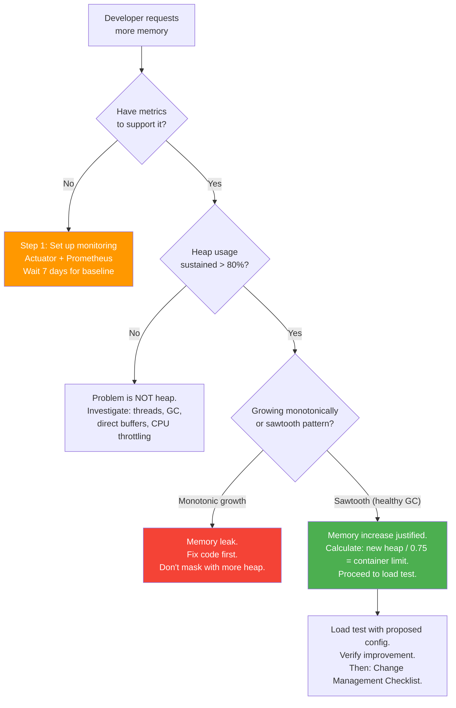

# Java Application Interview Questionnaire

[< Back to Main Guide](../java-memory-k8s-guide.md)

> Use this questionnaire when a Java developer requests memory changes, new deployments, or performance tuning. The answers inform right-sizing decisions and prevent common misconfigurations.

---

## How to Use This Document

1. Walk through the sections with the developer
2. Document answers — they form the basis of your sizing recommendation
3. Flag any red flags (marked with caution indicators throughout)
4. Use the summary at the end to produce a sizing recommendation

---

## Section 1: Application Overview

### Identity & Purpose

| Question | Answer |
|:---------|:-------|
| Application name | |
| Team / owner | |
| Repository URL | |
| What does this application do? (1-2 sentences) | |
| Is it a microservice, monolith, or something else? | |
| What type of workload? (web API, batch processor, event consumer, scheduler, BFF, gateway) | |

### Technology Stack

| Question | Answer |
|:---------|:-------|
| Java version (8, 11, 17, 21?) | |
| Spring Boot version | |
| Build tool (Maven / Gradle) | |
| JDK distribution (Temurin, Corretto, Liberica, Oracle?) | |
| Base Docker image used | |
| Any native libraries or JNI? | |

> **Red flag:** Java 8 < u191 has no container awareness. Java 11 has partial cgroup v2 support. Recommend Java 17+ for containers.

---

## Section 2: Current State

### What's Deployed Today

| Question | Answer |
|:---------|:-------|
| Current environment (dev / staging / production?) | |
| Current replica count | |
| Current memory request | |
| Current memory limit | |
| Current CPU request | |
| Current CPU limit | |
| Current JVM flags (exact `JAVA_TOOL_OPTIONS` or `JAVA_OPTS` value) | |
| Current GC algorithm (if known) | |
| How is the heap configured? (`-Xmx` absolute or `MaxRAMPercentage`?) | |

### What's the Problem?

| Question | Answer |
|:---------|:-------|
| What symptom are you experiencing? | |
| How often does it occur? (constant, under load, sporadic, after X hours) | |
| When did the problem start? (new deployment? traffic increase? data growth?) | |
| Are pods being OOMKilled? How often? | |
| Are there latency spikes? What's the p99? | |
| Have you seen `OutOfMemoryError` in logs? Which type? | |
| Have you already tried anything? What happened? | |

> **Red flag:** "It was fine until last week's deployment" — likely a code change introduced a leak. Increasing memory masks it.

> **Red flag:** "We just need more memory" without evidence — always ask for metrics first.

---

## Section 3: Traffic & Load Profile

### Request Patterns

| Question | Answer |
|:---------|:-------|
| Average requests per second (steady state) | |
| Peak requests per second (highest observed) | |
| When do peaks occur? (time of day, day of week, events) | |
| Average response time (p50) | |
| Target response time SLO (p99) | |
| Any long-running requests? (file uploads, reports, exports) | |
| Average request payload size (inbound) | |
| Average response payload size (outbound) | |

### Traffic Sources

| Question | Answer |
|:---------|:-------|
| Who calls this service? (users, other services, both) | |
| Upstream services (what calls you) | |
| Downstream dependencies (what you call) | |
| Is traffic bursty or steady? | |
| Any scheduled batch jobs hitting this service? | |
| Is there a load balancer / ingress in front? | |

> **Why this matters:** A service handling 10 RPS with 2KB payloads has very different memory needs than one handling 10 RPS with 50MB file uploads.

---

## Section 4: Data & Persistence

### Database

| Question | Answer |
|:---------|:-------|
| Database type (PostgreSQL, MySQL, Oracle, MongoDB, etc.) | |
| Connection pool library (HikariCP default?) | |
| Connection pool size (max connections per pod) | |
| Database max_connections setting | |
| Using a connection pooler (PgBouncer, ProxySQL)? | |
| Largest typical query result set (row count) | |
| Any bulk/batch operations that load large datasets? | |
| Using JPA/Hibernate? Any N+1 query concerns? | |

> **Red flag:** Pool size 20 × 15 max replicas = 300 connections. If DB max_connections < 300, scaling will cascade-fail before memory is ever the issue.

### Caching

| Question | Answer |
|:---------|:-------|
| Using Spring `@Cacheable`? | |
| Cache implementation (Caffeine, Ehcache, Redis, Hazelcast?) | |
| Is the cache bounded (max size / TTL configured)? | |
| Approximate cache size at steady state | |
| Is anything cached in-memory that could grow unbounded? | |
| Using Redis/Memcached for shared cache? | |

> **Red flag:** `@Cacheable` with no `maximumSize` or `expireAfterWrite` = unbounded heap growth.

### Sessions

| Question | Answer |
|:---------|:-------|
| Stateless (JWT/token) or stateful (server sessions)? | |
| If stateful: where are sessions stored? (in-memory, Redis, JDBC?) | |
| Average session size | |
| Expected concurrent session count | |

> **Red flag:** In-memory sessions × high user count = significant heap consumption that scales with users, not requests.

---

## Section 5: Application Internals

### Threading Model

| Question | Answer |
|:---------|:-------|
| Embedded server (Tomcat, Jetty, Netty/WebFlux?) | |
| Max thread pool size (Tomcat default: 200) | |
| Using `@Async`? With what executor configuration? | |
| Using `@Scheduled` tasks? How many? What frequency? | |
| Using virtual threads (Java 21)? | |
| Any background thread pools (custom executors)? | |
| Approximate peak thread count observed | |

> **Why this matters:** 300 threads × 1MB stack = 300MB of non-heap memory. This often explains OOMKills where heap looks fine.

### Memory-Intensive Operations

| Question | Answer |
|:---------|:-------|
| Any in-memory data structures (large maps, lists, queues)? | |
| File processing (reading large files into memory)? | |
| Image/PDF generation? | |
| XML/JSON parsing of large documents? | |
| Streaming or buffering large HTTP responses? | |
| Report generation? | |
| Any ML/AI inference? | |

### Messaging & Events

| Question | Answer |
|:---------|:-------|
| Using Kafka? How many consumers/partitions? | |
| Using RabbitMQ/SQS/other message broker? | |
| Message batch size | |
| Consumer concurrency | |
| Any in-memory event buses (Spring Events, Guava EventBus)? | |
| Do event listeners accumulate state? | |

### External Integrations

| Question | Answer |
|:---------|:-------|
| HTTP client library (RestTemplate, WebClient, Feign, OkHttp?) | |
| HTTP connection pool size | |
| gRPC connections? | |
| Any long-lived connections (WebSockets, SSE, streaming)? | |
| External API call timeout settings | |
| Circuit breaker configured (Resilience4j)? | |

---

## Section 6: Deployment & Operations

### Container & Image

| Question | Answer |
|:---------|:-------|
| Dockerfile available for review? | |
| Multi-stage build? | |
| Are JVM flags hardcoded in Dockerfile or configurable via env? | |
| Any sidecar containers? (Istio, Fluentbit, Datadog agent, Vault?) | |
| Sidecar memory allocations | |

### Kubernetes Configuration

| Question | Answer |
|:---------|:-------|
| Namespace | |
| Cluster / Rancher project | |
| Namespace resource quota (if any) | |
| LimitRange in namespace (if any) | |
| Deployment strategy (RollingUpdate, Recreate?) | |
| PodDisruptionBudget configured? | |
| Pod anti-affinity rules? | |
| Node affinity / tolerations? | |

### Autoscaling

| Question | Answer |
|:---------|:-------|
| HPA enabled? | |
| HPA min/max replicas | |
| HPA metric (CPU, custom?) | |
| HPA target utilization | |
| VPA in use? (mode: Off/Initial/Auto) | |
| Cluster autoscaler for nodes? | |

### Observability

| Question | Answer |
|:---------|:-------|
| Spring Actuator enabled? | |
| Prometheus metrics exposed? (`/actuator/prometheus`) | |
| Grafana dashboards exist for this app? | |
| Alerts configured? Which ones? | |
| Logging: where do logs go? (stdout, file, ELK, Loki?) | |
| APM agent installed? (DataDog, New Relic, Dynatrace?) | |
| APM agent memory overhead known? | |

> **Red flag:** No observability = no ability to validate the need for memory or measure the impact of changes. Set this up first.

### Startup Characteristics

| Question | Answer |
|:---------|:-------|
| Approximate startup time (to ready) | |
| Does it run database migrations on startup? | |
| Heavy initialization (loading reference data, warming caches)? | |
| Current startup/readiness probe configuration | |
| Has the app ever been killed during startup for being too slow? | |

---

## Section 7: The Actual Request

### What They're Asking For

| Question | Answer |
|:---------|:-------|
| What change is being requested? | |
| Requested heap size (from → to) | |
| Requested container limit (from → to) | |
| Why this specific number? (evidence, guess, recommendation from somewhere?) | |
| Has this been tested in a non-production environment? | |
| Is there a deadline or urgency? | |

### Evidence

| Question | Answer |
|:---------|:-------|
| Can you show Prometheus/Grafana data supporting the need? | |
| What's the sustained heap usage percentage over the last 7 days? | |
| What's the GC pause frequency and duration? | |
| Have you captured a heap dump? What did it show? | |
| Have you load tested with the proposed configuration? | |

> **Red flag:** No metrics, no heap dumps, no load test = the request is based on guessing. Push back gently and help them gather evidence.

---

## Section 8: Risk Assessment

### Impact of the Change

| Question | Answer |
|:---------|:-------|
| Will this require nodes with more memory? | |
| Will this impact other workloads in the namespace (quota)? | |
| Does HPA maxReplicas × new limit fit within cluster capacity? | |
| Does the DB connection pool scale with new max replicas? | |
| Have downstream dependencies been checked for capacity? | |
| Is there a rollback plan? | |

### Red Flag Summary

Review the interview and check for these patterns:

- [ ] Problem started after a recent deployment (possible code regression, not sizing issue)
- [ ] No monitoring in place (can't validate need or measure impact)
- [ ] Heap usage < 70% but requesting more memory (problem is elsewhere)
- [ ] Unbounded caches or in-memory collections (fix the code, not the memory)
- [ ] OOMKilled with healthy heap (non-heap issue — threads, direct buffers, native)
- [ ] DB connection pool × max replicas exceeds DB max_connections
- [ ] No load testing done
- [ ] Request is "just give us more to be safe" without evidence

---

## Summary & Recommendation Template

After completing the interview, fill in this summary:

```markdown
## Memory Sizing Recommendation: [App Name]

**Date:** YYYY-MM-DD
**Interviewed:** [Developer name/team]
**Prepared by:** [Your name]

### Current State
- Heap: X GB | Container: Y Gi | Replicas: N
- Heap usage: __% sustained | GC pauses: __ ms avg
- Problem: [describe]

### Root Cause Assessment
- [ ] Genuine heap starvation (needs more memory)
- [ ] Memory leak (needs code fix)
- [ ] Non-heap issue (needs container limit increase, not heap)
- [ ] GC algorithm mismatch (needs GC change, not more memory)
- [ ] Connection pool / threading issue (not a memory problem)
- [ ] Insufficient evidence (needs monitoring first)

### Recommendation
| Parameter | Current | Recommended | Rationale |
|:----------|:--------|:------------|:----------|
| Heap (-Xmx or %) | | | |
| Container limit | | | |
| Container request | | | |
| GC algorithm | | | |
| Replicas | | | |
| HPA max | | | |
| Connection pool size | | | |

### Prerequisites Before Change
1. [e.g., Set up Prometheus metrics]
2. [e.g., Load test in staging]
3. [e.g., Fix unbounded cache first]

### Risks
- [e.g., Namespace quota insufficient — need platform team approval]
- [e.g., DB connections at max if HPA scales to 15]

### Next Steps
1. [ ] ...
2. [ ] ...
3. [ ] ...
```

---

## Quick Decision Framework



---

## Next Steps

- [Capacity Planning](capacity-planning.md) — Load testing process
- [Monitoring & Metrics](monitoring-metrics.md) — Setting up observability
- [Spring Boot Memory Traps](spring-boot-memory-traps.md) — Common issues to probe during interview
- [Change Management Checklist](change-management-checklist.md) — After the recommendation is approved
