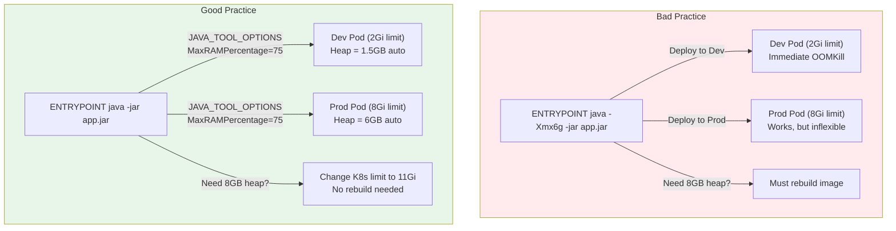
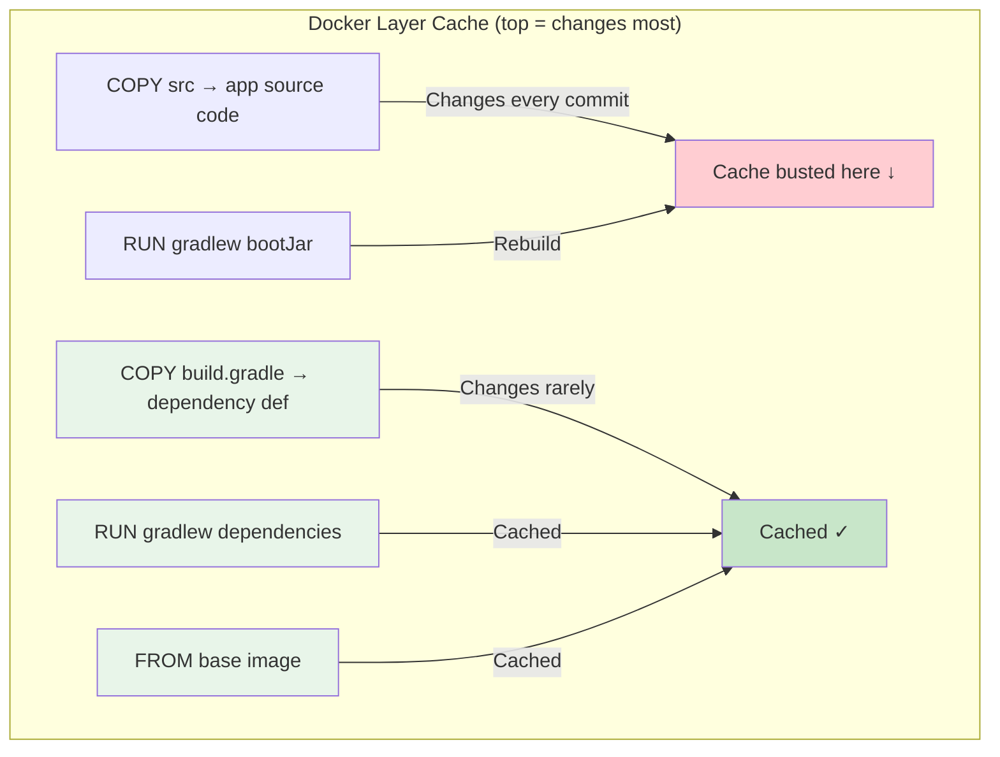

# Dockerfile Best Practices

[< Back to Main Guide](../java-memory-k8s-guide.md)

---

## Principles

1. **Separate build concerns from runtime concerns** — memory tuning belongs in K8s, not the Dockerfile
2. **Minimize image size** — smaller images = faster pulls, smaller attack surface
3. **Run as non-root** — security baseline
4. **Use multi-stage builds** — keep build tools out of the runtime image

---

## Recommended Dockerfile

```dockerfile
# ============================================================
# Build Stage
# ============================================================
FROM eclipse-temurin:21-jdk-alpine AS builder

WORKDIR /app

# Cache dependencies (layer caching optimization)
COPY build.gradle settings.gradle gradlew ./
COPY gradle ./gradle
RUN ./gradlew dependencies --no-daemon || true

# Build the application
COPY src ./src
RUN ./gradlew bootJar --no-daemon -x test

# ============================================================
# Runtime Stage
# ============================================================
FROM eclipse-temurin:21-jre-alpine

WORKDIR /app

# Security: non-root user
RUN addgroup -S appgroup && adduser -S appuser -G appgroup

# Create directories for diagnostics
RUN mkdir -p /tmp/heapdumps && chown appuser:appgroup /tmp/heapdumps

# Copy the built artifact
COPY --from=builder /app/build/libs/*.jar app.jar

# Switch to non-root
USER appuser

# Expose application port
EXPOSE 8080

# Health check (container-level, complementary to K8s probes)
HEALTHCHECK --interval=30s --timeout=10s --retries=3 \
  CMD wget -qO- http://localhost:8080/actuator/health || exit 1

# Entrypoint — do NOT hardcode JVM memory flags here
ENTRYPOINT ["java", "-jar", "app.jar"]
```

### Maven Variant

```dockerfile
FROM eclipse-temurin:21-jdk-alpine AS builder
WORKDIR /app
COPY pom.xml mvnw ./
COPY .mvn ./.mvn
RUN ./mvnw dependency:go-offline -B
COPY src ./src
RUN ./mvnw package -DskipTests -B

FROM eclipse-temurin:21-jre-alpine
WORKDIR /app
RUN addgroup -S appgroup && adduser -S appuser -G appgroup
RUN mkdir -p /tmp/heapdumps && chown appuser:appgroup /tmp/heapdumps
COPY --from=builder /app/target/*.jar app.jar
USER appuser
EXPOSE 8080
ENTRYPOINT ["java", "-jar", "app.jar"]
```

---

## Why NOT to Hardcode Memory in the Dockerfile



**The Dockerfile defines how to run the app. Kubernetes defines how much resource it gets.** These are separate concerns.

---

## Base Image Selection

| Image | Size | Shell | Security | Use Case |
|:------|:-----|:------|:---------|:---------|
| `eclipse-temurin:21-jre-alpine` | ~80 MB | Yes (sh) | Good | **Recommended default** |
| `eclipse-temurin:21-jre` | ~220 MB | Yes (bash) | Good | Need more OS tooling |
| `amazoncorretto:21-alpine` | ~85 MB | Yes (sh) | Good | AWS-optimized |
| `gcr.io/distroless/java21-debian12` | ~90 MB | **No** | Best | Maximum security (no exec into pod) |
| `bellsoft/liberica-openjre-alpine:21` | ~75 MB | Yes (sh) | Good | Smallest footprint |

### Distroless Trade-offs

**Pros:** No shell, no package manager, smallest attack surface, CIS benchmark compliant.

**Cons:**
- Cannot `kubectl exec` for debugging (no shell)
- Cannot run `jcmd` or `jmap` for diagnostics
- Heap dumps require sidecar or pre-configured JVM flags

**Recommendation:** Use Alpine-based for production if you need runtime diagnostics. Use distroless for hardened production where you rely entirely on external observability.

---

## Layer Caching Strategy



**Order files from least-frequently-changed to most-frequently-changed.** This maximizes cache hits and minimizes build times.

---

## Diagnostic Tools in the Image

If using Alpine (not distroless), you get `jcmd`, `jmap`, `jstack` from the JDK. But we're using the JRE. Options:

### Option A: Include JDK tools in a debug layer

```dockerfile
# For images that need runtime diagnostics
FROM eclipse-temurin:21-jdk-alpine AS jdk-tools
FROM eclipse-temurin:21-jre-alpine

# Copy just the diagnostic tools from JDK
COPY --from=jdk-tools /opt/java/openjdk/bin/jcmd /usr/local/bin/
COPY --from=jdk-tools /opt/java/openjdk/bin/jstack /usr/local/bin/
COPY --from=jdk-tools /opt/java/openjdk/bin/jmap /usr/local/bin/
COPY --from=jdk-tools /opt/java/openjdk/lib/libattach.so /opt/java/openjdk/lib/
```

### Option B: Use ephemeral debug containers (preferred)

```bash
# Attach a debug container with full JDK to a running pod
kubectl debug -it <pod> --image=eclipse-temurin:21-jdk-alpine --target=my-spring-app -- jcmd 1 GC.heap_info
```

---

## .dockerignore

Always include a `.dockerignore` to speed up builds and prevent leaking secrets:

```
.git
.gradle
build/
target/
*.md
.env
.env.*
docker-compose*.yml
*.hprof
```

---

## Build Arguments for Flexibility

```dockerfile
ARG JAVA_VERSION=21
FROM eclipse-temurin:${JAVA_VERSION}-jre-alpine

ARG APP_JAR=app.jar
COPY --from=builder /app/build/libs/*.jar ${APP_JAR}
ENTRYPOINT ["java", "-jar", "app.jar"]
```

---

## Security Scanning

Integrate image scanning in CI:

```yaml
# GitHub Actions step
- name: Scan image for vulnerabilities
  uses: aquasecurity/trivy-action@master
  with:
    image-ref: ${{ env.REGISTRY }}/${{ env.IMAGE_NAME }}:${{ github.sha }}
    format: 'sarif'
    output: 'trivy-results.sarif'
    severity: 'CRITICAL,HIGH'
```

---

## Next Steps

- [Kubernetes Resources](kubernetes-resources.md) — How K8s manages the container's memory
- [CI/CD with GitHub Actions](cicd-github-actions.md) — Building and deploying the image
