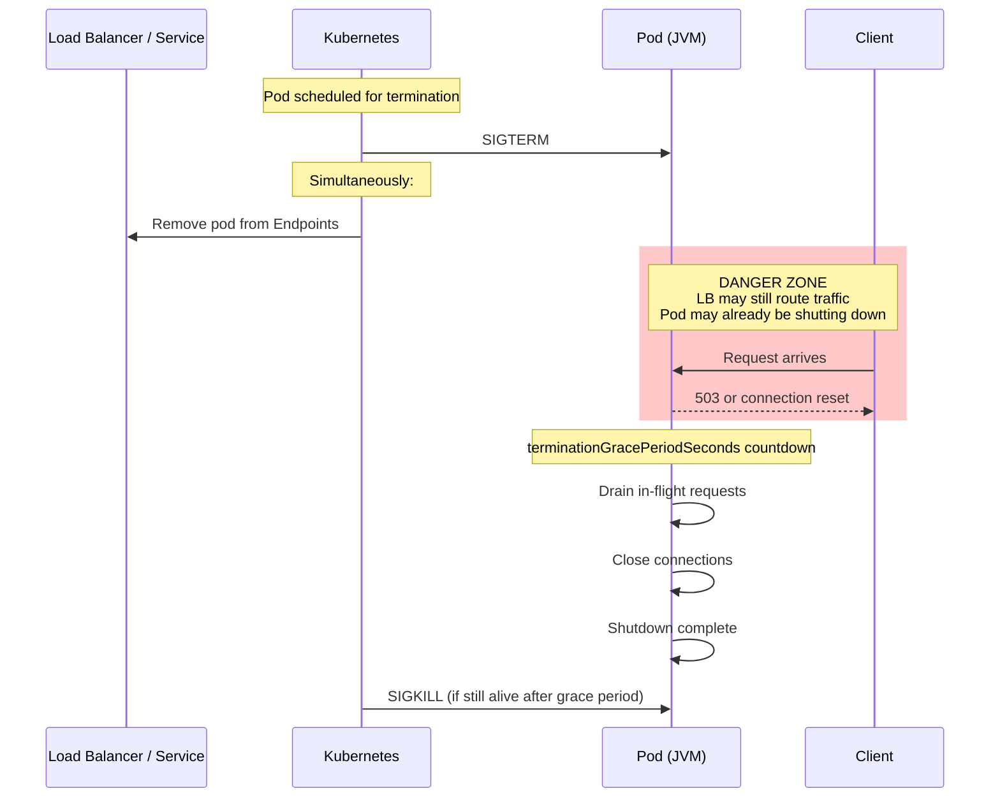
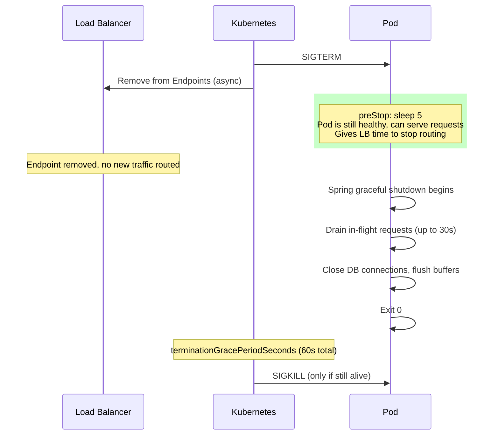
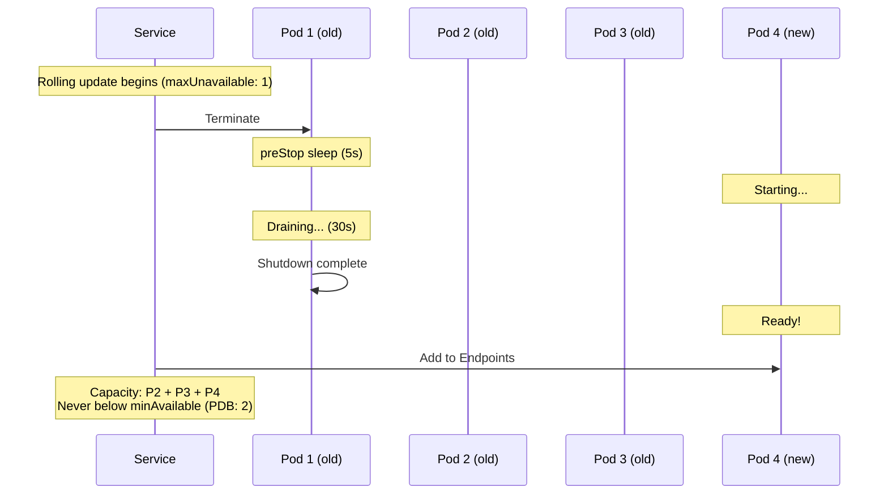

# Graceful Shutdown & Connection Draining

[< Back to Main Guide](../java-memory-k8s-guide.md)

---

## The Problem

When Kubernetes terminates a pod (scaling down, rolling update, node drain), a race condition exists between:
1. The load balancer removing the pod from traffic
2. The pod actually stopping

Without proper configuration, **in-flight requests are dropped** and clients receive 5xx errors.



---

## The Solution: Full Configuration

### Spring Boot Configuration

```yaml
# application.yml
server:
  shutdown: graceful    # Enable graceful shutdown (Spring Boot 2.3+)

spring:
  lifecycle:
    timeout-per-shutdown-phase: 30s    # How long to wait for in-flight requests
```

### Kubernetes Pod Configuration

```yaml
spec:
  terminationGracePeriodSeconds: 60    # Must be > Spring's timeout-per-shutdown-phase
  containers:
    - name: my-spring-app
      lifecycle:
        preStop:
          exec:
            command: ["sh", "-c", "sleep 5"]    # Wait for LB to deregister
```

### Why the `preStop` Sleep?



The Endpoints update is **asynchronous**. Without the `preStop` sleep, the pod starts shutting down while the load balancer is still sending traffic.

---

## Timing Budget

```mermaid
gantt
    title Pod Termination Timeline (60s grace period)
    dateFormat  s
    axisFormat %S

    section Phases
    preStop sleep (LB deregistration)     :a, 0, 5s
    Spring graceful drain                  :b, after a, 30s
    Safety buffer                          :c, after b, 25s
    SIGKILL (if needed)                    :crit, 60, 1s
```



**The math:**
```
terminationGracePeriodSeconds >= preStop sleep
                                + spring.lifecycle.timeout-per-shutdown-phase
                                + safety buffer (10-20s)

60s >= 5s + 30s + 25s ✓
```

If `terminationGracePeriodSeconds` is too short, Kubernetes sends SIGKILL before Spring finishes draining — killing in-flight requests.

---

## What Spring Boot Shuts Down Gracefully

When `server.shutdown=graceful` is set:

| Component | Behavior During Shutdown |
|:----------|:------------------------|
| HTTP server (Tomcat/Netty) | Stops accepting new connections; existing requests complete |
| `@PreDestroy` methods | Execute after requests drain |
| `DisposableBean.destroy()` | Execute after requests drain |
| `SmartLifecycle.stop()` | Execute in phase order |
| Database connection pools (HikariCP) | Close after active queries complete |
| Kafka consumers | Commit offsets, leave consumer group |
| Scheduled tasks (`@Scheduled`) | Current execution completes; no new triggers |
| Spring Cloud Stream bindings | Unbind and flush |

### Custom Shutdown Logic

```java
@Component
public class GracefulShutdownHandler implements SmartLifecycle {

    private volatile boolean running = true;

    @Override
    public void stop(Runnable callback) {
        // Custom cleanup: flush caches, complete async operations, etc.
        log.info("Graceful shutdown: flushing buffers...");
        bufferService.flush();
        running = false;
        callback.run();  // Signal completion
    }

    @Override
    public int getPhase() {
        return Integer.MAX_VALUE;  // Stop last
    }

    @Override
    public boolean isRunning() {
        return running;
    }

    // ... other SmartLifecycle methods
}
```

---

## Readiness Probe Interaction

During shutdown, the readiness probe should **fail immediately** so the Service stops routing new traffic:

```yaml
# Spring Boot handles this automatically when using actuator probes:
readinessProbe:
  httpGet:
    path: /actuator/health/readiness
    port: 8080
```

Spring Boot automatically sets the readiness state to `REFUSING_TRAFFIC` when shutdown begins. This causes the readiness probe to fail, which removes the pod from the Service endpoints — complementing the `preStop` sleep.

---

## Common Mistakes

### Mistake 1: No graceful shutdown configured

```yaml
# BAD: Default is immediate shutdown
server:
  shutdown: immediate    # This is the default!
```

Result: Pod receives SIGTERM → JVM exits → all in-flight requests fail.

### Mistake 2: Grace period too short

```yaml
# BAD: Only 10s total
terminationGracePeriodSeconds: 10

# With preStop sleep of 5s, Spring only gets 5s to drain
# Long-running requests will be killed
```

### Mistake 3: No preStop hook

```yaml
# BAD: No delay for load balancer deregistration
spec:
  containers:
    - name: my-spring-app
      # No lifecycle.preStop
```

Result: SIGTERM sent and Endpoints update happen simultaneously. During the brief window, the LB still routes traffic to a pod that's shutting down.

### Mistake 4: Spring timeout exceeds K8s grace period

```yaml
# BAD: Spring waits 60s but K8s kills at 30s
spring:
  lifecycle:
    timeout-per-shutdown-phase: 60s

# K8s:
terminationGracePeriodSeconds: 30
```

Result: SIGKILL at 30s, overriding Spring's graceful drain.

---

## Verifying Graceful Shutdown

### Test Procedure

```bash
# 1. Start a long-running request
curl -v http://my-spring-app/api/slow-endpoint &

# 2. Trigger pod termination
kubectl delete pod <pod-name> -n my-namespace

# 3. Observe:
# - The curl request should complete successfully (200)
# - No 502/503/connection reset
# - Pod logs show "Graceful shutdown initiated" then "Shutdown complete"
```

### What to Look For in Logs

```bash
kubectl logs <pod-name> -n my-namespace --follow

# Expected sequence:
# INFO: Commencing graceful shutdown. Waiting for active requests to complete
# INFO: Graceful shutdown complete
# INFO: Shutting down ExecutorService 'applicationTaskExecutor'
# INFO: HikariPool - Shutdown initiated
# INFO: HikariPool - Shutdown completed
```

---

## Special Cases

### Long-Running Requests (File Uploads, Reports)

If some endpoints take > 30s:

```yaml
spring:
  lifecycle:
    timeout-per-shutdown-phase: 120s    # Allow up to 2 min for long requests

# K8s must accommodate:
terminationGracePeriodSeconds: 150      # 5s preStop + 120s drain + 25s buffer
```

### WebSocket Connections

WebSocket connections don't drain naturally — they stay open indefinitely. Handle explicitly:

```java
@Component
public class WebSocketShutdownHandler implements SmartLifecycle {
    @Override
    public void stop(Runnable callback) {
        // Send close frame to all connected WebSocket clients
        webSocketSessions.forEach(session -> {
            session.close(CloseStatus.SERVICE_RESTARTED);
        });
        callback.run();
    }
}
```

### Kafka Consumers

Kafka consumer shutdown must commit offsets before exit:

```yaml
spring:
  kafka:
    listener:
      # Ensure offsets are committed during shutdown
      ack-mode: record    # or 'batch' with manual commit
```

---

## Rolling Update Coordination

During a rolling update with 3 replicas:



Ensure your PDB, `maxUnavailable`, and graceful shutdown work together so you never drop below minimum capacity.

---

## Next Steps

- [Kubernetes Resources](kubernetes-resources.md) — Pod spec configuration
- [JVM Warmup](jvm-warmup.md) — The new pod's performance after startup
- [Autoscaling](autoscaling.md) — Scale-down behavior and drain coordination
