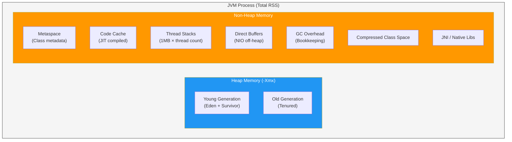
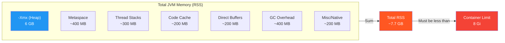

# JVM Memory Model

[< Back to Main Guide](../java-memory-k8s-guide.md)

---

## Overview

The JVM divides memory into distinct regions. Understanding these is critical because **the heap is only part of the picture** — non-heap memory is what typically causes unexpected OOMKills in Kubernetes.



---

## Heap Memory

The heap is where your application objects live. It is managed by the garbage collector.

### Generations


| Region | Purpose | Typical Behavior |
|:-------|:--------|:-----------------|
| **Eden** | Where new objects are allocated | Fills quickly, collected by minor GC |
| **Survivor (S0/S1)** | Objects that survived at least one GC | Copied back and forth between S0/S1 |
| **Old Generation** | Long-lived objects | Collected by major/full GC (expensive) |

### Key Flags

| Flag | Purpose | Example |
|:-----|:--------|:--------|
| `-Xms` | Initial heap size | `-Xms6g` |
| `-Xmx` | Maximum heap size | `-Xmx6g` |
| `-Xmn` | Young generation size | `-Xmn2g` (usually let GC decide) |
| `-XX:NewRatio` | Ratio of old/young | `-XX:NewRatio=2` (old is 2x young) |
| `-XX:SurvivorRatio` | Eden/survivor ratio | `-XX:SurvivorRatio=8` |

> **Best Practice:** Set `-Xms` equal to `-Xmx` in containers. This avoids heap resize pauses and makes memory usage predictable for Kubernetes scheduling.

---

## Non-Heap Memory

This is the memory that catches teams off guard. The JVM uses significant memory outside the heap.

### Breakdown

| Region | Purpose | Typical Size | Control Flag |
|:-------|:--------|:-------------|:-------------|
| **Metaspace** | Class metadata, method bytecode | 100-500 MB (Spring Boot is heavy due to reflection/proxies) | `-XX:MaxMetaspaceSize=512m` |
| **Thread Stacks** | One stack per thread | `1 MB × thread_count` (default) | `-Xss512k` to reduce |
| **Code Cache** | JIT-compiled native code | 48-240 MB | `-XX:ReservedCodeCacheSize=256m` |
| **Direct Buffers** | NIO off-heap buffers | Varies (Netty-heavy apps can use GBs) | `-XX:MaxDirectMemorySize=512m` |
| **GC Overhead** | GC data structures and bookkeeping | 5-10% of heap size | Depends on GC algorithm |
| **Compressed Class Space** | 32-bit pointers for classes | Up to 1 GB | `-XX:CompressedClassSpaceSize=256m` |
| **JNI / Native** | Native libraries (OpenSSL, etc.) | Varies | Not directly capped |

### Thread Stack Sizing

Thread count is often underestimated in Spring Boot apps:

```
Tomcat threads (default):    200
Spring async threads:        variable
GC threads:                  CPU-count based
JIT compiler threads:        1-4
Scheduled tasks:             variable
---
Total could easily be:       250-400 threads

Memory: 300 threads × 1MB = 300MB just for stacks
```

Reducing `-Xss` from 1MB to 512KB for those 300 threads saves **150MB**.

---

## The Critical Formula



```
Total JVM Memory = Heap (-Xmx)           6000 MB
                 + Metaspace               400 MB
                 + Thread Stacks           300 MB
                 + Code Cache              200 MB
                 + Direct Buffers          200 MB
                 + GC Overhead             400 MB
                 + Misc/Native             200 MB
                 ─────────────────────────────────
                 ≈ Total                  7700 MB
```

**Rule of thumb: Container limit = Heap / 0.75**

---

## Verifying Memory Usage

### From Inside the Container

```bash
# Full native memory breakdown (requires -XX:NativeMemoryTracking=summary)
jcmd 1 VM.native_memory summary

# Just heap info
jcmd 1 GC.heap_info

# All JVM flags (see actual computed values)
jcmd 1 VM.flags
```

### Example NMT Output

```
Total: reserved=8456MB, committed=7823MB

-                 Java Heap (reserved=6144MB, committed=6144MB)
-                     Class (reserved=512MB, committed=387MB)
-                    Thread (reserved=312MB, committed=312MB)
-                      Code (reserved=256MB, committed=198MB)
-                        GC (reserved=423MB, committed=423MB)
-                  Internal (reserved=45MB, committed=45MB)
-                    Symbol (reserved=12MB, committed=12MB)
-    Native Memory Tracking (reserved=8MB, committed=8MB)
-                     Other (reserved=744MB, committed=294MB)
```

---

## Common Memory Issues

| Symptom | Likely Cause | Investigation |
|:--------|:-------------|:--------------|
| Heap steadily grows, never shrinks | Memory leak (unreleased references) | Heap dump + Eclipse MAT analysis |
| Metaspace grows continuously | Classloader leak (common with hot-reload) | Monitor `jvm_classes_loaded_classes` |
| RSS exceeds heap + expected overhead | Direct buffer leak or native memory leak | NMT diff over time |
| Frequent full GC | Heap too small or too many long-lived objects | GC logs analysis |
| OOMKilled with low heap usage | Non-heap memory exceeded container margin | Enable NMT, check thread count |

---

## Next Steps

- [Container-Aware JVM Configuration](container-configuration.md) — How to configure these flags for containers
- [Monitoring & Metrics](monitoring-metrics.md) — How to observe these memory regions in production
- [Troubleshooting](troubleshooting.md) — Decision tree for diagnosing memory issues
