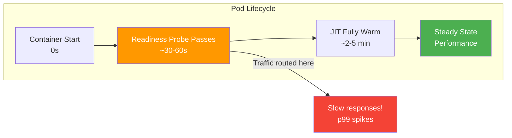
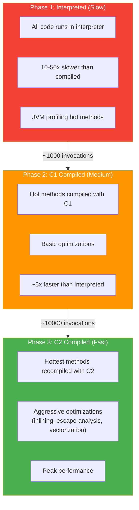
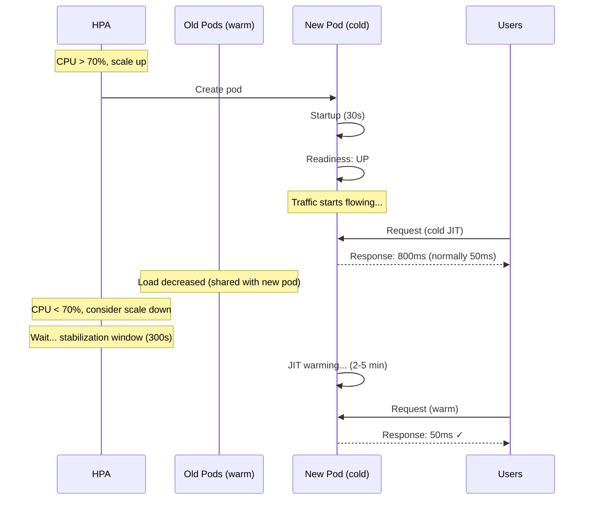

# JVM Warmup

[< Back to Main Guide](../java-memory-k8s-guide.md)

---

## The Problem

A freshly started JVM pod passes its readiness probe but performs **2-10x slower** than a warmed-up pod. This creates a latency spike after every deployment, scale-up event, or pod restart.



---

## Why Warmup Matters

### JIT Compilation Phases



### What Gets Compiled

| Component | Warmup Needed | Time to Warm |
|:----------|:-------------|:-------------|
| Spring Framework internals | High (reflection-heavy) | 1-2 min |
| Jackson serialization/deserialization | High | 1-2 min |
| Database driver / connection pool | Medium | 30-60s |
| Your business logic | Depends on complexity | 1-3 min |
| Regular expressions | High (if complex patterns) | 30s |
| Logging framework | Low | 10-20s |

---

## Measuring Warmup Impact

### Before/After Comparison

```bash
# Deploy fresh pods, then immediately check p99:
kubectl port-forward svc/my-spring-app 8080:8080 -n my-namespace &

# First request (cold):
time curl http://localhost:8080/api/resource/1
# Typical: 500ms - 2s

# After 5 minutes of traffic (warm):
time curl http://localhost:8080/api/resource/1
# Typical: 10-50ms
```

### Prometheus Queries

```promql
# p99 latency by pod (watch new pods vs old pods)
histogram_quantile(0.99,
  rate(http_server_requests_seconds_bucket{application="my-spring-app"}[1m])
) by (pod)

# Compare latency before and after deployment
# Look for spike in the first 2-5 minutes after new pods appear
```

---

## Warmup Strategies

### Strategy 1: Startup Warmup Script (Recommended)

Run synthetic requests against the pod **before** it passes readiness:

```java
@Component
public class WarmupRunner implements ApplicationRunner {

    private final RestTemplate selfClient;
    private final Logger log = LoggerFactory.getLogger(WarmupRunner.class);

    public WarmupRunner(RestTemplate selfClient) {
        this.selfClient = selfClient;
    }

    @Override
    public void run(ApplicationArguments args) {
        log.info("Starting JVM warmup...");

        // Hit key endpoints to trigger JIT compilation
        List<String> warmupPaths = List.of(
            "/api/resource/1",
            "/api/resource/search?q=test",
            "/api/health-check-deep"
        );

        for (int i = 0; i < 100; i++) {  // 100 iterations per endpoint
            for (String path : warmupPaths) {
                try {
                    selfClient.getForEntity("http://localhost:8080" + path, String.class);
                } catch (Exception e) {
                    // Ignore errors during warmup — data may not exist
                }
            }
        }

        log.info("JVM warmup complete. {} endpoints warmed with 100 iterations each.",
            warmupPaths.size());
    }
}
```

**Critical:** This runs **before** the readiness probe passes (if the readiness endpoint is separate from the warmed endpoints). The pod doesn't receive real traffic until warm.

### Strategy 2: Readiness Gate with Warmup Check

Create a custom readiness indicator that only becomes ready after warmup:

```java
@Component
public class WarmupHealthIndicator implements HealthIndicator {

    private volatile boolean warmedUp = false;

    @Override
    public Health health() {
        if (warmedUp) {
            return Health.up().build();
        }
        return Health.down().withDetail("reason", "JVM warmup in progress").build();
    }

    public void markWarmedUp() {
        this.warmedUp = true;
    }
}
```

```yaml
# Include warmup indicator in readiness group
management:
  endpoint:
    health:
      group:
        readiness:
          include: readinessState, warmup    # Custom warmup indicator
```

### Strategy 3: Kubernetes `minReadySeconds`

Delay traffic to new pods for a fixed period after readiness:

```yaml
spec:
  minReadySeconds: 120    # Pod must be Ready for 2 min before receiving traffic
```

**Trade-off:** Simple but blunt — delays ALL new pods even if they warm up faster. Also delays rolling updates.

### Strategy 4: Gradual Traffic Shift (Istio/Service Mesh)

If using a service mesh, gradually increase traffic to new pods:

```yaml
# Istio VirtualService — canary-style warmup
apiVersion: networking.istio.io/v1beta1
kind: VirtualService
metadata:
  name: my-spring-app
spec:
  http:
    - route:
        - destination:
            host: my-spring-app
            subset: stable
          weight: 90
        - destination:
            host: my-spring-app
            subset: canary    # New pods get 10% initially
          weight: 10
```

### Strategy 5: Class Data Sharing (CDS/AppCDS)

Pre-load and pre-link classes at build time to reduce startup + warmup:

```dockerfile
# Build stage: create class list and archive
FROM eclipse-temurin:21-jdk-alpine AS builder
COPY app.jar /app/app.jar
RUN java -XX:DumpLoadedClassList=/app/classes.lst -jar /app/app.jar --spring.main.lazy-initialization=true &\
    sleep 30 && kill $!
RUN java -Xshare:dump -XX:SharedClassListFile=/app/classes.lst -XX:SharedArchiveFile=/app/app-cds.jsa -jar /app/app.jar

# Runtime stage: use the archive
FROM eclipse-temurin:21-jre-alpine
COPY --from=builder /app/app.jar /app/app.jar
COPY --from=builder /app/app-cds.jsa /app/app-cds.jsa
ENTRYPOINT ["java", "-XX:SharedArchiveFile=/app/app-cds.jsa", "-jar", "/app/app.jar"]
```

**Impact:** Reduces startup by 20-40% and partially warms metaspace/code cache.

---

## JIT Compiler Tuning for Faster Warmup

```bash
# More aggressive compilation at startup (use more CPU for faster warmup)
-XX:+TieredCompilation                 # Default, keep it
-XX:CompileThreshold=1000              # Compile sooner (default varies)
-XX:Tier3CompileThreshold=500          # C1 compile faster
-XX:Tier4CompileThreshold=5000         # C2 compile sooner (default 15000)

# Give compiler more threads during startup
-XX:CICompilerCount=4                  # More compiler threads

# Trade-off: uses more CPU during startup but warms faster
```

**Important:** These require sufficient CPU. If your pod has `cpu.limits=1`, the compiler threads compete with application threads, making startup SLOWER. Ensure generous CPU during startup:

```yaml
resources:
  requests:
    cpu: "2000m"      # Ensure enough for JIT compilation
  limits:
    cpu: "4000m"      # Allow burst for warmup
    # Or omit CPU limit entirely
```

---

## Warmup and Autoscaling Interaction



### Problem: HPA Oscillation

1. Load increases → HPA scales up
2. New pods are cold → they're slow → they consume MORE CPU (interpreted code uses more CPU)
3. HPA sees even higher CPU → scales up MORE
4. Eventually pods warm up → CPU drops → HPA scales down aggressively
5. Remaining pods overloaded → cycle repeats

### Fix: Conservative HPA Behavior

```yaml
behavior:
  scaleUp:
    stabilizationWindowSeconds: 120     # Wait 2min before scaling up (time to warm)
    policies:
      - type: Pods
        value: 2
        periodSeconds: 120              # Max 2 pods per 2 minutes
  scaleDown:
    stabilizationWindowSeconds: 600     # Wait 10min before scaling down
    policies:
      - type: Pods
        value: 1
        periodSeconds: 180              # Remove 1 pod per 3 minutes
```

---

## Measuring JIT Status

```bash
# Check compilation status
kubectl exec <pod> -n my-namespace -- jcmd 1 Compiler.queue
# If queue is empty, JIT is caught up

# Check how many methods have been compiled
kubectl exec <pod> -n my-namespace -- jcmd 1 Compiler.codecache
# Look at "full_count" — should be 0 (code cache not full)

# Print compiled methods (verbose, use sparingly)
# Add to JAVA_TOOL_OPTIONS: -XX:+PrintCompilation
kubectl logs <pod> -n my-namespace | grep "%" | tail -20
```

---

## Warmup Checklist for Deployments

- [ ] Warmup script runs critical code paths before readiness probe passes
- [ ] Startup probe allows enough time for warmup (failureThreshold × periodSeconds)
- [ ] CPU requests are sufficient for JIT compilation (>= 2 cores)
- [ ] HPA `stabilizationWindowSeconds` accounts for warmup period
- [ ] `minReadySeconds` or mesh traffic shaping prevents cold-pod latency spikes
- [ ] Monitoring tracks per-pod latency to detect cold-start impact
- [ ] AppCDS configured for faster class loading (optional but helpful)
- [ ] Post-deployment latency validated against baseline

---

## Impact on Memory

Warmup is primarily a CPU/latency concern, but it has memory implications:

| Phase | Memory Impact |
|:------|:-------------|
| Interpreter phase | Low heap allocation rate (slow throughput) |
| C1 compilation | Code cache grows; metaspace loads more classes |
| C2 compilation | Code cache peaks; temporary compilation buffers on heap |
| Steady state | Code cache stable; GC patterns established |

**Warmup and memory sizing:** If you size memory based on steady-state metrics, be aware that the JIT compilation phase temporarily uses additional memory for code cache and compiler buffers. This is usually small (50-100MB) but can matter if you're tight on the container limit.

---

## Next Steps

- [Graceful Shutdown](graceful-shutdown.md) — The other end of the pod lifecycle
- [Autoscaling](autoscaling.md) — Configuring HPA to work with warmup
- [Container Configuration](container-configuration.md) — CPU allocation for JIT
