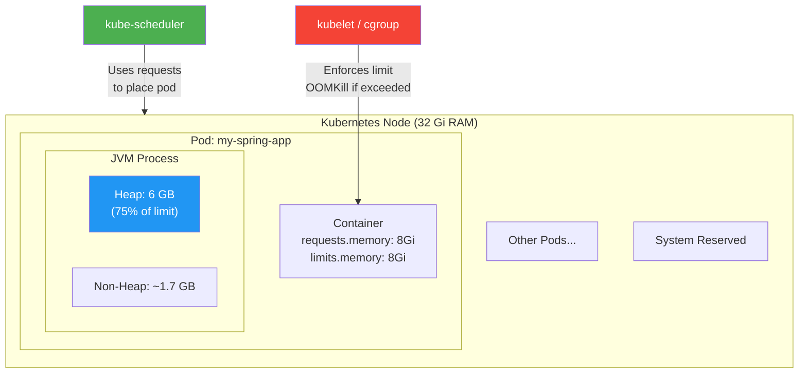
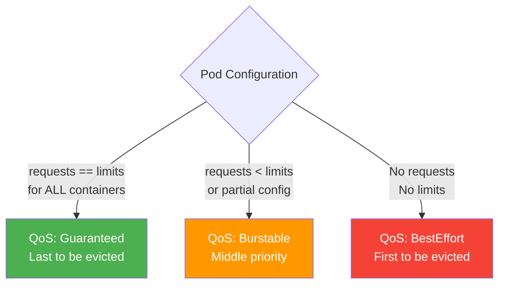
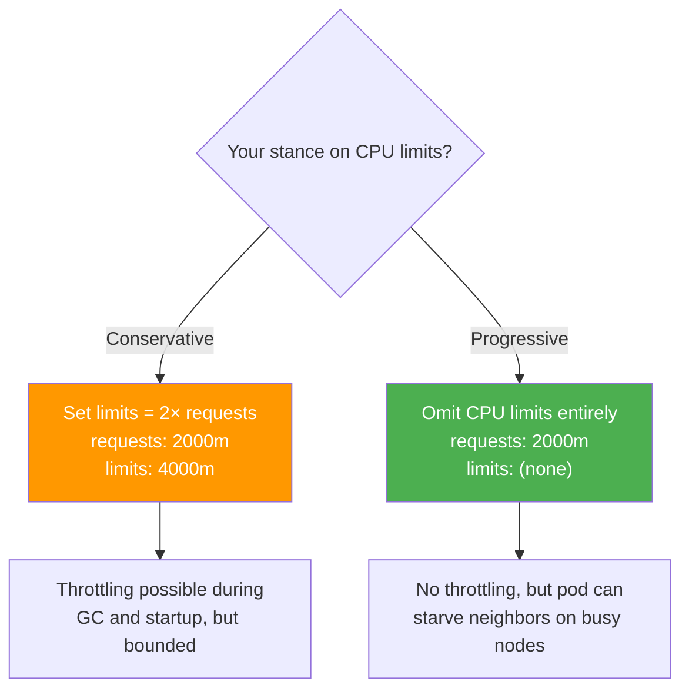
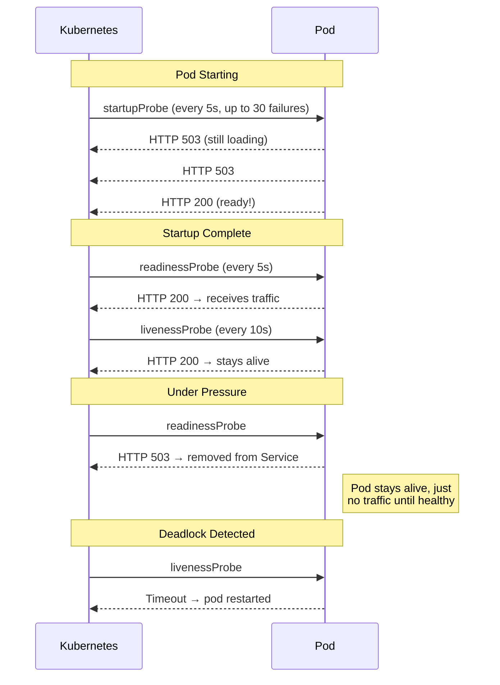

# Kubernetes Resource Configuration

[< Back to Main Guide](../java-memory-k8s-guide.md)

---

## Resource Model Overview



---

## Requests vs Limits: What They Mean

| Resource | `requests` | `limits` |
|:---------|:-----------|:---------|
| **Memory** | Guaranteed allocation; scheduler uses this to place pods | Maximum allowed; exceeding triggers OOMKill |
| **CPU** | Guaranteed baseline; scheduler uses this | Maximum allowed; exceeding triggers **throttling** (not kill) |

### The Golden Rule for Java

> **Always set `requests.memory == limits.memory` for Java containers.**

Reasons:
1. Guarantees QoS class = **Guaranteed** (last to be evicted under node pressure)
2. The JVM allocates heap upfront and never voluntarily releases it — `Burstable` provides no benefit
3. Prevents the confusing scenario where a pod uses more than `requests` but less than `limits`, making it an eviction candidate

---

## Complete Deployment Manifest

```yaml
apiVersion: apps/v1
kind: Deployment
metadata:
  name: my-spring-app
  namespace: my-namespace
  labels:
    app: my-spring-app
    version: v1
spec:
  replicas: 3
  strategy:
    type: RollingUpdate
    rollingUpdate:
      maxUnavailable: 1
      maxSurge: 1
  selector:
    matchLabels:
      app: my-spring-app
  template:
    metadata:
      labels:
        app: my-spring-app
        version: v1
      annotations:
        prometheus.io/scrape: "true"
        prometheus.io/port: "8080"
        prometheus.io/path: "/actuator/prometheus"
    spec:
      terminationGracePeriodSeconds: 60
      containers:
        - name: my-spring-app
          image: registry.example.com/my-spring-app:1.2.3
          ports:
            - containerPort: 8080
              name: http

          env:
            - name: JAVA_TOOL_OPTIONS
              value: >-
                -XX:MaxRAMPercentage=75.0
                -XX:InitialRAMPercentage=75.0
                -XX:+UseG1GC
                -XX:MaxMetaspaceSize=512m
                -Xss512k
                -XX:+HeapDumpOnOutOfMemoryError
                -XX:HeapDumpPath=/tmp/heapdump.hprof
                -XX:+ExitOnOutOfMemoryError
                -Xlog:gc*:file=/tmp/gc.log:time,uptime,level,tags:filecount=5,filesize=10m
            - name: SPRING_PROFILES_ACTIVE
              value: "production"

          resources:
            requests:
              memory: "8Gi"
              cpu: "2000m"
            limits:
              memory: "8Gi"
              cpu: "4000m"    # See CPU section below

          startupProbe:
            httpGet:
              path: /actuator/health/liveness
              port: 8080
            initialDelaySeconds: 10
            periodSeconds: 5
            failureThreshold: 30  # Allows up to 160s startup

          livenessProbe:
            httpGet:
              path: /actuator/health/liveness
              port: 8080
            periodSeconds: 10
            failureThreshold: 3

          readinessProbe:
            httpGet:
              path: /actuator/health/readiness
              port: 8080
            periodSeconds: 5
            failureThreshold: 3

          volumeMounts:
            - name: tmp-volume
              mountPath: /tmp

      volumes:
        - name: tmp-volume
          emptyDir:
            sizeLimit: 10Gi   # For heap dumps and GC logs
```

---

## QoS Classes



**For production Java apps: always target Guaranteed.**

Check a pod's QoS class:
```bash
kubectl get pod <pod-name> -n my-namespace -o jsonpath='{.status.qosClass}'
```

---

## CPU Configuration for Java

### The CPU Throttling Problem

Kubernetes enforces CPU limits using CFS (Completely Fair Scheduler) bandwidth control. This causes **throttling**, not killing — but for Java, throttling is particularly harmful:

- **GC pauses lengthen** — GC threads are throttled mid-collection
- **JIT compilation stalls** — code runs interpreted (slower) longer
- **Startup time increases** — heavily CPU-bound during warmup

### Recommendations



Many organizations (Google, Shopify, etc.) recommend **not setting CPU limits** for latency-sensitive services, only CPU requests.

If you must set limits:
```yaml
resources:
  requests:
    cpu: "2000m"    # 2 cores guaranteed
  limits:
    cpu: "4000m"    # Allow burst to 4 cores (GC, JIT, startup)
```

### Detecting CPU Throttling

```bash
# Check throttling metrics via Prometheus
container_cpu_cfs_throttled_periods_total / container_cpu_cfs_periods_total

# Or directly from the pod's cgroup
kubectl exec <pod> -- cat /sys/fs/cgroup/cpu/cpu.stat
```

---

## Probes for Spring Boot

### Why Three Probes?



### Spring Boot Actuator Probe Configuration

```yaml
# application.yml
management:
  endpoint:
    health:
      probes:
        enabled: true   # Exposes /actuator/health/liveness and /readiness
      group:
        liveness:
          include: livenessState
        readiness:
          include: readinessState, db, redis  # Add dependencies here
```

---

## Namespace Resource Quotas

Rancher/K8s may have quotas that limit total namespace resources:

```bash
# Check existing quotas
kubectl describe resourcequota -n my-namespace

# Check LimitRange (may silently modify your pod's resources)
kubectl describe limitrange -n my-namespace
```

If a quota blocks your increase, you'll need a Rancher admin to raise it:

```yaml
apiVersion: v1
kind: ResourceQuota
metadata:
  name: my-namespace-quota
  namespace: my-namespace
spec:
  hard:
    requests.memory: "64Gi"    # Total for all pods in namespace
    limits.memory: "64Gi"
    requests.cpu: "16"
    limits.cpu: "32"
```

---

## Useful kubectl Commands

```bash
# Current resource usage vs limits
kubectl top pods -n my-namespace --containers

# Detailed pod status including QoS class, restart count, OOMKill reason
kubectl describe pod <pod-name> -n my-namespace

# Check for OOMKilled events in the namespace
kubectl get events -n my-namespace --field-selector reason=OOMKilling --sort-by='.lastTimestamp'

# Pod resource summary across the namespace
kubectl get pods -n my-namespace -o custom-columns=\
NAME:.metadata.name,\
MEM_REQ:.spec.containers[0].resources.requests.memory,\
MEM_LIM:.spec.containers[0].resources.limits.memory,\
CPU_REQ:.spec.containers[0].resources.requests.cpu,\
CPU_LIM:.spec.containers[0].resources.limits.cpu

# Node capacity and allocation
kubectl get nodes -o custom-columns=\
NAME:.metadata.name,\
ALLOCATABLE_MEM:.status.allocatable.memory,\
ALLOCATABLE_CPU:.status.allocatable.cpu

# Check node pressure conditions
kubectl describe nodes | grep -A 5 "Conditions"

# Verify the JVM started with correct flags
kubectl logs <pod-name> -n my-namespace | grep "Picked up JAVA_TOOL_OPTIONS"

# Check pod restart history and reasons
kubectl get pod <pod-name> -n my-namespace -o jsonpath='{.status.containerStatuses[0].lastState}'
```

---

## Pod Disruption Budget

Always pair deployments with a PDB to prevent all pods from being evicted during node maintenance:

```yaml
apiVersion: policy/v1
kind: PodDisruptionBudget
metadata:
  name: my-spring-app-pdb
  namespace: my-namespace
spec:
  minAvailable: 2
  selector:
    matchLabels:
      app: my-spring-app
```

---

## Next Steps

- [Autoscaling](autoscaling.md) — Scaling pods horizontally and vertically
- [Monitoring & Metrics](monitoring-metrics.md) — Observing resource usage
- [Troubleshooting](troubleshooting.md) — When things go wrong
