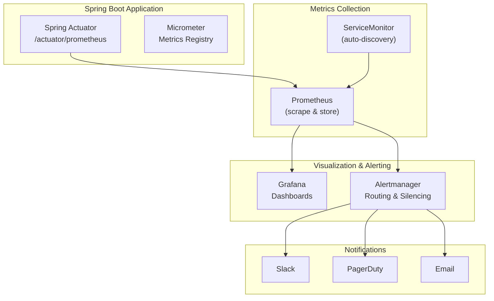
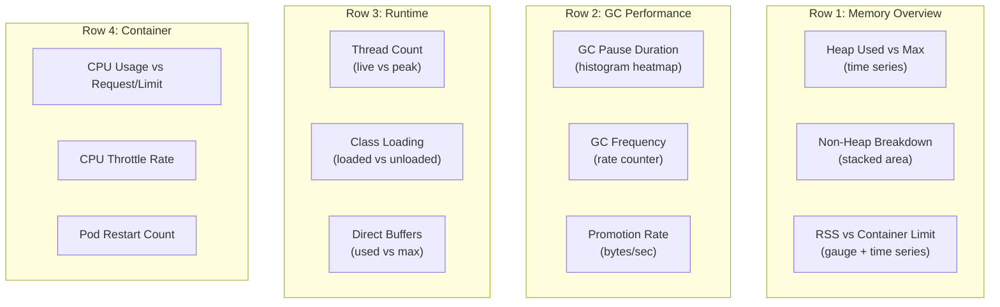
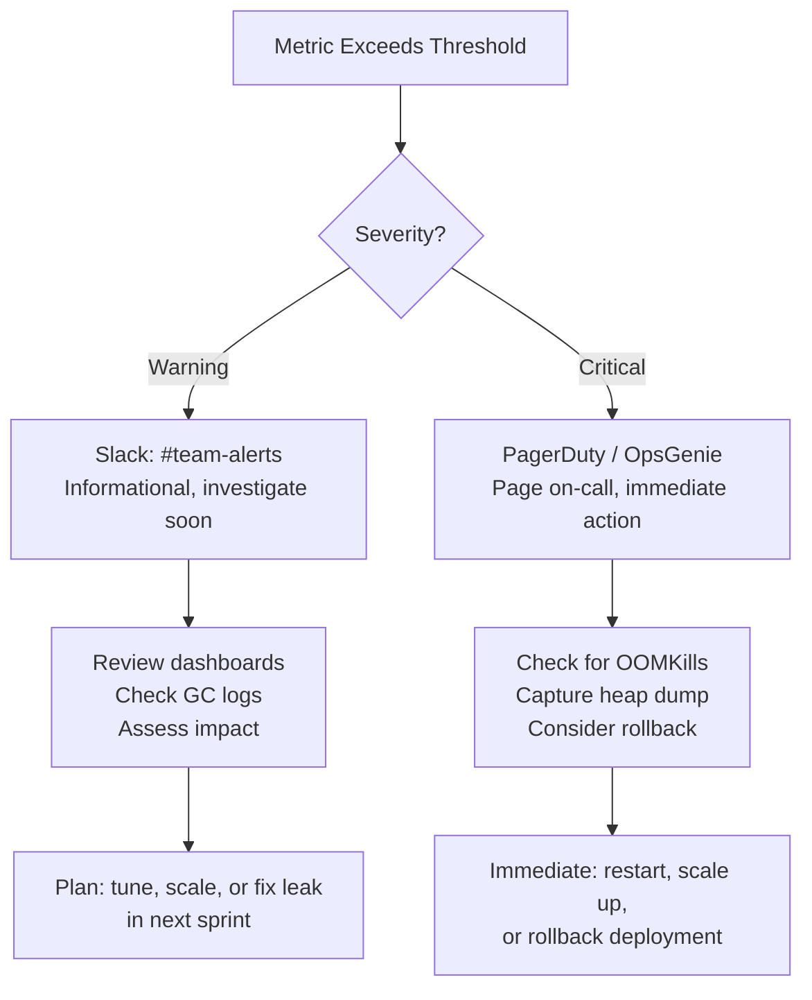

# Monitoring, Metrics & Observability

[< Back to Main Guide](../java-memory-k8s-guide.md)

---

## Observability Stack



---

## Spring Boot Actuator Setup

### Dependencies

**Gradle:**
```gradle
implementation 'org.springframework.boot:spring-boot-starter-actuator'
implementation 'io.micrometer:micrometer-registry-prometheus'
```

**Maven:**
```xml
<dependency>
    <groupId>org.springframework.boot</groupId>
    <artifactId>spring-boot-starter-actuator</artifactId>
</dependency>
<dependency>
    <groupId>io.micrometer</groupId>
    <artifactId>micrometer-registry-prometheus</artifactId>
</dependency>
```

### Application Configuration

```yaml
# application.yml (or application-production.yml)
management:
  endpoints:
    web:
      exposure:
        include: health,info,metrics,prometheus
  endpoint:
    health:
      show-details: always
      probes:
        enabled: true
      group:
        liveness:
          include: livenessState
        readiness:
          include: readinessState, db, redis
  metrics:
    tags:
      application: my-spring-app
      environment: ${SPRING_PROFILES_ACTIVE:default}
    distribution:
      percentiles-histogram:
        http.server.requests: true
      slo:
        http.server.requests: 50ms, 100ms, 200ms, 500ms, 1s, 5s
```

### Prometheus ServiceMonitor (for auto-discovery)

```yaml
apiVersion: monitoring.coreos.com/v1
kind: ServiceMonitor
metadata:
  name: my-spring-app
  namespace: my-namespace
  labels:
    release: prometheus   # Must match your Prometheus operator selector
spec:
  selector:
    matchLabels:
      app: my-spring-app
  endpoints:
    - port: http
      path: /actuator/prometheus
      interval: 15s
```

---

## Key Metrics to Monitor

### JVM Memory Metrics

| Metric | What It Tells You | Alert When |
|:-------|:------------------|:-----------|
| `jvm_memory_used_bytes{area="heap"}` | Current heap usage | > 85% of max for 5min |
| `jvm_memory_max_bytes{area="heap"}` | Configured max heap | Should match your -Xmx |
| `jvm_memory_committed_bytes{area="heap"}` | Heap currently allocated to JVM | Should equal max (if -Xms == -Xmx) |
| `jvm_memory_used_bytes{area="nonheap"}` | Metaspace + code cache etc. | Trending upward (leak) |
| `jvm_buffer_memory_used_bytes{id="direct"}` | NIO direct buffer usage | Approaching MaxDirectMemorySize |
| `jvm_buffer_memory_used_bytes{id="mapped"}` | Memory-mapped file buffers | Unexpected growth |
| `process_resident_memory_bytes` | RSS — what K8s/kernel sees | Approaching container limit |

### GC Metrics

| Metric | What It Tells You | Alert When |
|:-------|:------------------|:-----------|
| `jvm_gc_pause_seconds_sum` | Total time in GC | > 500ms per minute |
| `jvm_gc_pause_seconds_max` | Longest pause in window | > 1 second |
| `jvm_gc_pause_seconds_count` | GC event count | Sustained high frequency |
| `jvm_gc_memory_promoted_bytes_total` | Rate of old gen promotion | Rapid increase |
| `jvm_gc_memory_allocated_bytes_total` | Allocation rate | For capacity planning |

### Application Metrics

| Metric | What It Tells You | Alert When |
|:-------|:------------------|:-----------|
| `http_server_requests_seconds_count` | Request rate | Sudden drops (incident) |
| `http_server_requests_seconds_sum` | Total request time | For calculating averages |
| `http_server_requests_seconds_bucket` | Latency histogram | p99 > SLO threshold |
| `jvm_threads_live_threads` | Active thread count | Unexpected spikes |
| `jvm_threads_peak_threads` | Peak threads | For sizing -Xss |
| `jvm_classes_loaded_classes` | Loaded class count | Monotonically increasing (leak) |

### Container-Level Metrics (from cAdvisor/kubelet)

| Metric | What It Tells You | Alert When |
|:-------|:------------------|:-----------|
| `container_memory_working_set_bytes` | RSS that K8s considers for OOM | > 90% of limit |
| `container_memory_usage_bytes` | Total including cache | Less useful for OOMKill |
| `container_cpu_usage_seconds_total` | CPU consumed | For HPA and capacity |
| `container_cpu_cfs_throttled_seconds_total` | Time CPU-throttled | Any sustained throttling |
| `kube_pod_container_status_restarts_total` | Pod restart count | Any increase |

---

## Prometheus Alert Rules

```yaml
groups:
  - name: java-memory-alerts
    rules:
      # Heap approaching capacity
      - alert: JavaHeapHighUsage
        expr: |
          jvm_memory_used_bytes{area="heap", application="my-spring-app"}
          / jvm_memory_max_bytes{area="heap", application="my-spring-app"}
          > 0.85
        for: 5m
        labels:
          severity: warning
        annotations:
          summary: "Heap usage above 85% for {{ $labels.pod }}"
          description: "Pod {{ $labels.pod }} heap at {{ $value | humanizePercentage }}"
          runbook_url: "https://wiki.example.com/runbooks/java-heap-high"

      # Heap critical
      - alert: JavaHeapCritical
        expr: |
          jvm_memory_used_bytes{area="heap", application="my-spring-app"}
          / jvm_memory_max_bytes{area="heap", application="my-spring-app"}
          > 0.95
        for: 2m
        labels:
          severity: critical
        annotations:
          summary: "Heap usage CRITICAL (>95%) for {{ $labels.pod }}"

      # GC taking too much time
      - alert: JavaGCHighPauseTime
        expr: |
          rate(jvm_gc_pause_seconds_sum{application="my-spring-app"}[5m])
          > 0.5
        for: 5m
        labels:
          severity: warning
        annotations:
          summary: "GC consuming >50% of time for {{ $labels.pod }}"

      # Container approaching OOMKill
      - alert: ContainerOOMRisk
        expr: |
          container_memory_working_set_bytes{container="my-spring-app"}
          / container_spec_memory_limit_bytes{container="my-spring-app"}
          > 0.90
        for: 5m
        labels:
          severity: critical
        annotations:
          summary: "Container RSS at 90% of limit — OOMKill imminent for {{ $labels.pod }}"

      # Pod restarting (likely OOMKill or crash loop)
      - alert: PodRestarting
        expr: |
          increase(kube_pod_container_status_restarts_total{container="my-spring-app"}[1h]) > 2
        labels:
          severity: warning
        annotations:
          summary: "Pod {{ $labels.pod }} has restarted {{ $value }} times in the last hour"

      # Non-heap memory growing (possible metaspace/classloader leak)
      - alert: NonHeapMemoryGrowing
        expr: |
          deriv(jvm_memory_used_bytes{area="nonheap", application="my-spring-app"}[1h]) > 10000
        for: 30m
        labels:
          severity: warning
        annotations:
          summary: "Non-heap memory growing steadily for {{ $labels.pod }}"

      # CPU throttling
      - alert: CPUThrottling
        expr: |
          rate(container_cpu_cfs_throttled_seconds_total{container="my-spring-app"}[5m])
          / rate(container_cpu_usage_seconds_total{container="my-spring-app"}[5m])
          > 0.25
        for: 10m
        labels:
          severity: warning
        annotations:
          summary: "{{ $labels.pod }} is being CPU throttled >25% of the time"
```

---

## Grafana Dashboard

### Recommended Panels



### Key PromQL Queries for Dashboard

```promql
# Heap usage percentage
jvm_memory_used_bytes{area="heap", application="my-spring-app"}
/ jvm_memory_max_bytes{area="heap", application="my-spring-app"}

# GC pause rate (seconds of GC per second)
rate(jvm_gc_pause_seconds_sum{application="my-spring-app"}[5m])

# Request rate
rate(http_server_requests_seconds_count{application="my-spring-app"}[1m])

# p99 latency
histogram_quantile(0.99, rate(http_server_requests_seconds_bucket{application="my-spring-app"}[5m]))

# RSS headroom (how close to OOMKill)
1 - (
  container_memory_working_set_bytes{container="my-spring-app"}
  / container_spec_memory_limit_bytes{container="my-spring-app"}
)

# CPU throttle percentage
rate(container_cpu_cfs_throttled_periods_total{container="my-spring-app"}[5m])
/ rate(container_cpu_cfs_periods_total{container="my-spring-app"}[5m])
```

---

## Runtime Diagnostic Commands

### From kubectl

```bash
# Verify JVM flags in use
kubectl exec -it <pod> -n my-namespace -- jcmd 1 VM.flags

# Heap info
kubectl exec -it <pod> -n my-namespace -- jcmd 1 GC.heap_info

# Native memory tracking (requires -XX:NativeMemoryTracking=summary)
kubectl exec -it <pod> -n my-namespace -- jcmd 1 VM.native_memory summary

# Native memory diff (run baseline first, then diff later)
kubectl exec -it <pod> -n my-namespace -- jcmd 1 VM.native_memory baseline
# Wait 10 minutes...
kubectl exec -it <pod> -n my-namespace -- jcmd 1 VM.native_memory summary.diff

# Thread dump
kubectl exec -it <pod> -n my-namespace -- jcmd 1 Thread.print

# Top memory-consuming classes
kubectl exec -it <pod> -n my-namespace -- jcmd 1 GC.class_histogram | head -30

# Heap dump (for offline analysis)
kubectl exec -it <pod> -n my-namespace -- jcmd 1 GC.heap_dump /tmp/heapdump.hprof
kubectl cp my-namespace/<pod>:/tmp/heapdump.hprof ./heapdump.hprof

# Java Flight Recorder (low overhead profiling)
kubectl exec -it <pod> -n my-namespace -- jcmd 1 JFR.start duration=60s filename=/tmp/recording.jfr
# After 60s:
kubectl cp my-namespace/<pod>:/tmp/recording.jfr ./recording.jfr
# Analyze with JDK Mission Control (jmc)
```

### Via Actuator Endpoints

```bash
# Port-forward to access actuator locally
kubectl port-forward svc/my-spring-app 8080:8080 -n my-namespace

# Then query metrics:
curl -s http://localhost:8080/actuator/metrics/jvm.memory.used | jq
curl -s http://localhost:8080/actuator/metrics/jvm.gc.pause | jq
curl -s http://localhost:8080/actuator/metrics/jvm.threads.live | jq
curl -s http://localhost:8080/actuator/metrics/process.memory.rss | jq

# Full Prometheus scrape format
curl -s http://localhost:8080/actuator/prometheus | grep jvm_memory
```

---

## Alerting Strategy



---

## Next Steps

- [Capacity Planning](capacity-planning.md) — Load testing to establish baselines
- [Troubleshooting](troubleshooting.md) — When alerts fire, what to do
- [CI/CD](cicd-github-actions.md) — Automating deployments with validation
