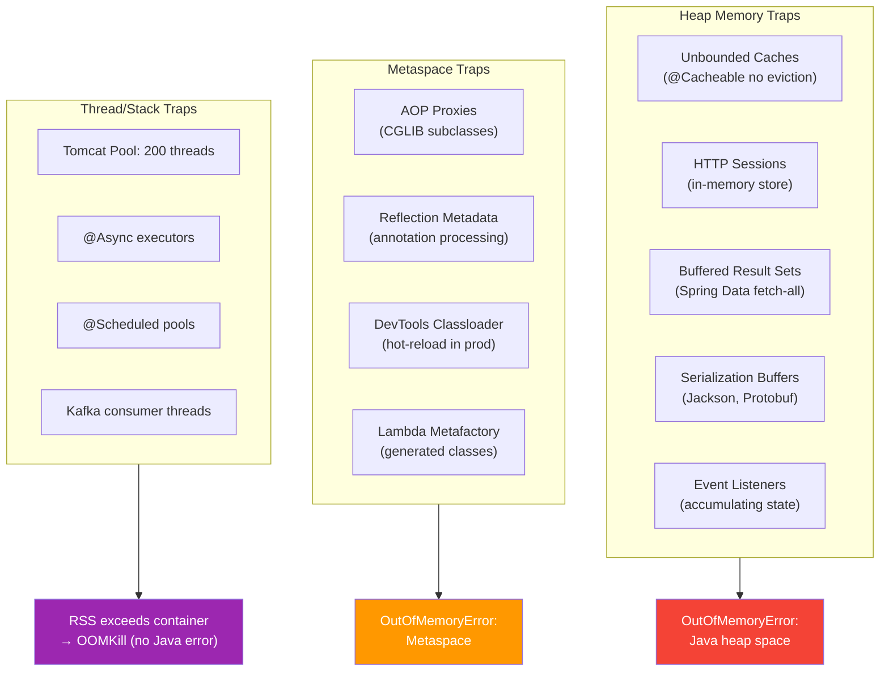
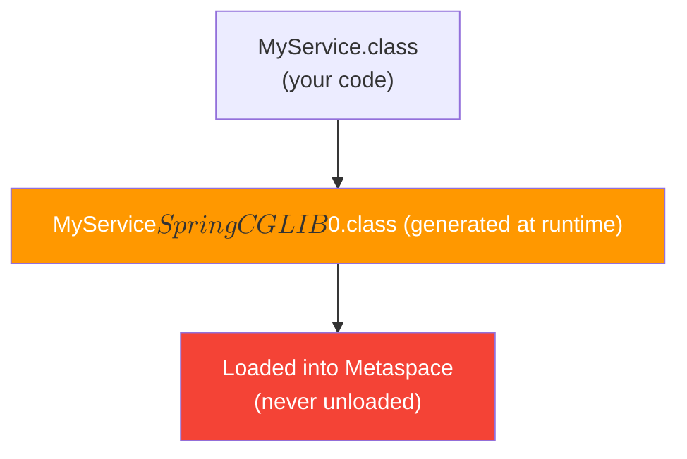

# Spring Boot Memory Traps

[< Back to Main Guide](../java-memory-k8s-guide.md)

---

## Overview

Spring Boot's conventions and "magic" (auto-configuration, reflection, proxies) have real memory costs. This document covers the traps that silently consume heap and metaspace in production.



---

## Heap Traps

### 1. Unbounded Caches (`@Cacheable`)

**The trap:** `@Cacheable` with no eviction policy grows forever.

```java
// DANGEROUS: No size limit, no TTL
@Cacheable("users")
public User findUser(Long id) {
    return userRepository.findById(id).orElseThrow();
}
```

**Memory impact:** Each cached object lives in heap indefinitely. With 100K unique users × 2KB per object = **200MB** of heap consumed and never freed.

**Fix:**

```java
// With Caffeine (recommended cache implementation)
@Bean
public CacheManager cacheManager() {
    CaffeineCacheManager manager = new CaffeineCacheManager();
    manager.setCaffeine(Caffeine.newBuilder()
        .maximumSize(10_000)           // Cap entries
        .expireAfterWrite(Duration.ofMinutes(30))  // TTL
        .recordStats());               // For monitoring
    return manager;
}
```

```yaml
# application.yml — Spring Boot auto-config with Caffeine
spring:
  cache:
    type: caffeine
    caffeine:
      spec: maximumSize=10000,expireAfterWrite=30m
```

**Monitor:** `cache.size` and `cache.eviction.count` via Micrometer.

---

### 2. Spring Data: Fetching Entire Result Sets

**The trap:** Repository methods that load unbounded data into memory.

```java
// DANGEROUS: What if there are 10 million orders?
List<Order> findByStatus(OrderStatus status);

// DANGEROUS: findAll() with no pagination
List<Customer> findAll();
```

**Memory impact:** Spring Data fetches ALL matching rows into a `List` in heap. 1M rows × 1KB = **1GB** spike.

**Fix:**

```java
// Use pagination
Page<Order> findByStatus(OrderStatus status, Pageable pageable);

// Use streaming for batch processing
@Query("SELECT o FROM Order o WHERE o.status = :status")
Stream<Order> streamByStatus(@Param("status") OrderStatus status);

// Use projection to reduce object size
interface OrderSummary {
    Long getId();
    String getCustomerName();
    BigDecimal getTotal();
}
List<OrderSummary> findByStatus(OrderStatus status, Pageable pageable);
```

**For batch jobs:**
```java
@Transactional(readOnly = true)
public void processLargeDataset() {
    try (Stream<Order> stream = orderRepository.streamByStatus(PENDING)) {
        stream.forEach(order -> {
            process(order);
            entityManager.detach(order);  // Release from persistence context
        });
    }
}
```

---

### 3. JPA Persistence Context (First-Level Cache)

**The trap:** Every entity loaded in a transaction stays in the persistence context until the transaction ends.

```java
// DANGEROUS: 50,000 entities in memory simultaneously
@Transactional
public void migrateAll() {
    List<Record> records = recordRepository.findAll();  // 50K objects in heap
    records.forEach(r -> {
        r.setMigrated(true);
        recordRepository.save(r);
        // Entity STILL in persistence context even after save
    });
}
```

**Fix:** Batch processing with periodic flush and clear:

```java
@Transactional
public void migrateAll() {
    int batchSize = 500;
    int page = 0;
    Page<Record> batch;

    do {
        batch = recordRepository.findAll(PageRequest.of(page++, batchSize));
        batch.forEach(r -> r.setMigrated(true));
        recordRepository.saveAll(batch.getContent());
        entityManager.flush();
        entityManager.clear();  // Release entities from memory
    } while (batch.hasNext());
}
```

---

### 4. HTTP Session Memory (Non-Stateless APIs)

**The trap:** If sessions are stored in-memory (default), each active session consumes heap.

```
10,000 concurrent users × 50KB session = 500MB heap
```

**Symptoms:** Heap grows proportionally with user count, never shrinks (sessions don't expire by default in short timeframes).

**Fix:**

```yaml
# For stateless APIs (most microservices): disable sessions entirely
server:
  servlet:
    session:
      timeout: 5m    # Short timeout
      tracking-modes: cookie

# Better: use externalized session store
spring:
  session:
    store-type: redis    # or jdbc
    redis:
      flush-mode: on-save
```

For REST APIs using JWT tokens, sessions are unnecessary:
```java
@Configuration
public class SecurityConfig {
    @Bean
    public SecurityFilterChain filterChain(HttpSecurity http) throws Exception {
        http.sessionManagement(s -> s.sessionCreationPolicy(SessionCreationPolicy.STATELESS));
        return http.build();
    }
}
```

---

### 5. Jackson Serialization Buffers

**The trap:** Serializing large response bodies allocates large byte buffers on heap.

```java
// Returning a 50MB JSON response materializes entirely in memory
@GetMapping("/export")
public List<Record> exportAll() {
    return recordRepository.findAll();  // 50MB serialized in memory
}
```

**Fix:** Use streaming serialization:

```java
@GetMapping("/export")
public ResponseEntity<StreamingResponseBody> exportAll() {
    return ResponseEntity.ok()
        .contentType(MediaType.APPLICATION_JSON)
        .body(outputStream -> {
            try (Stream<Record> stream = recordRepository.streamAll()) {
                JsonGenerator gen = objectMapper.getFactory().createGenerator(outputStream);
                gen.writeStartArray();
                stream.forEach(record -> {
                    try { gen.writeObject(record); }
                    catch (IOException e) { throw new UncheckedIOException(e); }
                });
                gen.writeEndArray();
                gen.flush();
            }
        });
}
```

---

### 6. Event Listeners Accumulating State

**The trap:** `@EventListener` or `ApplicationListener` implementations that store references.

```java
// DANGEROUS: Unbounded list growing with every event
@Component
public class AuditListener {
    private final List<AuditEvent> events = new ArrayList<>();  // NEVER cleared

    @EventListener
    public void onEvent(AuditEvent event) {
        events.add(event);  // Memory leak
    }
}
```

**Fix:** Use bounded collections or external storage (DB, queue, log).

---

## Metaspace Traps

### 7. AOP Proxy Generation (CGLIB)

**The trap:** Every `@Transactional`, `@Cacheable`, `@Async`, or `@Secured` class generates a CGLIB proxy subclass in metaspace.



**Memory impact:** Each proxy adds 10-50KB to metaspace. With 500 proxied beans: **5-25MB**.

This is usually acceptable, but beware:
- Excessive use of `@Transactional` on methods that don't need it
- Deeply nested AOP chains (each interceptor adds metadata)
- Libraries that create many proxies (Spring Cloud, Spring Security)

**Monitor:**
```promql
jvm_classes_loaded_classes
```
If this number keeps increasing after startup, you have a classloader leak.

---

### 8. Spring DevTools in Production

**The trap:** `spring-boot-devtools` uses a custom classloader that duplicates classes.

```gradle
// DANGEROUS if this ends up in production image
dependencies {
    developmentOnly 'org.springframework.boot:spring-boot-devtools'
}
```

**Memory impact:** Double metaspace usage due to two classloaders.

**Fix:** Ensure DevTools is excluded from production builds:
- Gradle: `developmentOnly` scope (correct, won't be in bootJar)
- Maven: `<optional>true</optional>` (correct, won't be in fat JAR)
- **Verify:** Check production image for the DevTools JAR:
  ```bash
  kubectl exec <pod> -- find / -name "spring-boot-devtools*" 2>/dev/null
  ```

---

### 9. Groovy/Script Engines Leaking Classes

**The trap:** Using Groovy templates, SpEL with complex expressions, or script engines creates classes that are never unloaded.

```java
// DANGEROUS: Each evaluation can create a new class
ScriptEngine engine = new ScriptEngineManager().getEngineByName("groovy");
engine.eval(userProvidedScript);  // New class per unique script
```

**Fix:** Use pre-compiled templates, cache compiled scripts, or avoid runtime compilation.

---

## Thread and Stack Traps

### 10. Default Tomcat Thread Pool

**The trap:** Tomcat defaults to 200 max threads. At 1MB per thread stack, that's **200MB** just for thread stacks — even if most are idle.

```yaml
# Default values (often excessive for microservices):
server:
  tomcat:
    threads:
      max: 200       # 200 threads × 1MB = 200MB stacks
      min-spare: 10
```

**Right-sizing:**

```yaml
# For a typical microservice with sub-second responses:
server:
  tomcat:
    threads:
      max: 50        # 50 × 512KB (-Xss512k) = 25MB
      min-spare: 10
    max-connections: 8192
    accept-count: 100
```

**With virtual threads (Java 21 + Spring Boot 3.2):**
```yaml
spring:
  threads:
    virtual:
      enabled: true   # No thread pool limit — virtual threads are cheap

# Tomcat thread pool becomes irrelevant for request handling
```

---

### 11. Uncontrolled `@Async` Thread Pools

**The trap:** Default `@Async` executor creates a new thread per task with no bound.

```java
// DANGEROUS: Uses SimpleAsyncTaskExecutor by default (unbounded threads)
@Async
public void processInBackground(Data data) {
    // Each call creates a NEW thread
}
```

**Fix:** Configure explicit thread pools:

```java
@Configuration
@EnableAsync
public class AsyncConfig {

    @Bean("asyncExecutor")
    public TaskExecutor asyncExecutor() {
        ThreadPoolTaskExecutor executor = new ThreadPoolTaskExecutor();
        executor.setCorePoolSize(5);
        executor.setMaxPoolSize(20);      // Bounded!
        executor.setQueueCapacity(100);   // Queue before rejecting
        executor.setThreadNamePrefix("async-");
        executor.setRejectedExecutionHandler(new CallerRunsPolicy());
        return executor;
    }
}

@Async("asyncExecutor")  // Specify which pool
public void processInBackground(Data data) { ... }
```

---

### 12. `@Scheduled` Task Accumulation

**The trap:** If a scheduled task takes longer than its interval, instances pile up.

```java
// DANGEROUS: If processQueue() takes 30s but runs every 10s
@Scheduled(fixedRate = 10000)
public void processQueue() {
    // Three instances running simultaneously, each with its own stack
    // and potentially holding large amounts of heap data
}
```

**Fix:**

```java
// Use fixedDelay (wait after completion) instead of fixedRate
@Scheduled(fixedDelay = 10000)
public void processQueue() { ... }

// Or use a lock
@Scheduled(fixedRate = 10000)
public void processQueue() {
    if (!lock.tryLock()) return;  // Skip if previous still running
    try { ... }
    finally { lock.unlock(); }
}
```

---

## Configuration Overhead

### 13. Auto-Configuration Loading

**The trap:** Spring Boot auto-configures everything on the classpath, even if unused. Each auto-config class and its beans consume metaspace and heap.

**Diagnosis:**
```bash
# See what's being auto-configured
curl http://localhost:8080/actuator/conditions | jq '.contexts[].positiveMatches | keys | length'
```

**Fix:** Exclude unused auto-configurations:

```java
@SpringBootApplication(exclude = {
    DataSourceAutoConfiguration.class,       // If not using JDBC
    MongoAutoConfiguration.class,            // If not using MongoDB
    RedisAutoConfiguration.class,            // If not using Redis
    SecurityAutoConfiguration.class,         // If not using Spring Security
    MailSenderAutoConfiguration.class        // If not sending email
})
public class MyApplication { }
```

---

### 14. Actuator and Micrometer Overhead

**The trap:** Micrometer's meter registry stores all metric time series in heap. High-cardinality metrics (per-user, per-URL-path) create thousands of meter instances.

```java
// DANGEROUS: Unbounded cardinality
@Timed(value = "api.requests", extraTags = {"userId", "${userId}"})
public Response handleRequest(String userId) { ... }
// 100K unique userIds = 100K Timer instances in memory
```

**Memory impact:** Each Timer instance ≈ 1-5KB. 100K timers = **100-500MB**.

**Fix:**

```java
// Use bounded tag values
@Timed(value = "api.requests", extraTags = {"endpoint", "/api/users"})

// Filter high-cardinality tags
@Bean
public MeterFilter denyHighCardinality() {
    return MeterFilter.deny(id ->
        id.getName().equals("http.server.requests")
        && id.getTag("uri") != null
        && id.getTag("uri").matches("/api/users/\\d+")  // Collapse parameterized paths
    );
}
```

```yaml
# application.yml — limit what actuator exposes
management:
  metrics:
    enable:
      jvm: true
      http: true
      system: true
      process: true
      all: false    # Disable everything else by default
```

---

## Memory Audit Checklist

Use this to review a Spring Boot application for memory traps:

- [ ] All `@Cacheable` usages have eviction policies (size + TTL)
- [ ] No `findAll()` without pagination on large tables
- [ ] Batch operations use `flush()` + `clear()` on entity manager
- [ ] Sessions are externalized (Redis) or disabled (stateless)
- [ ] `@Async` methods use a bounded thread pool, not default executor
- [ ] `@Scheduled` tasks use `fixedDelay` or locking to prevent pile-up
- [ ] No high-cardinality metric tags
- [ ] Unused auto-configurations are excluded
- [ ] DevTools is not present in production image
- [ ] Tomcat `max-threads` is right-sized for the workload
- [ ] Large response bodies use streaming serialization
- [ ] Thread pool sizes are documented and bounded

---

## Monitoring for These Traps

```promql
# Detect unbounded cache growth
increase(cache_size{application="my-spring-app"}[1h])

# Detect thread count growth
jvm_threads_live_threads{application="my-spring-app"}

# Detect class loading growth (metaspace leak indicator)
increase(jvm_classes_loaded_classes{application="my-spring-app"}[1h])

# Detect old gen filling (objects not being collected)
jvm_memory_used_bytes{area="heap", id="G1 Old Gen"} / jvm_memory_max_bytes{area="heap"}
```

---

## Next Steps

- [JVM Memory Model](jvm-memory-model.md) — Understanding where these traps live in memory
- [Monitoring & Metrics](monitoring-metrics.md) — Catching these issues before OOM
- [Troubleshooting](troubleshooting.md) — When a trap has already caused an incident
