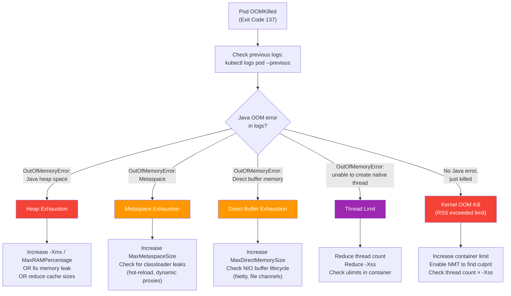
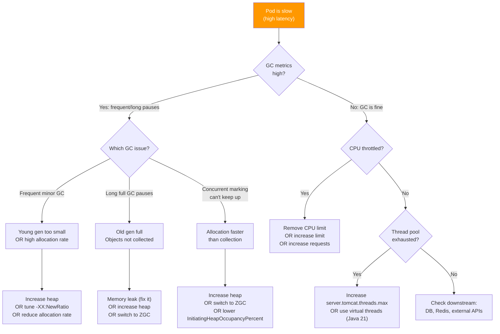
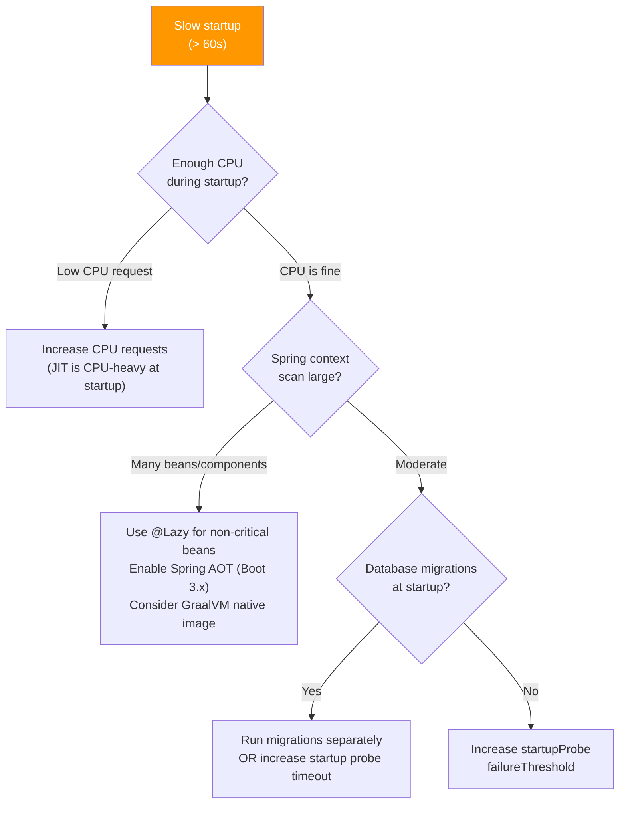

# Troubleshooting

[< Back to Main Guide](../java-memory-k8s-guide.md)

---

## Decision Tree: Pod is OOMKilled



---

## Decision Tree: Pod is Slow (Not Crashing)



---

## Decision Tree: Pod Startup is Slow



---

## Common Scenarios and Fixes

### Scenario 1: OOMKilled After Running Fine for Hours

**Symptoms:**
- Pod runs fine for 4-8 hours then gets killed
- Heap usage shows gradual increase without drops
- Full GC doesn't reclaim much

**Diagnosis:** Memory leak — objects are referenced but unused.

**Investigation:**
```bash
# Take heap dumps at intervals and compare
kubectl exec <pod> -n my-namespace -- jcmd 1 GC.heap_dump /tmp/dump1.hprof
# Wait 2 hours...
kubectl exec <pod> -n my-namespace -- jcmd 1 GC.heap_dump /tmp/dump2.hprof

# Copy and analyze with Eclipse MAT
kubectl cp my-namespace/<pod>:/tmp/dump1.hprof ./dump1.hprof
kubectl cp my-namespace/<pod>:/tmp/dump2.hprof ./dump2.hprof
```

**Common leak sources in Spring Boot:**
- Unbounded caches (Ehcache/Caffeine without eviction)
- Event listeners that accumulate state
- ThreadLocal not cleaned up
- Connection pool objects not returned
- Session objects in stateful services

---

### Scenario 2: OOMKilled Immediately on Deployment

**Symptoms:**
- Pod starts, runs for 30-60s, then OOMKilled
- Happens consistently with new configuration

**Diagnosis:** Container limit too small for JVM startup needs.

**Investigation:**
```bash
# Check what the JVM tried to allocate
kubectl logs <pod> -n my-namespace --previous | head -20
# Look for: "Picked up JAVA_TOOL_OPTIONS: ..."
# And: "insufficient memory" or "could not reserve enough space"
```

**Fix:** The JVM allocates `-Xms` immediately at startup. If `-Xms == -Xmx == 6g` but container limit is only 6Gi, there's no room for non-heap. Increase container limit to at least 8Gi.

---

### Scenario 3: Intermittent OOMKills Under Load

**Symptoms:**
- Pod dies during traffic spikes
- Heap is fine (< 80%)
- Happens unpredictably

**Diagnosis:** Non-heap memory spikes during load (usually threads or direct buffers).

**Investigation:**
```bash
# Check thread count during load
kubectl exec <pod> -n my-namespace -- jcmd 1 Thread.print | grep "^\"" | wc -l

# Check direct buffer usage
kubectl exec <pod> -n my-namespace -- jcmd 1 VM.native_memory summary | grep -A 2 "Internal"

# Monitor RSS vs heap
# RSS = container_memory_working_set_bytes
# Heap = jvm_memory_used_bytes{area="heap"}
# Gap = non-heap usage
```

**Fix:** Cap the offending non-heap region:
```bash
-Xss512k                        # Reduce per-thread stack
-XX:MaxDirectMemorySize=256m    # Cap direct buffers
```
Or increase container limit to accommodate the spike.

---

### Scenario 4: GC Pauses Causing Timeouts

**Symptoms:**
- Intermittent 5xx responses
- Downstream services see timeouts
- Application "freezes" for 1-5 seconds

**Diagnosis:** Stop-the-world GC pauses.

**Investigation:**
```bash
# Check GC pause duration
kubectl exec <pod> -n my-namespace -- jcmd 1 GC.heap_info

# Check GC log (if configured)
kubectl exec <pod> -n my-namespace -- tail -50 /tmp/gc.log
```

**Fixes (in order of preference):**
1. Switch to ZGC (`-XX:+UseZGC`) — sub-millisecond pauses
2. Increase heap (fewer GC cycles needed)
3. Tune G1: `-XX:MaxGCPauseMillis=100 -XX:InitiatingHeapOccupancyPercent=35`
4. Reduce allocation rate (code changes — object pooling, avoid unnecessary allocations)

---

### Scenario 5: CPU Throttling Causing Latency

**Symptoms:**
- Latency spikes that don't correlate with GC
- `container_cpu_cfs_throttled_seconds_total` increasing
- Worse during startup or after deployment

**Diagnosis:** CFS bandwidth throttling.

**Investigation:**
```bash
# Check throttle ratio
# In Prometheus:
# rate(container_cpu_cfs_throttled_periods_total{container="my-spring-app"}[5m])
# / rate(container_cpu_cfs_periods_total{container="my-spring-app"}[5m])

# From inside the pod (cgroup v2):
kubectl exec <pod> -n my-namespace -- cat /sys/fs/cgroup/cpu.stat
```

**Fixes:**
1. **Best:** Remove CPU limit entirely (keep only requests)
2. **If limits required:** Set `limits.cpu >= 2× requests.cpu`
3. Increase `requests.cpu` during startup (use VPA in `Initial` mode)

---

## Quick Reference Commands

```bash
# === Diagnosing OOMKills ===

# Check termination reason
kubectl get pod <pod> -n my-namespace -o jsonpath='{.status.containerStatuses[0].lastState.terminated}'

# Check events for OOMKill
kubectl get events -n my-namespace --field-selector reason=OOMKilling --sort-by='.lastTimestamp'

# Previous pod logs (before crash)
kubectl logs <pod> -n my-namespace --previous

# === Memory Investigation ===

# Native memory tracking summary
kubectl exec <pod> -n my-namespace -- jcmd 1 VM.native_memory summary

# Start tracking changes over time
kubectl exec <pod> -n my-namespace -- jcmd 1 VM.native_memory baseline
# Wait, then:
kubectl exec <pod> -n my-namespace -- jcmd 1 VM.native_memory summary.diff

# Top classes by instance count
kubectl exec <pod> -n my-namespace -- jcmd 1 GC.class_histogram | head -30

# === GC Investigation ===

# Current heap state
kubectl exec <pod> -n my-namespace -- jcmd 1 GC.heap_info

# Force full GC (test reclaimability)
kubectl exec <pod> -n my-namespace -- jcmd 1 GC.run

# === Thread Investigation ===

# Thread dump (find deadlocks, blocked threads)
kubectl exec <pod> -n my-namespace -- jcmd 1 Thread.print

# Thread count
kubectl exec <pod> -n my-namespace -- jcmd 1 Thread.print | grep "^\"" | wc -l

# === Profiling ===

# Start Java Flight Recorder
kubectl exec <pod> -n my-namespace -- jcmd 1 JFR.start duration=60s filename=/tmp/recording.jfr

# Copy recording for analysis
kubectl cp my-namespace/<pod>:/tmp/recording.jfr ./recording.jfr
```

---

## When to Escalate

| Situation | Action |
|:----------|:-------|
| Memory leak identified but source unclear | Heap dump analysis with Eclipse MAT |
| Native memory leak (RSS grows, heap stable) | Profile with async-profiler or jemalloc |
| OOMKills despite generous limits | Check for fork/exec in native code, check sidecar containers |
| GC tuning insufficient | Consider architecture changes (caching strategy, async processing) |
| Problem only in production | Enable NMT temporarily, capture JFR recording |

---

## Next Steps

- [JVM Memory Model](jvm-memory-model.md) — Understanding what you're diagnosing
- [Monitoring & Metrics](monitoring-metrics.md) — Setting up the observability to catch issues early
- [Change Management Checklist](change-management-checklist.md) — Process for applying fixes
