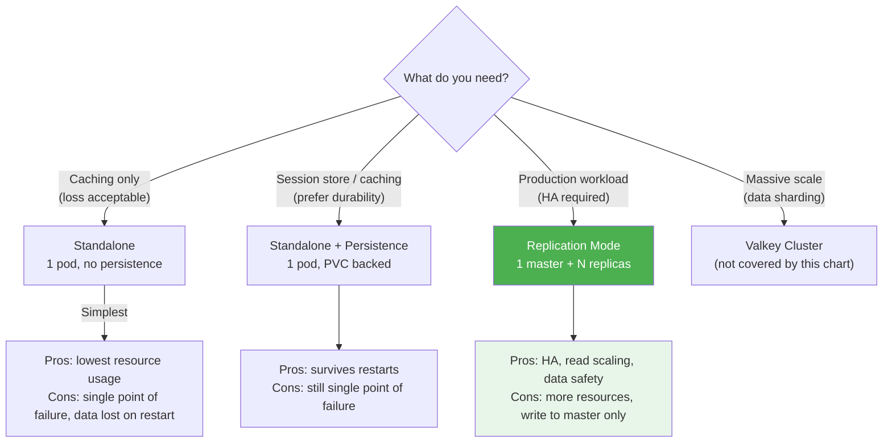
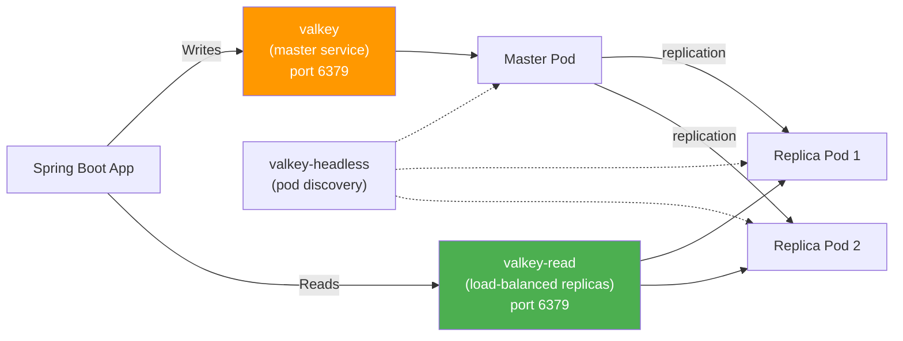
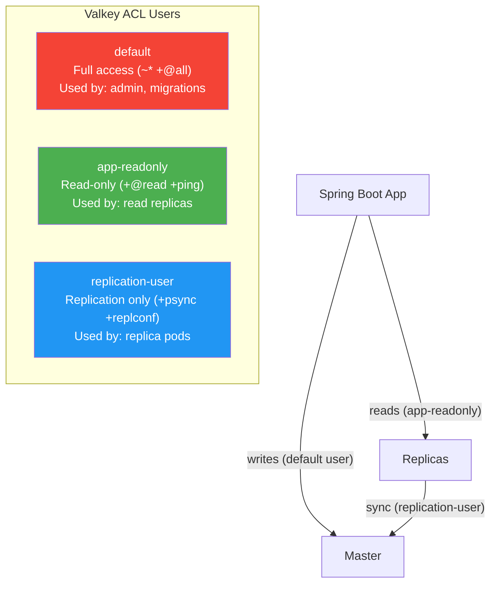
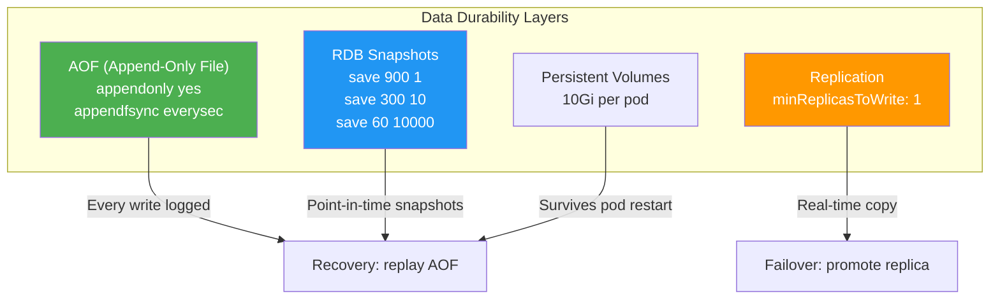
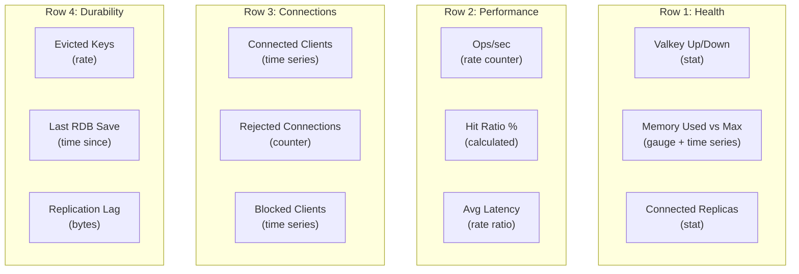
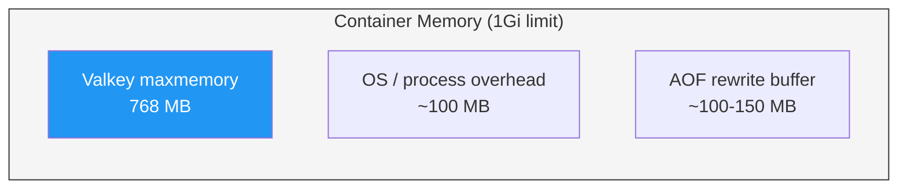
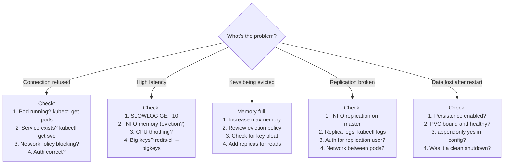

# Operationally Ready Valkey on Kubernetes

[< Back to Main Guide](../java-memory-k8s-guide.md)

> A production-ready deployment guide for [Valkey](https://valkey.io/) (Redis-compatible key-value store) on Kubernetes using the [official Valkey Helm chart](https://github.com/valkey-io/valkey-helm).

---

## Table of Contents

- [What is Valkey](#what-is-valkey)
- [Architecture Decision](#architecture-decision)
- [Prerequisites](#prerequisites)
- [Installation](#installation)
- [Production Values](#production-values)
- [Authentication & Security](#authentication--security)
- [Persistence & Data Durability](#persistence--data-durability)
- [TLS Encryption](#tls-encryption)
- [Networking & Network Policies](#networking--network-policies)
- [Monitoring & Alerting](#monitoring--alerting)
- [Resource Sizing](#resource-sizing)
- [High Availability & Pod Disruption](#high-availability--pod-disruption)
- [Backup & Restore](#backup--restore)
- [Spring Boot Integration](#spring-boot-integration)
- [Operational Runbook](#operational-runbook)
- [Upgrade & Rollback Strategy](#upgrade--rollback-strategy)
- [Checklist](#production-readiness-checklist)

---

## What is Valkey

Valkey is a high-performance, open-source key-value store forked from Redis (post-license change). It is protocol-compatible with Redis — existing Redis clients, libraries, and tools work without modification.

**Why Valkey over Redis:**
- BSD 3-Clause license (truly open source)
- Active community governance (Linux Foundation)
- Drop-in replacement — same protocol, same commands
- No licensing ambiguity for production use

---

## Architecture Decision



**Recommendation:** For any production Spring Boot deployment, use **Replication Mode** with persistence enabled.

### Services Created (Replication Mode)



| Service | Purpose | Use For |
|:--------|:--------|:--------|
| `valkey` | Routes to master pod | All write operations |
| `valkey-read` | Load-balanced across all pods (master + replicas) | Read operations |
| `valkey-headless` | Direct pod DNS (StatefulSet discovery) | Debugging, direct pod access |

---

## Prerequisites

```bash
# Helm 3.5+
helm version

# Add the Valkey Helm repo
helm repo add valkey https://valkey.io/valkey-helm/
helm repo update

# Verify chart is available
helm search repo valkey/valkey
```

**Cluster requirements:**
- Kubernetes 1.20+
- A StorageClass for persistent volumes (check with `kubectl get storageclass`)
- Prometheus Operator (for ServiceMonitor/PrometheusRule support)

---

## Installation

### Quick Install (Non-Production)

```bash
helm install valkey valkey/valkey -n my-namespace
```

### Production Install (Using Values File)

```bash
helm install valkey valkey/valkey \
  -n my-namespace \
  -f valkey-production-values.yaml \
  --wait \
  --timeout 5m
```

---

## Production Values

Below is a complete, annotated production values file. Each section is explained.

```yaml
# =============================================================
# valkey-production-values.yaml
# Production-ready Valkey deployment with replication
# =============================================================

# --- Image Configuration ---
image:
  registry: "docker.io"
  repository: valkey/valkey
  pullPolicy: IfNotPresent
  # Pin to a specific version — never use "latest" in production
  tag: "8.1.1"

# --- Service Account ---
serviceAccount:
  create: true
  automount: false    # Principle of least privilege

# --- Pod Security ---
podSecurityContext:
  fsGroup: 1000
  runAsUser: 1000
  runAsGroup: 1000
  seccompProfile:
    type: RuntimeDefault

securityContext:
  allowPrivilegeEscalation: false
  capabilities:
    drop:
      - ALL
  readOnlyRootFilesystem: true
  runAsNonRoot: true
  runAsUser: 1000

# --- Service ---
service:
  type: ClusterIP
  port: 6379

# --- Resources ---
resources:
  requests:
    cpu: "500m"
    memory: "1Gi"
  limits:
    memory: "1Gi"
    # CPU limit omitted intentionally — avoid throttling

# --- Valkey Configuration ---
valkeyConfig: |
  # Memory policy — what to do when maxmemory is reached
  maxmemory 768mb
  maxmemory-policy allkeys-lru

  # Persistence (append-only file)
  appendonly yes
  appendfsync everysec

  # RDB snapshots
  save 900 1
  save 300 10
  save 60 10000

  # Performance
  tcp-keepalive 300
  timeout 300
  tcp-backlog 511

  # Slow log (queries taking > 10ms)
  slowlog-log-slower-than 10000
  slowlog-max-len 128

  # Disable dangerous commands in production
  rename-command FLUSHALL ""
  rename-command FLUSHDB ""
  rename-command DEBUG ""

valkeyLogLevel: "notice"

# --- Authentication ---
auth:
  enabled: true
  usersExistingSecret: "valkey-passwords"
  aclUsers:
    default:
      permissions: "~* &* +@all"
      passwordKey: "valkey-password"
    app-readonly:
      permissions: "~* -@all +@read +@connection +ping +info +select"
      passwordKey: "readonly-password"
    replication-user:
      permissions: "+psync +replconf +ping"
      passwordKey: "replication-password"

# --- Replication ---
replica:
  enabled: true
  replicas: 2                # 2 replicas + 1 master = 3 pods total
  replicationUser: "replication-user"
  disklessSync: false        # Disk-based safer for production
  minReplicasToWrite: 1      # Require at least 1 replica in sync
  minReplicasMaxLag: 10      # Max lag before replica is "unhealthy"

  service:
    enabled: true
    type: ClusterIP
    port: 6379

  persistence:
    size: "10Gi"
    storageClass: ""         # Use cluster default, or specify
    accessModes:
      - ReadWriteOnce

  persistentVolumeClaimRetentionPolicy:
    whenDeleted: Retain       # Keep PVCs when StatefulSet deleted
    whenScaled: Retain        # Keep PVCs when scaling down

# --- Master Persistence (standalone storage config) ---
dataStorage:
  enabled: true
  volumeName: "valkey-data"
  requestedSize: "10Gi"
  className: ""
  accessModes:
    - ReadWriteOnce
  keepPvc: true              # Don't delete PVC on helm uninstall

# --- TLS ---
tls:
  enabled: false             # Enable in Section: TLS Encryption below
  # existingSecret: "valkey-tls"
  # serverPublicKey: server.crt
  # serverKey: server.key
  # caPublicKey: ca.crt

# --- Network Policy ---
networkPolicy: {}
  # See Section: Networking

# --- Scheduling ---
nodeSelector: {}
  # Example: target memory-optimized nodes
  # node.kubernetes.io/instance-type: r5.large

tolerations: []

affinity: {}
  # See Section: High Availability

topologySpreadConstraints: []
  # See Section: High Availability

# --- Pod Disruption Budget ---
podDisruptionBudget:
  enabled: true
  maxUnavailable: 1

# --- Monitoring ---
metrics:
  enabled: true
  exporter:
    port: 9121
    image:
      registry: ghcr.io
      repository: oliver006/redis_exporter
      pullPolicy: IfNotPresent
      tag: "v1.79.0"
    resources:
      requests:
        cpu: "50m"
        memory: "64Mi"
      limits:
        memory: "128Mi"

  service:
    enabled: true
    type: ClusterIP
    ports:
      http: 9121

  serviceMonitor:
    enabled: true
    interval: 15s
    scrapeTimeout: 10s

  prometheusRule:
    enabled: true
    rules:
      - alert: ValkeyDown
        expr: redis_up == 0
        for: 2m
        labels:
          severity: critical
        annotations:
          summary: "Valkey instance {{ $labels.instance }} is down"

      - alert: ValkeyMemoryHigh
        expr: |
          redis_memory_used_bytes * 100
          / redis_memory_max_bytes > 85
        for: 5m
        labels:
          severity: warning
        annotations:
          summary: "Valkey memory usage above 85% on {{ $labels.instance }}"

      - alert: ValkeyMemoryCritical
        expr: |
          redis_memory_used_bytes * 100
          / redis_memory_max_bytes > 95
        for: 2m
        labels:
          severity: critical
        annotations:
          summary: "Valkey memory CRITICAL (>95%) on {{ $labels.instance }}"

      - alert: ValkeyKeyEviction
        expr: increase(redis_evicted_keys_total[5m]) > 0
        for: 1m
        labels:
          severity: warning
        annotations:
          summary: "Valkey evicting keys on {{ $labels.instance }}"

      - alert: ValkeyReplicationBroken
        expr: redis_connected_slaves < 1
        for: 2m
        labels:
          severity: critical
        annotations:
          summary: "Valkey master has fewer than 1 connected replica"

      - alert: ValkeyReplicationLag
        expr: redis_replication_backlog_bytes > 10485760
        for: 5m
        labels:
          severity: warning
        annotations:
          summary: "Valkey replication lag > 10MB on {{ $labels.instance }}"

      - alert: ValkeyHighLatency
        expr: |
          redis_commands_duration_seconds_total
          / redis_commands_processed_total > 0.01
        for: 5m
        labels:
          severity: warning
        annotations:
          summary: "Valkey avg command latency > 10ms on {{ $labels.instance }}"

      - alert: ValkeyHighConnectionCount
        expr: redis_connected_clients > 500
        for: 5m
        labels:
          severity: warning
        annotations:
          summary: "Valkey has >500 client connections on {{ $labels.instance }}"

      - alert: ValkeyRejectedConnections
        expr: increase(redis_rejected_connections_total[5m]) > 0
        for: 1m
        labels:
          severity: critical
        annotations:
          summary: "Valkey rejecting connections on {{ $labels.instance }}"
```

---

## Authentication & Security

### Creating the Passwords Secret

```bash
# Generate strong passwords
VALKEY_PASS=$(openssl rand -base64 32)
READONLY_PASS=$(openssl rand -base64 32)
REPL_PASS=$(openssl rand -base64 32)

# Create the Kubernetes secret
kubectl create secret generic valkey-passwords \
  -n my-namespace \
  --from-literal=valkey-password="$VALKEY_PASS" \
  --from-literal=readonly-password="$READONLY_PASS" \
  --from-literal=replication-password="$REPL_PASS"

# Save passwords securely (e.g., vault, password manager)
echo "Default password: $VALKEY_PASS"
echo "Readonly password: $READONLY_PASS"
echo "Replication password: $REPL_PASS"
```

### ACL User Design



### Security Hardening

The production values already include:

| Feature | Setting | Purpose |
|:--------|:--------|:--------|
| Non-root user | `runAsUser: 1000` | No root in container |
| Read-only filesystem | `readOnlyRootFilesystem: true` | Prevent binary injection |
| Drop all capabilities | `capabilities.drop: [ALL]` | Minimal Linux capabilities |
| No privilege escalation | `allowPrivilegeEscalation: false` | Prevent sudo/setuid |
| Seccomp profile | `seccompProfile: RuntimeDefault` | Restrict system calls |
| Service account token | `automount: false` | No K8s API access from pod |
| Dangerous commands disabled | `rename-command FLUSHALL ""` | Prevent accidental data wipe |

---

## Persistence & Data Durability

### Persistence Strategy



### Why Both AOF and RDB?

| Method | Data Loss Window | Recovery Speed | Disk Usage |
|:-------|:----------------|:---------------|:-----------|
| **AOF** (`appendfsync everysec`) | ~1 second | Slow (replay all writes) | High (full log) |
| **RDB** (`save` rules) | Minutes (between snapshots) | Fast (load snapshot) | Low (compressed) |
| **Both** | ~1 second (AOF), fast start (RDB) | Best of both | Higher |

Valkey uses RDB for fast startup, then replays AOF for the last few seconds of data since the snapshot.

### Storage Sizing

```
Rule of thumb:
  PVC size = (2 × expected data size) + headroom for RDB/AOF

  If you expect 2GB of data:
    PVC = (2 × 2GB) + 2GB = 6GB minimum
    Recommended: 10Gi
```

The extra space is needed because:
- RDB snapshots are written to a temp file then renamed (briefly 2× data)
- AOF rewrite creates a new file alongside the old one
- Fragmentation can increase on-disk size

### Critical: Persistence in Replication Mode

> **Persistence is mandatory in replication mode.** Without it, if the master restarts with empty data, replicas will sync the empty dataset and **all data is permanently lost**.

---

## TLS Encryption

### Creating TLS Certificates

```bash
# Generate CA
openssl genrsa -out ca.key 4096
openssl req -x509 -new -nodes -sha256 -key ca.key \
  -days 3650 -out ca.crt -subj "/CN=Valkey CA"

# Generate server certificate
openssl genrsa -out server.key 2048
openssl req -new -key server.key \
  -out server.csr -subj "/CN=valkey"

# Sign with CA (include SANs for service DNS)
cat > server-ext.cnf << EOF
subjectAltName = DNS:valkey, DNS:valkey-read, DNS:valkey-headless, DNS:*.valkey-headless.my-namespace.svc.cluster.local, DNS:valkey.my-namespace.svc.cluster.local
EOF

openssl x509 -req -in server.csr -CA ca.crt -CAkey ca.key \
  -CAcreateserial -out server.crt -days 365 -sha256 \
  -extfile server-ext.cnf

# Create K8s secret
kubectl create secret generic valkey-tls \
  -n my-namespace \
  --from-file=server.crt \
  --from-file=server.key \
  --from-file=ca.crt
```

### Enable in Values

```yaml
tls:
  enabled: true
  existingSecret: "valkey-tls"
  serverPublicKey: server.crt
  serverKey: server.key
  caPublicKey: ca.crt
  requireClientCertificate: false    # Set true for mTLS
```

### Impact on Spring Boot Client

With TLS enabled, the connection URL changes:

```yaml
# application.yml
spring:
  data:
    redis:
      host: valkey.my-namespace.svc.cluster.local
      port: 6379
      ssl:
        enabled: true
      # Lettuce will use the JVM's truststore — add the CA cert:
      # keytool -importcert -file ca.crt -alias valkey-ca -keystore $JAVA_HOME/lib/security/cacerts
```

---

## Networking & Network Policies

### Restricting Access to Valkey

```yaml
# valkey-network-policy.yaml
apiVersion: networking.k8s.io/v1
kind: NetworkPolicy
metadata:
  name: valkey-access
  namespace: my-namespace
spec:
  podSelector:
    matchLabels:
      app.kubernetes.io/name: valkey
  policyTypes:
    - Ingress
  ingress:
    # Allow traffic from application pods
    - from:
        - podSelector:
            matchLabels:
              app: my-spring-app
      ports:
        - port: 6379
          protocol: TCP

    # Allow traffic between Valkey pods (replication)
    - from:
        - podSelector:
            matchLabels:
              app.kubernetes.io/name: valkey
      ports:
        - port: 6379
          protocol: TCP

    # Allow Prometheus scraping
    - from:
        - namespaceSelector:
            matchLabels:
              kubernetes.io/metadata.name: monitoring
      ports:
        - port: 9121
          protocol: TCP
```

---

## Monitoring & Alerting

### Key Metrics

The redis_exporter sidecar exposes metrics at `:9121/metrics`. Key ones to dashboard:

| Metric | Purpose | Panel Type |
|:-------|:--------|:-----------|
| `redis_up` | Is Valkey responding? | Stat (1/0) |
| `redis_memory_used_bytes` | Current memory usage | Time series |
| `redis_memory_max_bytes` | Configured maxmemory | Stat |
| `redis_connected_clients` | Client connection count | Time series |
| `redis_connected_slaves` | Replica count | Stat |
| `redis_evicted_keys_total` | Keys evicted (memory pressure) | Counter rate |
| `redis_keyspace_hits_total` / `redis_keyspace_misses_total` | Cache hit ratio | Calculated gauge |
| `redis_commands_processed_total` | Operations per second | Counter rate |
| `redis_commands_duration_seconds_total` | Command latency | Counter rate |
| `redis_rdb_last_save_timestamp_seconds` | Last RDB snapshot time | Stat |
| `redis_aof_last_rewrite_duration_sec` | AOF rewrite duration | Stat |
| `redis_replication_backlog_bytes` | Replication lag | Time series |
| `redis_rejected_connections_total` | Rejected connections | Counter rate |
| `redis_blocked_clients` | Clients in blocking commands | Time series |

### Grafana Dashboard Panels



### Key PromQL Queries

```promql
# Cache hit ratio (%)
redis_keyspace_hits_total / (redis_keyspace_hits_total + redis_keyspace_misses_total) * 100

# Operations per second
rate(redis_commands_processed_total[5m])

# Memory usage percentage
redis_memory_used_bytes / redis_memory_max_bytes * 100

# Average command latency (seconds)
rate(redis_commands_duration_seconds_total[5m]) / rate(redis_commands_processed_total[5m])

# Eviction rate
rate(redis_evicted_keys_total[5m])

# Connected replicas (should equal replica.replicas)
redis_connected_slaves
```

---

## Resource Sizing

### Memory Sizing



**The formula:**
```
Container memory limit = maxmemory + overhead (150-250MB)

maxmemory = container limit × 0.75   (similar to Java!)
```

| Expected Data | maxmemory | Container Limit | Notes |
|:--------------|:----------|:----------------|:------|
| < 500 MB | 768m | 1 Gi | Small caches, sessions |
| 1-2 GB | 1536m | 2 Gi | Medium workloads |
| 4-6 GB | 6g | 8 Gi | Large datasets |
| 10+ GB | 12g | 16 Gi | Consider clustering |

### CPU Sizing

Valkey is **single-threaded** for command execution. One CPU core handles all commands. Additional CPU is used for:
- Background RDB saves (fork)
- AOF rewrite (fork)
- Network I/O threads (Valkey 8+)

| Workload | CPU Request | Notes |
|:---------|:------------|:------|
| Light (< 10K ops/sec) | 250m | Sufficient for most caches |
| Medium (10-50K ops/sec) | 500m | Typical production |
| Heavy (50-100K ops/sec) | 1000m | Consider I/O threads |
| Extreme (100K+ ops/sec) | 2000m | May need clustering |

---

## High Availability & Pod Disruption

### Spread Pods Across Nodes

```yaml
# Ensure master and replicas land on different nodes
affinity:
  podAntiAffinity:
    requiredDuringSchedulingIgnoredDuringExecution:
      - labelSelector:
          matchLabels:
            app.kubernetes.io/name: valkey
        topologyKey: kubernetes.io/hostname

# Or use topology spread for even distribution:
topologySpreadConstraints:
  - maxSkew: 1
    topologyKey: kubernetes.io/hostname
    whenUnsatisfiable: DoNotSchedule
    labelSelector:
      matchLabels:
        app.kubernetes.io/name: valkey
```

### Pod Disruption Budget

Already configured in values:

```yaml
podDisruptionBudget:
  enabled: true
  maxUnavailable: 1    # Only 1 pod can be down at a time
```

This ensures during node drains or cluster upgrades, at least 2 of 3 Valkey pods remain available.

### Write Safety

```yaml
replica:
  minReplicasToWrite: 1     # Master rejects writes if < 1 replica connected
  minReplicasMaxLag: 10     # Replica must be within 10s of master
```

This prevents data loss in split-brain scenarios: if the master loses contact with all replicas, it stops accepting writes rather than diverging.

---

## Backup & Restore

### Automated Backup (CronJob)

```yaml
apiVersion: batch/v1
kind: CronJob
metadata:
  name: valkey-backup
  namespace: my-namespace
spec:
  schedule: "0 */6 * * *"    # Every 6 hours
  jobTemplate:
    spec:
      template:
        spec:
          containers:
            - name: backup
              image: valkey/valkey:8.1.1
              command:
                - /bin/sh
                - -c
                - |
                  set -e
                  TIMESTAMP=$(date +%Y%m%d-%H%M%S)
                  BACKUP_FILE="/backup/valkey-backup-${TIMESTAMP}.rdb"

                  # Trigger RDB save
                  valkey-cli -h valkey -a "${VALKEY_PASSWORD}" BGSAVE
                  sleep 10  # Wait for save to complete

                  # Copy RDB file
                  valkey-cli -h valkey -a "${VALKEY_PASSWORD}" --rdb "${BACKUP_FILE}"

                  echo "Backup saved to ${BACKUP_FILE}"
                  ls -lh /backup/

                  # Retain last 7 days of backups
                  find /backup -name "*.rdb" -mtime +7 -delete
              env:
                - name: VALKEY_PASSWORD
                  valueFrom:
                    secretKeyRef:
                      name: valkey-passwords
                      key: valkey-password
              volumeMounts:
                - name: backup-volume
                  mountPath: /backup
          restartPolicy: OnFailure
          volumes:
            - name: backup-volume
              persistentVolumeClaim:
                claimName: valkey-backups
```

### Restore Procedure

```bash
# 1. Scale down the deployment
kubectl scale statefulset valkey -n my-namespace --replicas=0

# 2. Copy the RDB file into the data volume
# Find the PVC:
kubectl get pvc -n my-namespace -l app.kubernetes.io/name=valkey

# Attach a temporary pod to the PVC:
kubectl run valkey-restore --rm -it \
  --image=valkey/valkey:8.1.1 \
  --overrides='{
    "spec": {
      "containers": [{
        "name": "restore",
        "image": "valkey/valkey:8.1.1",
        "command": ["sh"],
        "stdin": true,
        "tty": true,
        "volumeMounts": [{
          "mountPath": "/data",
          "name": "valkey-data"
        }]
      }],
      "volumes": [{
        "name": "valkey-data",
        "persistentVolumeClaim": {
          "claimName": "valkey-data-valkey-0"
        }
      }]
    }
  }' \
  -n my-namespace -- sh

# Inside the pod:
# cp /backup/valkey-backup-YYYYMMDD-HHMMSS.rdb /data/dump.rdb

# 3. Scale back up
kubectl scale statefulset valkey -n my-namespace --replicas=3
```

---

## Spring Boot Integration

### Dependencies

```gradle
implementation 'org.springframework.boot:spring-boot-starter-data-redis'
```

### Configuration

```yaml
# application.yml
spring:
  data:
    redis:
      host: valkey.my-namespace.svc.cluster.local
      port: 6379
      password: ${VALKEY_PASSWORD}
      timeout: 5s
      connect-timeout: 3s
      lettuce:
        pool:
          max-active: 16
          max-idle: 8
          min-idle: 2
          max-wait: 3s
        shutdown-timeout: 200ms
```

### Read/Write Splitting

For high-read workloads, point reads at the read service:

```java
@Configuration
public class ValkeyConfig {

    // Write client → master service
    @Bean("valkeyWriteTemplate")
    public RedisTemplate<String, Object> valkeyWriteTemplate(
            RedisConnectionFactory connectionFactory) {
        RedisTemplate<String, Object> template = new RedisTemplate<>();
        template.setConnectionFactory(connectionFactory);
        template.setKeySerializer(new StringRedisSerializer());
        template.setValueSerializer(new GenericJackson2JsonRedisSerializer());
        return template;
    }

    // Read client → read service (load-balanced across replicas)
    @Bean("valkeyReadConnectionFactory")
    public LettuceConnectionFactory valkeyReadConnectionFactory() {
        RedisStandaloneConfiguration config = new RedisStandaloneConfiguration();
        config.setHostName("valkey-read.my-namespace.svc.cluster.local");
        config.setPort(6379);
        config.setPassword(RedisPassword.of(System.getenv("VALKEY_PASSWORD")));
        return new LettuceConnectionFactory(config);
    }

    @Bean("valkeyReadTemplate")
    public RedisTemplate<String, Object> valkeyReadTemplate(
            @Qualifier("valkeyReadConnectionFactory") RedisConnectionFactory cf) {
        RedisTemplate<String, Object> template = new RedisTemplate<>();
        template.setConnectionFactory(cf);
        template.setKeySerializer(new StringRedisSerializer());
        template.setValueSerializer(new GenericJackson2JsonRedisSerializer());
        return template;
    }
}
```

### Session Store

```yaml
# application.yml — externalise HTTP sessions to Valkey
spring:
  session:
    store-type: redis
    redis:
      flush-mode: on-save
      namespace: "session"
    timeout: 30m
```

### Connection Pool Sizing

Same principle as [database connection pool scaling](connection-pool-scaling.md):

```
Total Valkey connections = pods × max-active

15 pods × 16 = 240 connections
Valkey default maxclients = 10000 → no issue

But: monitor redis_connected_clients to be sure
```

---

## Operational Runbook

### Connecting to Valkey

```bash
# Port-forward
kubectl port-forward svc/valkey 6379:6379 -n my-namespace

# Connect with CLI
valkey-cli -h 127.0.0.1 -p 6379 -a "$VALKEY_PASSWORD"
# or use redis-cli (same protocol):
redis-cli -h 127.0.0.1 -p 6379 -a "$VALKEY_PASSWORD"
```

### Common Operational Commands

```bash
# --- Health ---
INFO server                    # Server info
INFO replication               # Replication status
INFO memory                    # Memory details
INFO stats                     # General statistics
PING                           # Health check

# --- Memory ---
INFO memory                    # Current memory usage
MEMORY DOCTOR                  # Memory health check
MEMORY USAGE <key>             # Memory used by a specific key
DBSIZE                         # Total key count

# --- Performance ---
SLOWLOG GET 10                 # Last 10 slow queries
LATENCY LATEST                 # Latest latency events
CLIENT LIST                    # Connected clients
INFO commandstats              # Per-command statistics

# --- Replication ---
INFO replication               # Master/replica status
# On master: shows connected_slaves, repl_backlog_size
# On replica: shows master_link_status, master_last_io_seconds_ago

# --- Danger Zone (disabled in production values) ---
# FLUSHALL                     # Renamed to "" (disabled)
# FLUSHDB                      # Renamed to "" (disabled)
```

### Troubleshooting Decision Tree



### Emergency: Master Down

```bash
# 1. Check pod status
kubectl get pods -l app.kubernetes.io/name=valkey -n my-namespace

# 2. Check events
kubectl describe pod valkey-0 -n my-namespace | tail -20

# 3. Check logs
kubectl logs valkey-0 -n my-namespace --previous

# 4. If master won't come back, manually promote a replica:
# Connect to a replica pod:
kubectl exec -it valkey-1 -n my-namespace -- valkey-cli -a "$VALKEY_PASSWORD"
> REPLICAOF NO ONE    # Promotes to master

# Then point the master service to this pod (temporary fix)
# Permanent fix: investigate why master failed, restore from backup if needed
```

---

## Upgrade & Rollback Strategy

### Upgrading Valkey Version

```bash
# 1. Check current version
helm list -n my-namespace
kubectl exec valkey-0 -n my-namespace -- valkey-server --version

# 2. Update the image tag in values
# image.tag: "8.1.2"  # New version

# 3. Dry run first
helm upgrade valkey valkey/valkey \
  -n my-namespace \
  -f valkey-production-values.yaml \
  --dry-run

# 4. Apply upgrade
helm upgrade valkey valkey/valkey \
  -n my-namespace \
  -f valkey-production-values.yaml \
  --wait --timeout 5m

# 5. Verify
kubectl get pods -l app.kubernetes.io/name=valkey -n my-namespace
kubectl exec valkey-0 -n my-namespace -- valkey-server --version
kubectl exec valkey-0 -n my-namespace -- valkey-cli -a "$VALKEY_PASSWORD" INFO replication
```

### Rollback

```bash
# Check history
helm history valkey -n my-namespace

# Rollback to previous revision
helm rollback valkey 1 -n my-namespace --wait

# Verify
kubectl rollout status statefulset/valkey -n my-namespace
```

---

## Production Readiness Checklist

### Security
- [ ] Authentication enabled (`auth.enabled: true`)
- [ ] Passwords in Kubernetes Secret (not inline in values)
- [ ] Default user has a password (not open access)
- [ ] Separate users for app, read-only, and replication
- [ ] Dangerous commands disabled (FLUSHALL, FLUSHDB, DEBUG)
- [ ] Pod security context: non-root, read-only filesystem, drop all capabilities
- [ ] Network policy restricts access to app pods only
- [ ] TLS enabled (if data sensitivity requires it)

### High Availability
- [ ] Replication enabled with >= 2 replicas (3 pods total)
- [ ] `minReplicasToWrite: 1` (write safety)
- [ ] Pod anti-affinity spreads pods across nodes
- [ ] PodDisruptionBudget configured
- [ ] Persistence enabled on all pods (mandatory for replication)

### Data Durability
- [ ] AOF enabled (`appendonly yes`, `appendfsync everysec`)
- [ ] RDB snapshots configured
- [ ] PVC `keepPvc: true` / `whenDeleted: Retain`
- [ ] Storage sized at 2x expected data + headroom
- [ ] Backup CronJob running
- [ ] Restore procedure tested

### Monitoring
- [ ] Metrics exporter enabled
- [ ] ServiceMonitor created for Prometheus
- [ ] Grafana dashboard with key panels
- [ ] Alert rules deployed (down, memory, eviction, replication, latency)
- [ ] Alerting routes configured (Slack, PagerDuty)

### Resources
- [ ] `maxmemory` set in valkeyConfig (not relying on default)
- [ ] `maxmemory-policy` appropriate for workload (allkeys-lru for cache)
- [ ] Container memory limit = maxmemory + 25% overhead
- [ ] CPU requests set appropriately
- [ ] Metrics exporter has its own resource limits

### Operations
- [ ] Image pinned to specific version (not `latest`)
- [ ] Helm values stored in version control
- [ ] Backup/restore procedure documented and tested
- [ ] Upgrade procedure documented
- [ ] Runbook available for on-call
- [ ] Connection pool sizing accounts for HPA max replicas

---

## Next Steps

- [Connection Pool Scaling](connection-pool-scaling.md) — Valkey connection pool sizing for Spring Boot
- [Spring Boot Memory Traps](spring-boot-memory-traps.md) — Cache configuration for `@Cacheable` with Valkey
- [Monitoring & Metrics](monitoring-metrics.md) — Integrating Valkey metrics into your observability stack

---

## References

- [Valkey Helm Chart (GitHub)](https://github.com/valkey-io/valkey-helm)
- [Valkey Documentation](https://valkey.io/docs/)
- [Valkey Configuration](https://valkey.io/docs/management/config/)
- [Redis Exporter (Prometheus)](https://github.com/oliver006/redis_exporter)

Sources:
- [valkey-io/valkey-helm](https://github.com/valkey-io/valkey-helm)
- [Bitnami Valkey Chart](https://github.com/bitnami/charts/blob/main/bitnami/valkey/README.md)
- [Valkey Helm Chart Docs](https://github.com/valkey-io/valkey-helm/tree/main/valkey)
