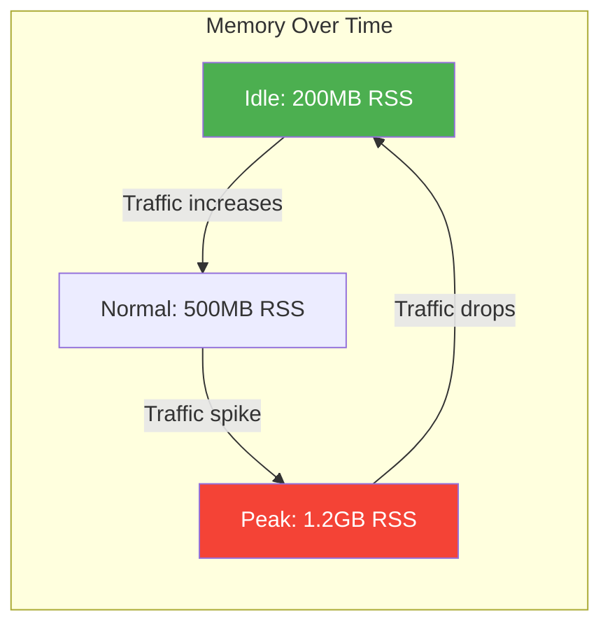
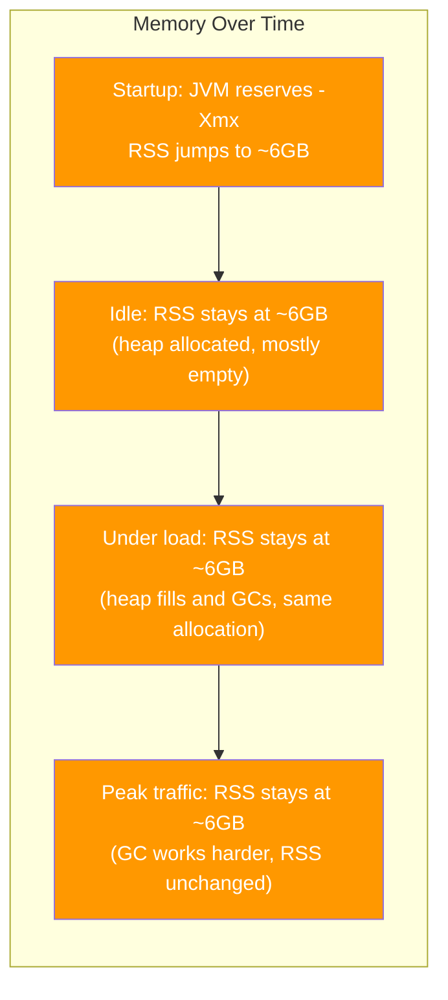
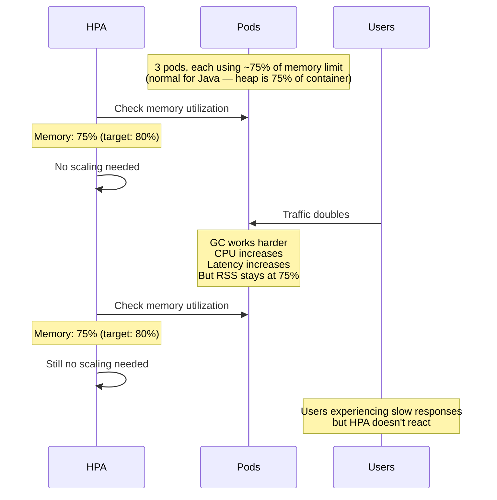
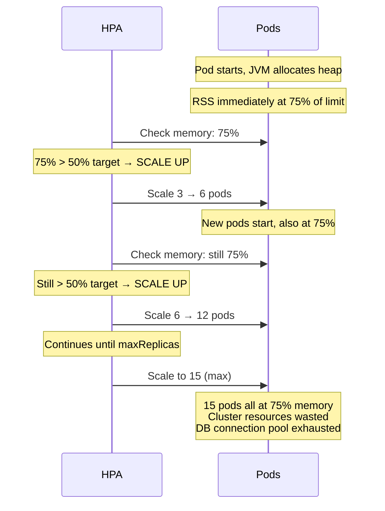
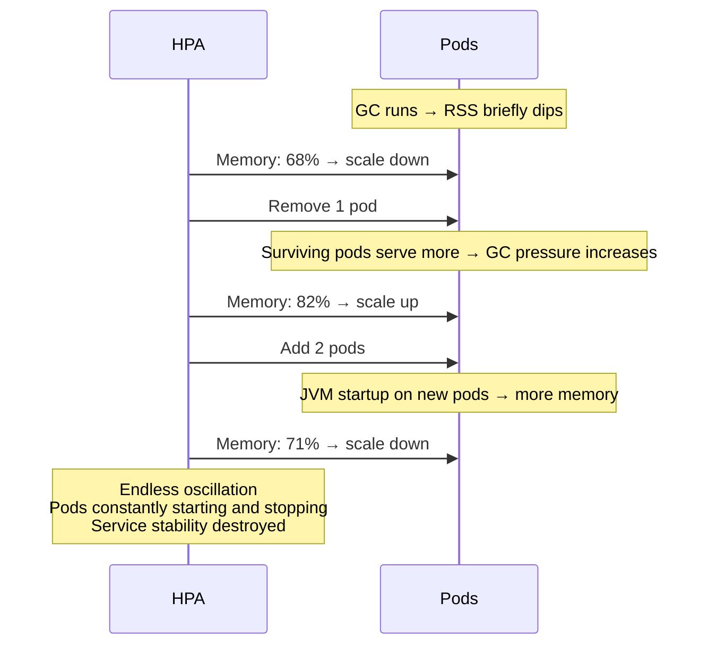
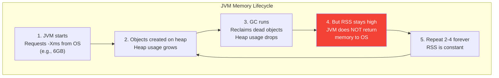
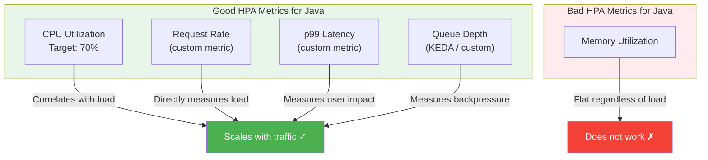
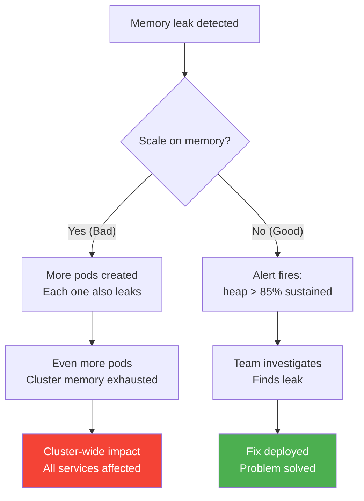
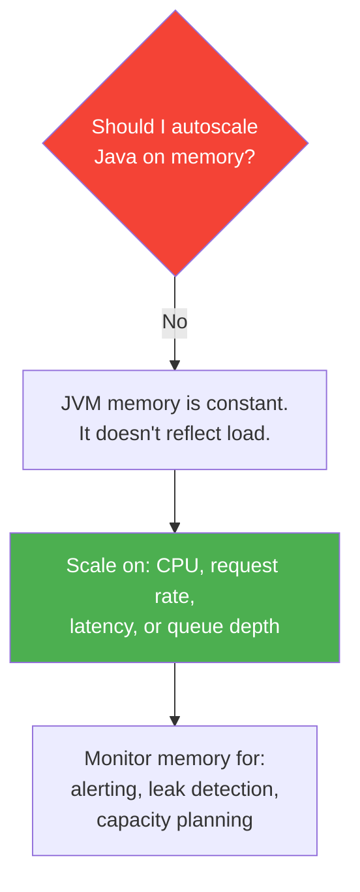

# Why You Should Not Autoscale Java on Memory

[< Back to Main Guide](../java-memory-k8s-guide.md)

---

## The Short Answer

The JVM allocates its maximum heap at startup and **never gives it back to the OS**. From Kubernetes' perspective, memory usage is effectively constant regardless of whether the application is idle or under heavy load. Memory-based autoscaling is meaningless for Java.

---

## How the JVM Uses Memory (vs What K8s Sees)

### A Typical Non-Java Application (Node.js, Go, Python)



Memory tracks load. HPA on memory makes sense — scale up when memory rises, scale down when it falls.

### A Java Application



Memory is **flat**. The JVM requested its full heap at startup. It doesn't grow or shrink with traffic. HPA on memory sees a flatline.

---

## What Actually Happens with Memory-Based HPA

### Scenario 1: HPA Never Triggers



**Result:** The application is overloaded, but memory hasn't changed, so HPA does nothing. Users suffer.

### Scenario 2: HPA Triggers Immediately and Scales to Max

```yaml
# If you set a low memory target:
metrics:
  - type: Resource
    resource:
      name: memory
      target:
        type: Utilization
        averageUtilization: 50    # Target 50% memory usage
```



**Result:** HPA scales to maximum immediately on startup, wasting cluster resources and potentially exhausting database connections. Memory never drops below 75% because that's how the JVM works.

### Scenario 3: HPA Oscillation

If memory happens to hover near the target threshold (due to GC cycles briefly freeing heap):



**Result:** Constant churn. Pods starting and stopping, never reaching steady state. Each restart loses JIT warmup, making performance worse.

---

## The Root Cause: JVM Memory Lifecycle



**Key behavior:** When the GC frees heap memory, it remains **committed** — the JVM keeps it for future allocations. The OS (and therefore Kubernetes) still sees it as used.

This is by design:
- Re-requesting memory from the OS is expensive
- The JVM assumes it will need the memory again
- `-Xms == -Xmx` (recommended for containers) means full allocation at startup

### Can the JVM Return Memory?

Some GCs can return memory to the OS, but it's unreliable for autoscaling:

| GC | Can Return Memory? | Flag | Practical for HPA? |
|:---|:-------------------|:-----|:-------------------|
| G1GC | Yes (Java 12+) | `-XX:G1PeriodicGCInterval=N` | No — too slow, unpredictable |
| ZGC | Yes (Java 13+) | `-XX:ZUncommitDelay=N` | No — aggressive uncommit hurts performance |
| Shenandoah | Yes | `-XX:ShenandoahUncommitDelay=N` | No — same issues |
| SerialGC | No | — | — |
| ParallelGC | No | — | — |

Even with uncommit enabled:
- There's a delay (default 5 minutes for ZGC)
- The JVM only uncommits if heap usage is **very** low
- Under any real load, the heap stays committed
- The uncommit/recommit cycle adds latency
- **It defeats the purpose of `-Xms == -Xmx`**, which is the recommended container configuration

---

## What You Should Scale On Instead



### Why CPU Works

Unlike memory, CPU usage **does** correlate with traffic for Java:
- More requests → more computation → higher CPU
- GC uses more CPU under heap pressure
- JIT compilation uses CPU during warmup
- CPU drops when traffic drops

```yaml
# Recommended: CPU-based HPA
apiVersion: autoscaling/v2
kind: HorizontalPodAutoscaler
metadata:
  name: my-spring-app-hpa
spec:
  scaleTargetRef:
    apiVersion: apps/v1
    kind: Deployment
    name: my-spring-app
  minReplicas: 3
  maxReplicas: 15
  metrics:
    - type: Resource
      resource:
        name: cpu
        target:
          type: Utilization
          averageUtilization: 70
```

### Why Request Rate Works

Custom metric that directly measures demand:

```yaml
# Scale when RPS per pod exceeds threshold
metrics:
  - type: Pods
    pods:
      metric:
        name: http_server_requests_per_second
      target:
        type: AverageValue
        averageValue: "100"
```

### Why Latency Works

Scale up when user experience degrades:

```yaml
# Scale when p99 exceeds SLO
metrics:
  - type: Pods
    pods:
      metric:
        name: http_server_requests_p99_seconds
      target:
        type: AverageValue
        averageValue: "0.5"    # Scale up when p99 > 500ms
```

### Why Queue Depth Works (Event-Driven)

For Kafka consumers or message processors:

```yaml
# KEDA: scale on queue backlog
triggers:
  - type: kafka
    metadata:
      topic: my-topic
      consumerGroup: my-group
      lagThreshold: "100"    # Scale when consumer lag > 100
```

---

## Multi-Metric Strategy

Use multiple metrics together for best results:

```yaml
apiVersion: autoscaling/v2
kind: HorizontalPodAutoscaler
metadata:
  name: my-spring-app-hpa
spec:
  scaleTargetRef:
    apiVersion: apps/v1
    kind: Deployment
    name: my-spring-app
  minReplicas: 3
  maxReplicas: 15
  behavior:
    scaleUp:
      stabilizationWindowSeconds: 60
      policies:
        - type: Pods
          value: 2
          periodSeconds: 60
    scaleDown:
      stabilizationWindowSeconds: 300
      policies:
        - type: Pods
          value: 1
          periodSeconds: 120
  metrics:
    # Primary: CPU utilization
    - type: Resource
      resource:
        name: cpu
        target:
          type: Utilization
          averageUtilization: 70

    # Secondary: request rate
    - type: Pods
      pods:
        metric:
          name: http_server_requests_per_second
        target:
          type: AverageValue
          averageValue: "100"
```

HPA evaluates all metrics and uses whichever recommends the **highest** replica count. This means:
- CPU spike → scales up (even if RPS is low — maybe GC pressure)
- RPS spike → scales up (even if CPU hasn't caught up yet)
- Both low → scales down

---

## "But What About Memory Leaks?"

A common argument for memory-based scaling: "If we scale on memory, we'll automatically add pods when there's a memory leak."

**This doesn't work because:**

1. Memory leaks are **bugs** — autoscaling masks them while the problem compounds
2. New pods also start leaking → eventually all pods are full → cluster exhausted
3. The leak is still there, just running on more pods
4. You've now consumed 5× the cluster resources while the leak continues



**The right approach:** Monitor heap percentage with alerts. When heap is sustained > 85%, alert the team to investigate. Fix the leak — don't throw more hardware at it.

---

## When Memory Monitoring IS Useful (Just Not for HPA)

Memory metrics are critical — just not as an autoscaling trigger:

| Use Case | Metric | Purpose |
|:---------|:-------|:--------|
| **Alerting** | `jvm_memory_used_bytes / jvm_memory_max_bytes > 0.85` | Detect heap pressure before OOM |
| **Alerting** | `container_memory_working_set_bytes / limit > 0.90` | Detect container OOMKill risk |
| **VPA recommendations** | VPA `updateMode: "Off"` | Right-size requests/limits over time |
| **Capacity planning** | Historical RSS trends | Plan node pool sizing |
| **Leak detection** | `deriv(jvm_memory_used_bytes[1h]) > 0` | Detect monotonic memory growth |
| **Post-deploy validation** | RSS vs limit gap | Verify new config has headroom |

---

## Summary



| Metric | Reflects Load? | Scales with Traffic? | Good for HPA? |
|:-------|:--------------|:--------------------|:---------------|
| **CPU** | Yes | Yes | **Yes** |
| **Request rate** | Yes | Yes | **Yes** |
| **Latency (p99)** | Yes | Inversely | **Yes** |
| **Queue depth** | Yes | Yes | **Yes** |
| **Memory (RSS)** | No | No | **No** |
| **Memory (heap %)** | Partially (GC sawtooth) | Weakly | **No** |

---

## Next Steps

- [Autoscaling](autoscaling.md) — Full HPA/VPA/KEDA configuration
- [Monitoring & Metrics](monitoring-metrics.md) — How to use memory metrics for alerting (not scaling)
- [JVM Memory Model](jvm-memory-model.md) — Why the JVM behaves this way
- [Capacity Planning](capacity-planning.md) — Right-sizing without autoscaling on memory
