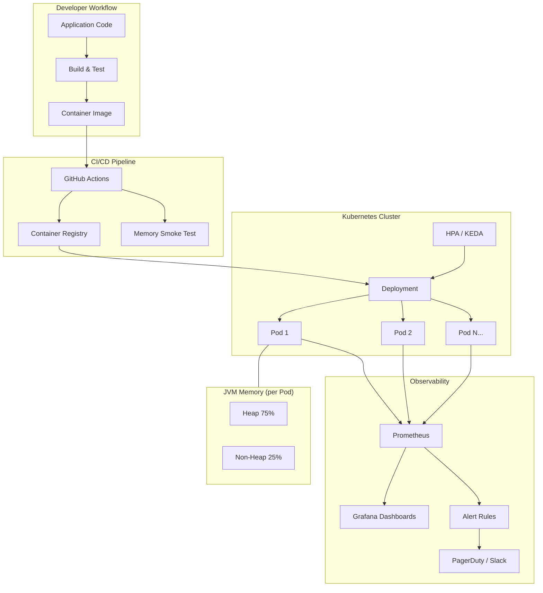
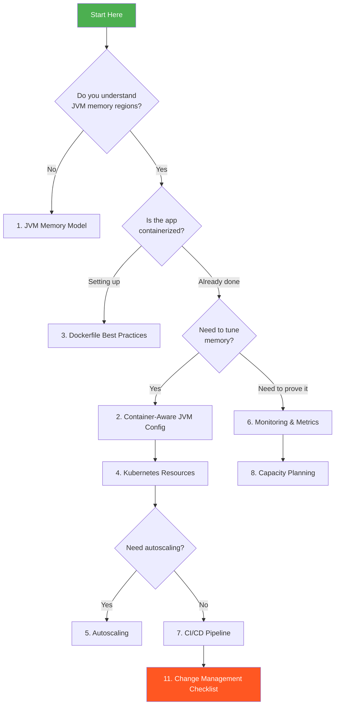

# Java Memory Management in Containerized Kubernetes Environments

> A comprehensive guide to right-sizing, deploying, monitoring, and scaling Java (Spring Boot) applications in Kubernetes with proper memory configuration.

---

## Table of Contents

1. [JVM Memory Model](docs/jvm-memory-model.md)
2. [Container-Aware JVM Configuration](docs/container-configuration.md)
3. [Dockerfile Best Practices](docs/dockerfile-best-practices.md)
4. [Kubernetes Resource Configuration](docs/kubernetes-resources.md)
5. [Autoscaling](docs/autoscaling.md)
6. [Monitoring, Metrics & Observability](docs/monitoring-metrics.md)
7. [CI/CD with GitHub Actions](docs/cicd-github-actions.md)
8. [Capacity Planning & Load Testing](docs/capacity-planning.md)
9. [Troubleshooting](docs/troubleshooting.md)
10. [Advanced Considerations](docs/advanced-considerations.md)
11. [Change Management Checklist](docs/change-management-checklist.md)

### Production Operations

12. [Graceful Shutdown & Connection Draining](docs/graceful-shutdown.md)
13. [JVM Warmup](docs/jvm-warmup.md)
14. [Connection Pool Scaling](docs/connection-pool-scaling.md)
15. [Spring Boot Memory Traps](docs/spring-boot-memory-traps.md)
16. [Incident Runbook](docs/incident-runbook.md)

### Deep Dives

17. [Why Not Autoscale Java on Memory](docs/why-not-autoscale-java-on-memory.md)

### Process & Discovery

18. [Developer Interview Questionnaire](docs/developer-interview-questionnaire.md)

---

## Overview



## The Core Principle


**The critical relationship:**

```
Container Memory Limit >= JVM Heap + Non-Heap Overhead (~25-30%)
```

For a **6 GB heap**, you need at minimum an **8 Gi container limit**.

---

## Quick Start

For teams that just need the answer:

### JVM Flags (set via `JAVA_TOOL_OPTIONS` env var)

```bash
-XX:MaxRAMPercentage=75.0
-XX:InitialRAMPercentage=75.0
-XX:+UseG1GC
-XX:MaxMetaspaceSize=512m
-XX:+HeapDumpOnOutOfMemoryError
-XX:+ExitOnOutOfMemoryError
```

### Kubernetes Resources

```yaml
resources:
  requests:
    memory: "8Gi"
    cpu: "2000m"
  limits:
    memory: "8Gi"
```

### The Formula

```
Container Limit = Desired Heap Size / 0.75
```

| Desired Heap | Container Limit | Notes |
|:------------:|:---------------:|:------|
| 3 GB | 4 Gi | Current state |
| 4 GB | 5.5 Gi | Moderate increase |
| 6 GB | 8 Gi | Proposed state |
| 8 GB | 11 Gi | Large workloads |

---

## How to Use This Guide



---

## Key Takeaways

1. **Never hardcode `-Xmx` in the Dockerfile** — use `MaxRAMPercentage` and control memory at the K8s layer
2. **Set `requests.memory == limits.memory`** for Java apps — gives Guaranteed QoS class
3. **[Do not autoscale on memory](docs/why-not-autoscale-java-on-memory.md)** for Java — the JVM doesn't release heap; scale on CPU or request rate
4. **Prove the need first** — use Prometheus metrics to validate that heap pressure justifies the increase
5. **Account for non-heap** — the JVM uses 25-30% more memory than the heap alone
6. **Monitor RSS, not just heap** — the kernel OOM killer sees RSS, not JVM heap usage

---

## Contributing

When updating this guide:

- Test all YAML manifests against a real cluster before committing
- Validate Mermaid diagrams render correctly
- Keep kubectl commands up to date with current API versions
- Link to official documentation where appropriate

---

## References

- [JVM Tuning Guide (Oracle)](https://docs.oracle.com/en/java/javase/21/gctuning/)
- [Kubernetes Resource Management](https://kubernetes.io/docs/concepts/configuration/manage-resources-containers/)
- [Spring Boot Actuator](https://docs.spring.io/spring-boot/docs/current/reference/html/actuator.html)
- [Micrometer Prometheus Registry](https://micrometer.io/docs/registry/prometheus)
